--- 
front: https://mc.res.netease.com/pc/zt/20201109161633/mc-dev/assets/img/5_2.7f54f2fa.png 
hard: Advanced 
time: 30 minutes 
--- 
# 1.5-BLOCKBENCH tutorial-model action production 

#### TAG: Model action BLOCKBENCH case 

#### Author: Ancient Stone 

#### Open source software: BLOCKBENCH usage tutorial-model action production 

In order to make the model have a soul, action is one of the essential auxiliary additives. Then let's add some dynamic effects to the car. 
First, let's switch from edit mode to animation mode. 

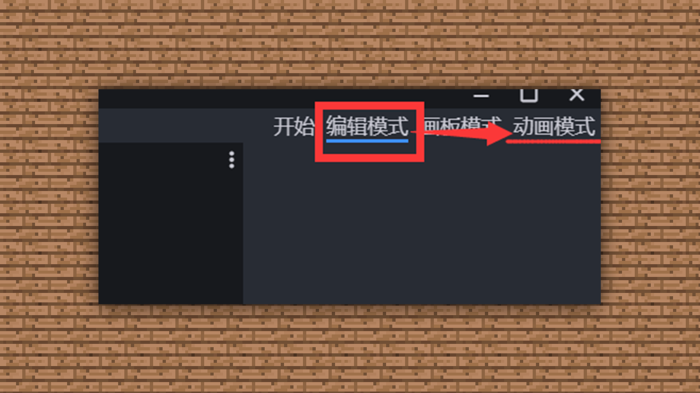 

After the animation mode, the interface is as follows: 

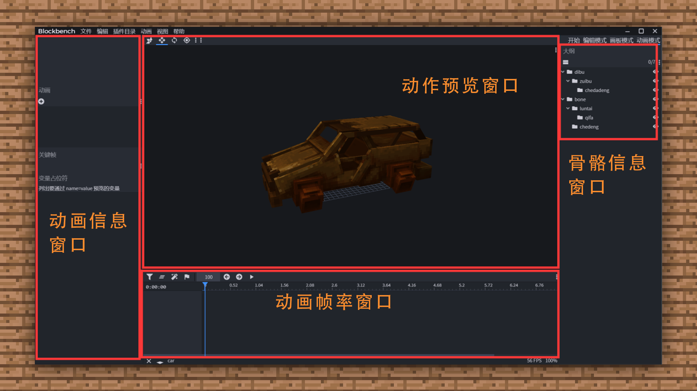 

Next, we select the piston block we want to move. 

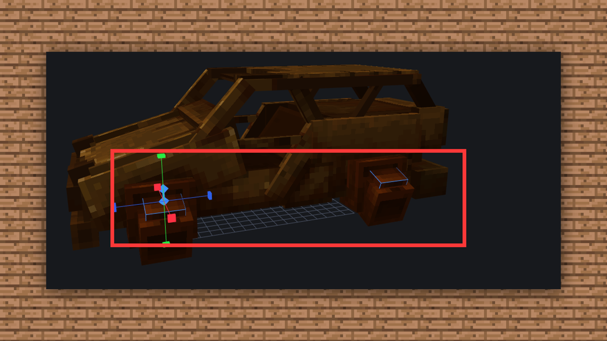 

Then create a new animation storage file in the animation panel. Ps: Only after creating this can you start making animations! 

 

Set a name for the action, and the rest does not need to be set for the time being. 

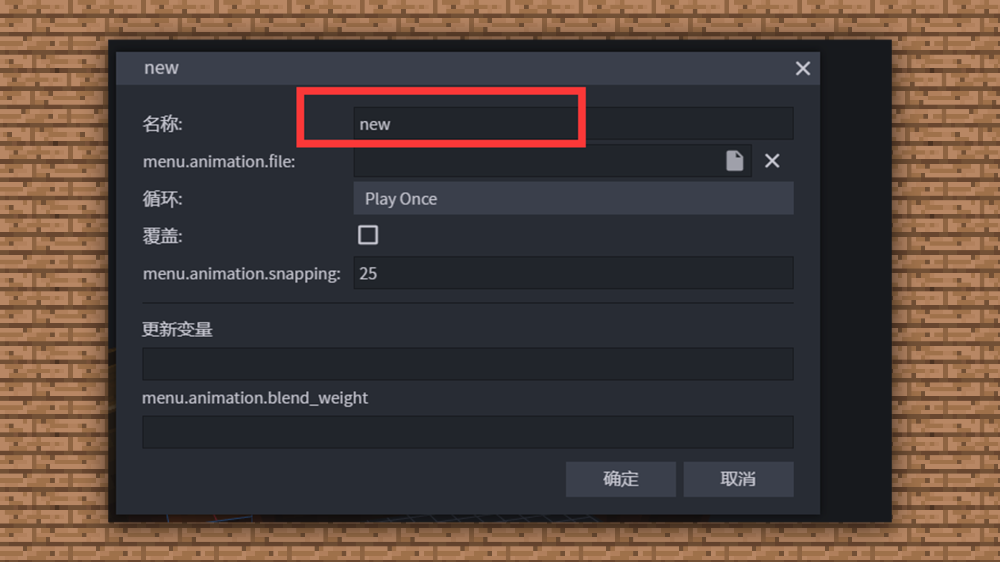 

After the new creation, the animation production of the component will appear below the animation frame.

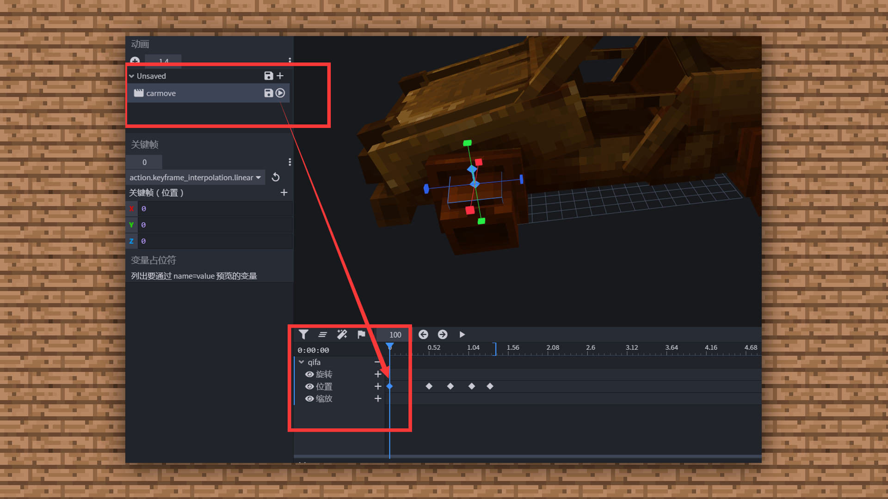 

Then we can set the frames according to the animation dynamic effects we want. Because the piston movement of the car is undulating, that is, there will be a contraction process, so we set the zeroth and first frames to the original state, the second frame to rise, the third frame to retract, and the fourth frame to return to the origin. 

Frame 0 and 1 

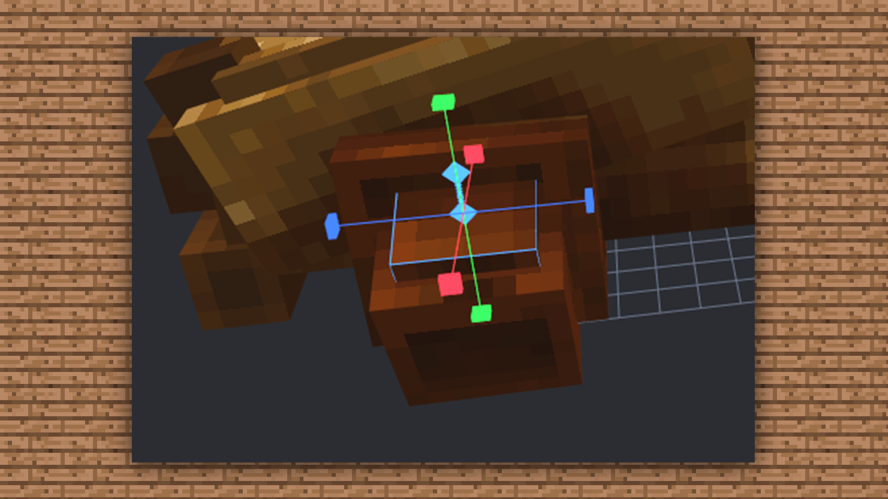 

Frame 2 

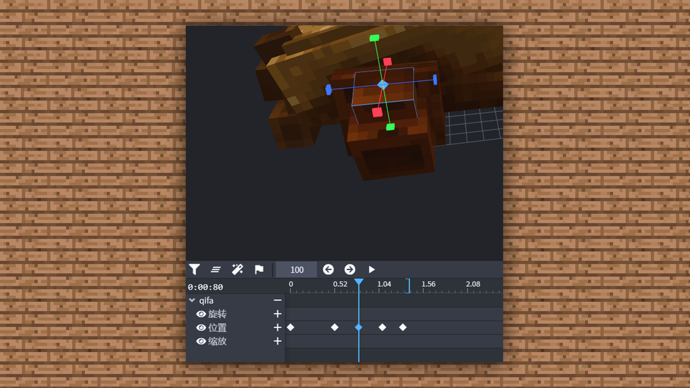 

Frame 3 

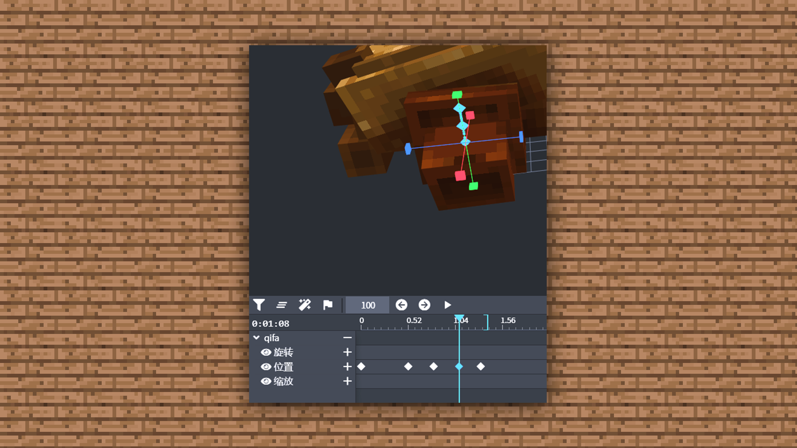 

Frame 4 

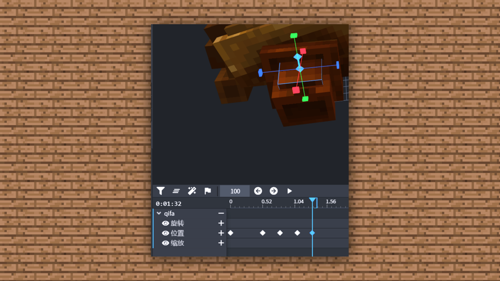 

After adjustment, we click the play button above 

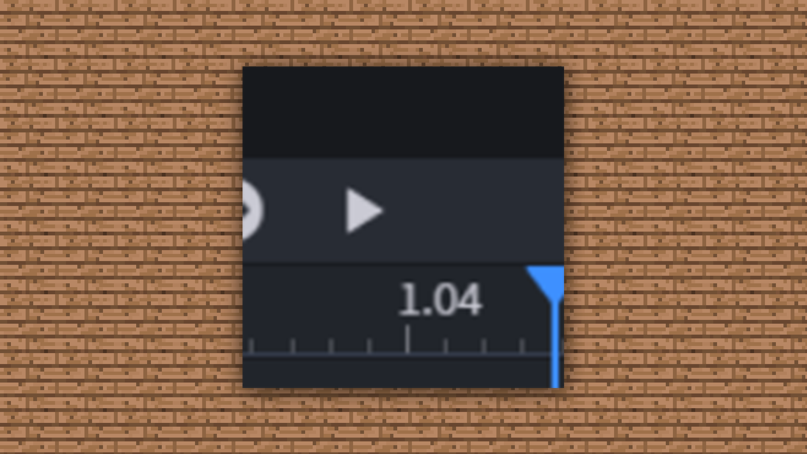 

Set the loop playback and you can see the piston moving. Isn't it simple~ 

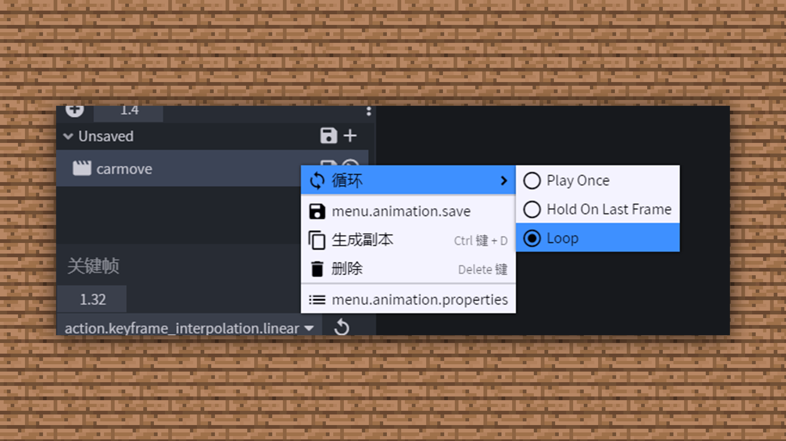 

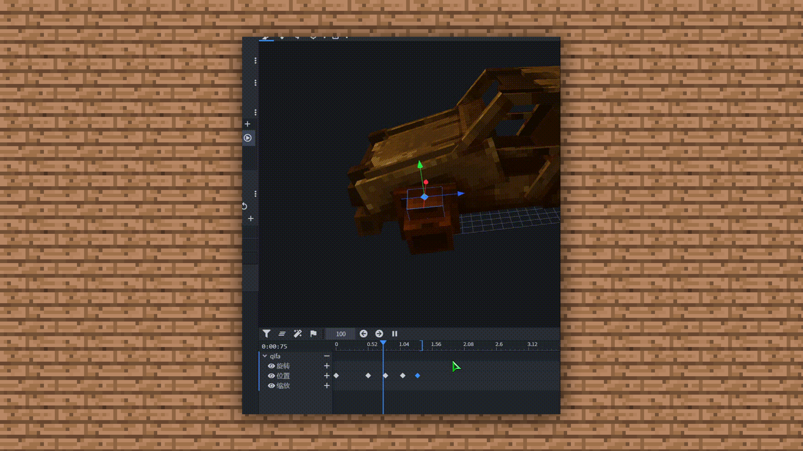 

After making the action model, just save it in json format. 

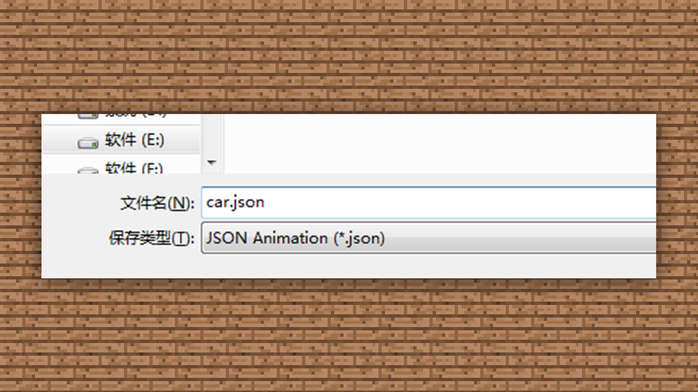

This way the model has both a cool appearance and an interesting soul. Because BB uses the model as the skeleton binding, we don't need to consider the issue of skeleton binding, which is very convenient and fast. You can try to adjust the model to get different model action effects~