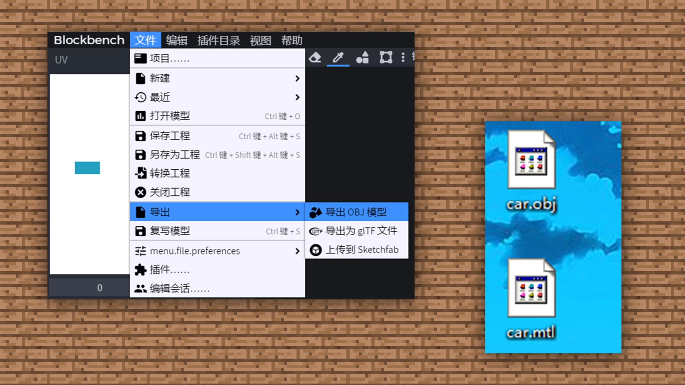
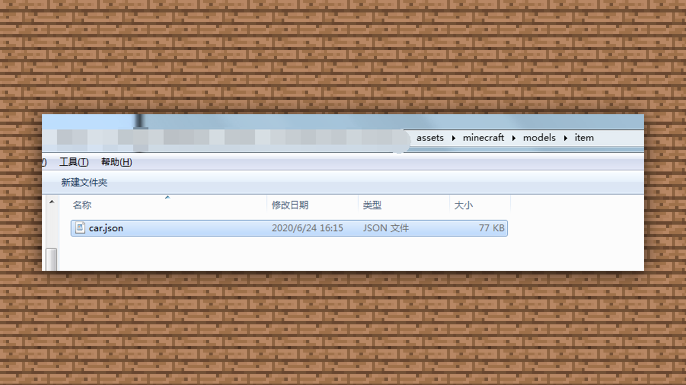

--- 
front: https://mc.res.netease.com/pc/zt/20201109161633/mc-dev/assets/img/6_1.281e661c.png 
hard: Advanced 
time: 10 minutes 
--- 
# 1.6 Correct way to export models 
#### TAG: Export model 
#### Author: Ancient Stone 
#### Correct way to export models 
When the car model is completed, we can use [File] - [Export] - [Export OBJ model] OBJ is specially used for various 3D modeling software for later animation shooting and production. 

 

We can also export jem, json java reading files to import game resource packages. Replace the name of the item to import it into the game from the resource package. 

 

Then put the js file into /assets/minecraft/models/item. 

 

Put the material into assets/minecraft/textures/item. 

 

Then you can enter the actual testing phase. If you find any problems in the game, you can modify and adjust them. This is a process of repeated optimization, which requires everyone to try and practice more~