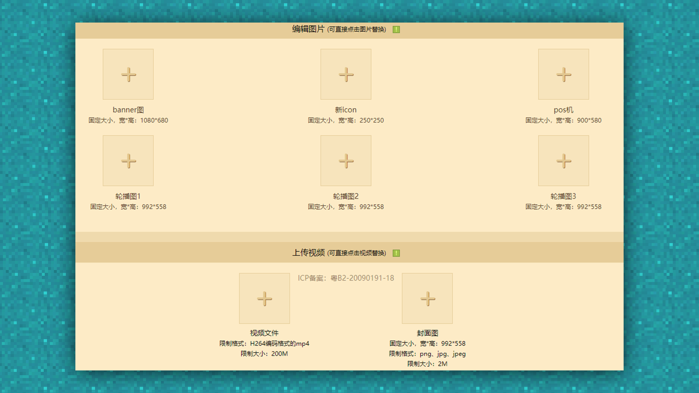
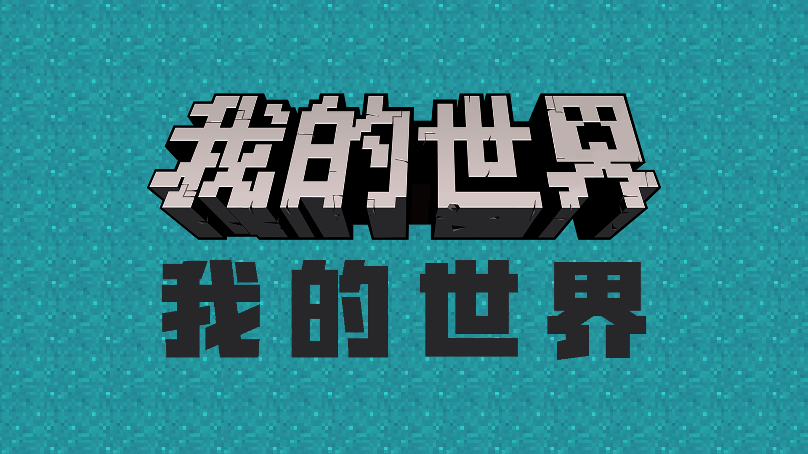
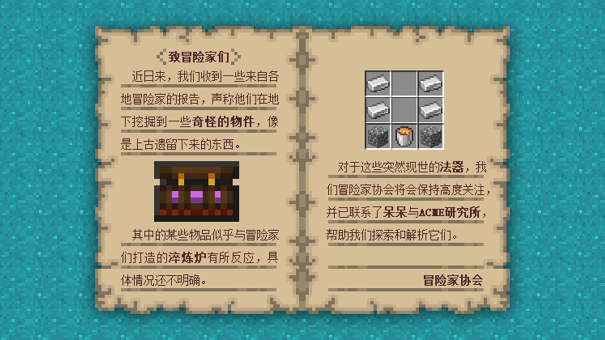
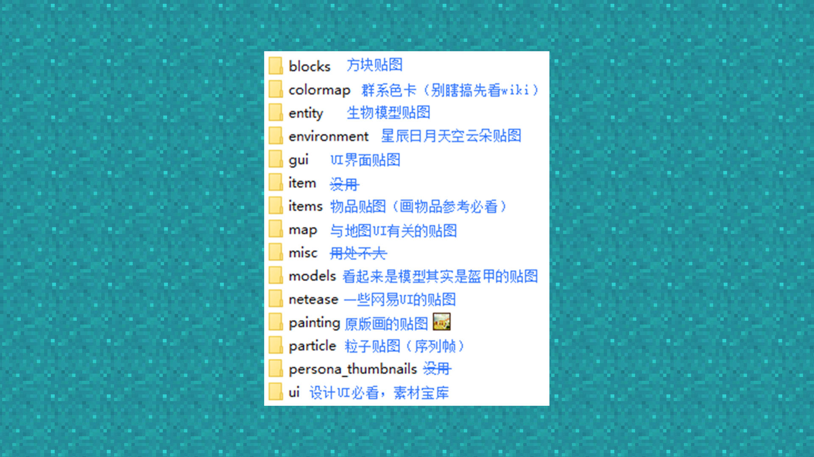

--- 
front: https://mc.res.netease.com/pc/zt/20201109161633/mc-dev/assets/img/1_1.512d5a24.png 
hard: Getting Started 
time: 10 minutes 
selection: true 
--- 
# Suggestions for creating component listing images 
#### Tag: Listing image creation 
Hello everyone, I am Spcoo (Xiaoou) from the ACME team. Taking the opportunity of being a mentor in the Autumn and Winter Development Training Camp, I have compiled a "Suggestions for creating listing images" for everyone, which can be regarded as some of my own little experience in the past two years. I hope it can help all developers to create more beautiful and attractive promotional images. ” 

### About the listing and promotional pictures in MC (taking PE as an example): 

#### Summary of key points: 

When you upload your work, you will find that at the bottom of the upload page, there will be a section where you need to submit the picture content. This part of the content is what we often call the listing and promotional pictures of the work. 

Taking the Chinese version of MC PE as an example, the types and sizes of pictures that need to be submitted are as follows. Next, I will explain in detail the specific uses of each type of picture. 

 

### Icon picture: 

#### Summary of key points: 

The icon image is the first image displayed to players in the resource center area component in the current version of the PE launcher. However, due to its small size, its main function is to convey a perception to players, that is, seeing the icon can roughly judge what style and type of module it is. 

 

For the icon image, what we need to do is: without stacking too many elements, it can stand out from the icon display images in the resource center and successfully attract players. 

The following is a brief overview of the resource center icon image: 

 

 (The image content is not targeted at any component or related studio, it is just a screenshot taken by myself)
 

#### Production suggestions: 

First, the icon image can be divided into multiple areas. Here I suggest dividing it into 3 areas: 

 

First, area 1 will be blocked by the rating content, so try not to place key elements in the lower right corner, and also pay attention to the component text not being blocked by the rating. Even if only part of a word is blocked, it will affect the overall appearance. 

Because of the setting of the rating (area 3), area 2 is relatively abrupt, so the recommended way to deal with it is to pull out a small horizontal bar at the bottom to perfectly integrate the rating into the entire icon image. 

 

The position of the small horizontal bar can be added with the team/studio name, or the component name or gameplay type. 

After the color matching of the small horizontal bar and the text is selected, it is recommended not to modify it at will. Keep it consistent in future icons. It will exist as a characteristic mark of the studio's works to facilitate player recognition. 

Area 1 is the focus of icon display. You can freely use it according to the characteristics of your own components. It is simple and beautiful, with some color tendencies as a whole. 

### banner image: 

#### Summary of key points: 

Banner image, the core display image of the gameplay. 

 

Although there is no display position for banner images in the current version of the resource center, considering that banner images are often used as an important criterion for participating in official promotions or activities, it is also necessary for everyone to prepare a good-looking banner image. 

In general, it is recommended that you make a banner image that highlights the theme of the gameplay, is beautiful, and has a certain visual impact. Good image materials are very important for everyone to publish their own gameplay promotion content in player forums, communities, and news. It can be simply understood that the beauty of the banner and the quality of the content displayed will determine the effect of player drainage. 

 

 (Simple layout mode reference, the specific layout method needs to be adjusted according to your own needs, but it must follow the principle of clear information) 
 

#### Generally, the following elements need to be included in the banner image: 

1. The display content of the module: it can be a rendering or a display of some gameplay elements; 

2. The name of the gameplay component (+ a brief description of the gameplay type);

3.Team/studio logo; 

#### Production suggestions: 

Banner images can be roughly divided into two types. Artists can choose different banner display methods according to different module contents. 

#### Core props: 

Suitable for components with simple content and main gameplay centered around an item or creature; 

This type of banner is mainly simple, mainly highlighting the key item props elements, so the general composition is also simple. Basically, the core elements can be arranged in the center, a simple and unpretentious background can be selected, and then the component name, studio logo, etc. can be placed in the appropriate position. 

#### System gameplay: 

For components with complex content and many creatures and items, simply stacking the module content will have a poor effect, which will appear messy, without focus, and lack of beauty. Therefore, renderings are generally used to display the content of the module in one scene, which is a very challenging operation for artistic skills. 

The content of the rendered banner is usually quite full, so try to find a blank space on the screen to put the text, do not cover the key elements in the screen, and you can appropriately reduce the text and logo to show the screen. For this type of banner, the impact of the screen is the most important. 

#### Font/color selection: 

It is recommended to use bold fonts as much as possible. Generally, we recommend that you choose commercially available open source fonts. 

You can try a font style close to the official logo, which will look very comfortable and not feel out of place. 

 

On the premise of not using three-dimensional font design, we generally recommend that you choose gradient colors for flat fonts, and try to choose pure color gradients for gradients. If you can master the principle of color matching, of course, we also recommend that you try other gradients with a large color span. 

 

### POS picture: 

#### Summary of key points: 

This is the picture that appears on the purchase page. Generally, players who can see this picture have the possibility of becoming your customers. 

So the information we need to convey in the POS image is very simple: 
1. Thank the adventurer for his support, and hope that the adventurer can pay attention to the studio's subsequent works or join the studio discussion group 

2. In case the adventurer's balance is insufficient, tell him that he can go to the advertiser to watch the advertisement to get diamonds 

#### Production suggestions: 

The content of the POS image does not need to be related to the component content, but it needs to have a certain degree of versatility, so follow the above points to complete the production, and then put the studio's logo, and it is almost done. 

### Carousel image: 

#### Summary of key points: 

The carousel image can be called a banner in the component page. It is very suitable for stacking content appropriately here. Try to display the most attractive parts of the component you think here. 

Don't put a large section of the instructions in the carousel image. Make good use of the valuable places. Put the coolest things in the module on it to attract the interest of a specific part of the players. This is the biggest role of the carousel image. 

Note: No matter how bright you think a certain highlight in the gameplay is, don't use the same one for all three carousel images... 

#### Production suggestions: 

Pick out the core elements of the gameplay, such as a certain system in the gameplay, and try to express the content in the form of pictures to reduce the appearance of text. 

 

Pick out the coolest art materials/models and stack them directly to display them. In order to highlight the subject, please avoid using complex and fancy backgrounds. 

 

### Video cover image: 

#### Summary of key points: 

The video cover image is the first image that players can see on the details page, but its focus is not in the image, but in the video that is opened by clicking on this image. The video cover is to some extent the facade of a component, so its function is similar to that of the banner. 

#### Production suggestions: 

As mentioned earlier, the requirements for video cover images and banner images are highly overlapped, so here you can use the banner image to make the video cover, but the size ratios of the two images are different, and forced stretching will cause a certain degree of deformation. You can use the following method to quickly make a video cover image - scale the banner proportionally, and add the words of the module display video in the blank space. 

 

### Introduction long image: 

#### Summary of key points: 

As the most complex and time-consuming image among all uploaded images, the introduction long image is also one of the most critical elements in the promotional image. But the longer the long image, the better, nor the more detailed the better. 

After two years of hard work in the resource center, I would like to briefly summarize how Chinese players view the long picture introduction, as well as some of my small suggestions: 

1. Most players prefer to look at the picture when choosing between pictures and words. The effect of writing a lot of small words in the picture is not as good as typing directly in the introduction. But it does not mean that you should not put words in the long picture, but if you have to put them, put them in large words. Necessary words are very important for guiding the gameplay and supplementing the picture content. Just try to avoid dense small words appearing in the first half of the long picture; 

2. Only a few players will carefully read the entire long picture, that is, the main function of the long picture is not a "product manual", it still plays the role of a "leaflet"; 

3. Some players will come back to look at the long picture again when they encounter problems after downloading, hoping to find a solution in the picture, but this is not the first mission of the long picture. The priority function of the long picture is to attract players to download, so the part about the detailed description of the components can be there, but it should be placed in the second half of the long picture; 

4. For modules with complex systems, non-linear introduction is not a disadvantage. The content of the long picture does not have to be introduced according to the game process. For modules with huge content, it is necessary to write the copy in advance so that the module content can be fully displayed in order in the long picture. In this way, the structure of the long picture looks very clear and regular, but in fact, its appeal to players still needs to be considered. Choosing to show the interesting parts of the module to players in a fragmented way can help players figure out the gameplay process by themselves. Although the content may be very different from the original content, the players have already developed a certain interest in the gameplay at this time, so this approach has certain benefits. 

5. In-game guidance > video guidance > introduction guidance of the long picture. Don't expect players to understand the module after watching the long picture. If you don't want to do too much explanation in the long picture, put it in the video and put it in the game. 

6. The recommended approach is: the introduction of the long picture from top to bottom should be concentrated in the upper half of the picture and the text in the lower half. 

#### Summary of key points: 

Currently, the developer platform has modified the size requirements for long images. The width cannot exceed 1000px, and the size of a single image is still not higher than 2MB. The width is recommended to be controlled between 720px-1000px. If it is lower than this range, the long image effect will be blurry, and the edges of small characters will also be blurred, which will not look good. 

Generally, jpg is selected as the format for long images. The size of the image is much smaller than png. With the same size, a longer introduction image can be made. When outputting, the image quality should not be lower than 10, otherwise the image will have obvious jpg graininess, just like an emoticon package is sent back and forth in the forum, and finally becomes very blurry. If the size is too large, do not reduce the image quality. You can choose high quality to output the image first, and then cut it into multiple long images for secondary upload. 

 

### Other notes: 

#### Scaling of low-pixel images: 

Many developers have encountered the situation where pixel images become blurred after being enlarged in the early stages of making images: 

 

To solve this problem, you only need to select the sampling type as "adjacent (hard edge)" when changing the image size in Photoshop. 

 

Similarly, when using Ctrl+T to stretch the image directly in the image, you can also select the interpolation value as "adjacent" at the top. Generally, this method is used more frequently and is more convenient, but please note that your pixel image must be a non-smart object. 

 

When the layer has this mark, it means that it is a smart object. Direct stretching will be blurry. You can right-click to directly rasterize the layer, and then stretch it. 

#### Pixel font production: 

Many basic fonts are actually dot matrix fonts, but the triggering conditions are slightly more complicated. First, call up the character window in PS, then select Songti (not necessarily Songti, here is an example), adjust the font size to 12 points, and select no aa anti-aliasing. 

 

Right-click to rasterize the text layer, and then enlarge the layer according to the above method to get pixel text. Pixel fonts are generally too thin and not suitable for eye-catching annotations. They are generally used as small text descriptions or to make UI text in games. They are very natural and have no sense of disobedience, and also save the trouble of typesetting and resolution adaptation. 

 

#### About the acquisition of image materials: 

If you want to say what is the best teaching material for making materials, it is still the original material package of the game. To obtain the original material package, you must first obtain the PC development package (computer test terminal), which can be downloaded in MCstudio to the latest version of the Mod PC development package. 

 

After downloading, find the root directory of the PC development package, which contains the entire game, as well as the behavior pack and the texture pack. If nothing goes wrong, the default path of the texture pack is as follows: 

C:/MCStudioDownload/game/MinecraftPE_Netease/PCLauncher/data/resource_packs/vanilla 

The specific contents of each folder are shown in the figure below: 

 

Now, whether it is designing UI or drawing item materials, I will definitely look for similar materials in the texture pack to get inspiration from them. Some of the icons, block materials, etc. in it can also be selected to be enlarged adjacent to (hard edges) and used as image materials in long pictures. 

 

For example, this dividing line made with a small crown and a blaze rod has a very original style; 

 

For example, this item display frame imitated the original UI, etc. 

The above is some production experience about component listing pictures. I hope that after reading this, you can practice more and find your own style.