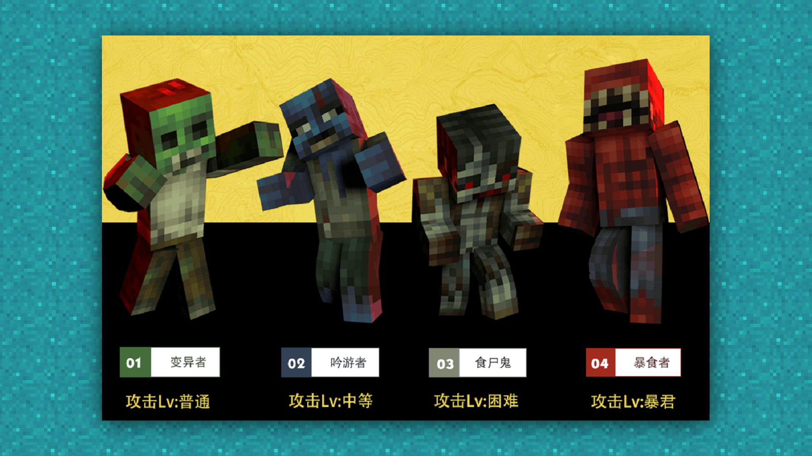

--- 
front: https://mc.res.netease.com/pc/zt/20201109161633/mc-dev/assets/img/2_1.f3fba919.png 
hard: Getting Started 
time: 10 minutes 
--- 
# Promotional Video: Concept and Production 
#### Author: Ancient Stone 
#### Tag: Video Concept Production 
#### Promotional Video: Concept and Production 

With a good promotional picture, of course, you also need a simple promotional video. But because the production of videos is relatively difficult, we usually shy away. However, in fact, as long as there is a reasonable concept, even a mobile phone can make a relatively good promotional video~ 

 

First of all, we need to determine the characteristics of our own work. 

For example: whether it has a special character setting, a special geographical environment, and special weapons and equipment. After determining the features, we need to think about whether the scenes in the game are enough to shoot some short videos? 

 

The monsters of various features are enough for our video display. 

 

Interesting gameplay is also enough for conception. 

 

If we have all these categories and the content is sufficient, then congratulations, the video can basically start production. 

If our content is not enough and there are still many features missing, then we need to take a good look at our work to see if there are any areas that can be optimized or added features to make our video more attractive. 

The early stage conception is a part of the material composition. Good material composition can enable us to achieve twice the result with half the effort.