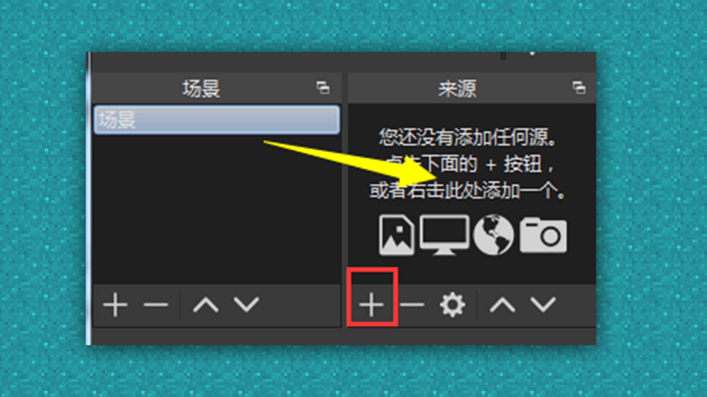
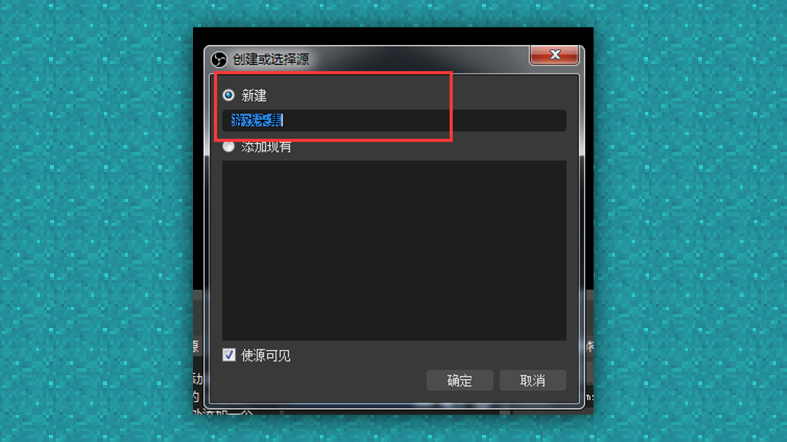
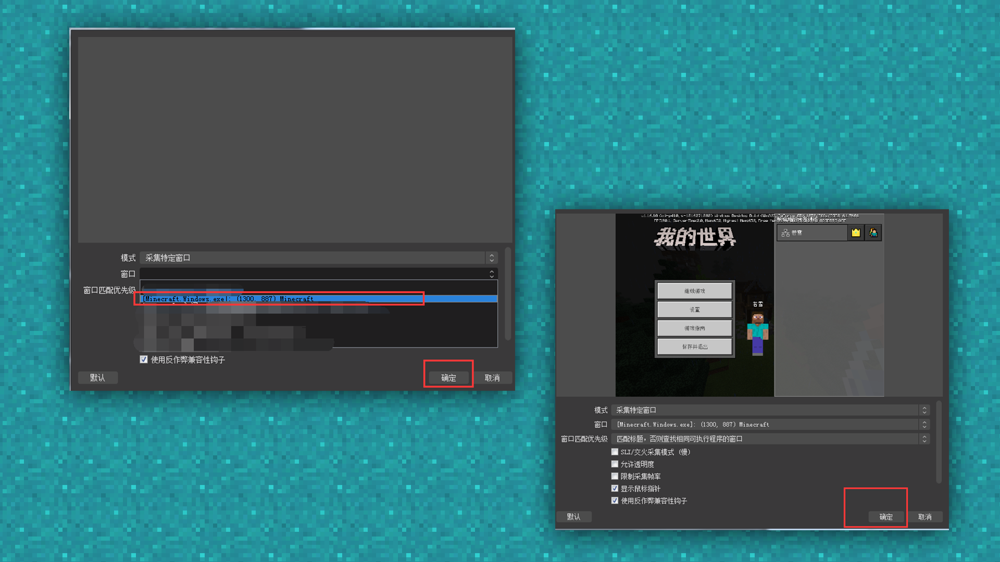
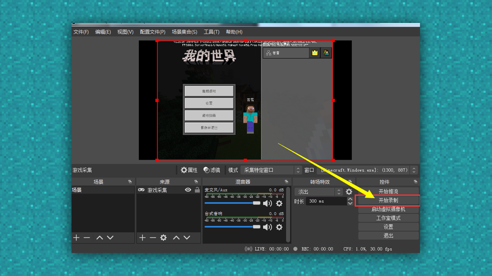
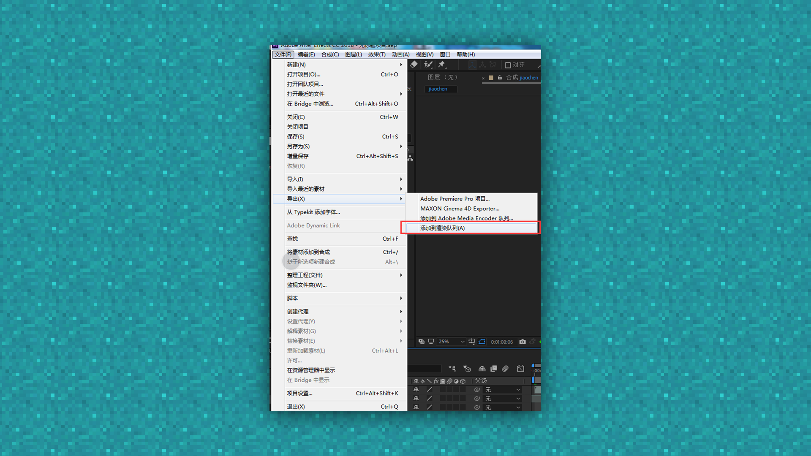

--- 
front: https://mc.res.netease.com/pc/zt/20201109161633/mc-dev/assets/img/3_1.fa841f96.png 
hard: Advanced 
time: 30 minutes 
--- 
# Promotional video: production process and method 
#### Author: Ancient Stone 
#### Tag: video production process 
#### Promotional video: production process and method 

Now that we have the right elements, we can start recording video materials. When recording in-game effects, we can choose a variety of different internal recording software, including some software's own recording system. 

 

#### Internal recording method: 

Here we use OBS to record videos internally. 

First, we download the OBS installation software from the OBS official website. Choose the corresponding download format according to your computer system. 

 

Then run the software and install it according to the software steps. After installation, there will be an OBS icon on the desktop. 

 

Double-click to open the software. 

Then open the game interface we need to record. 

 

Use the scene part of OBS to add a scene, and the name can be entered according to personal needs. 

 

After adding the scene, we can add and edit the window we want to record. 

We add the game window in the source next to the scene. 

 

Use the "+" button under the source and select Game Capture to add the game window. 

 

Create a new source and set a new name. 

 

Select the Minecraft game window through Window Capture, click OK, and the reading interface will appear. Click Confirm. 

 

Then we click Start Recording to start recording in the game frame. 

 

After recording the shooting content, select Stop Recording. 

 

Just find the recorded in-game video material in the display video under the file. 

 

After the internal recording is completed, we need to organize the recorded materials and put them into various video production software for production. 

If you need more professional software help, you can choose AE (Adobe After Effects) and other software. 

First open the selected editing software, here we take AE as an example. 

 

The video specifications are set according to the size we want to edit. Here we choose the default 1080 PC general size. 

 

After creating it, import the sorted materials into it. 

 

After importing, pull the video into the time module for editing and layout. 

As shown in the figure, the order of display can be sorted according to personal preference. 

 

The general editing is complete, and you can start placing music~ 

Put the music that you have selected in advance and purchased the copyright into the resource manager, and then drag it directly to the time bar to cut the music according to the specific node. 

 

Just like the video, we drag the music directly to the time bar. 

If the music is too long, you need to cut the second half of the music, and choose the most suitable part to place according to the content of the video. 

 

Use Ctrl+shift+D to directly cut the climax part at the beginning and end. 

 

After the production is completed, you need to review the video repeatedly. If there are no major problems, you can export it directly. 

The export method of each video clip is different. Here, just select [File]-[Export]-[Add to Render Queue]. 

 

After exporting, you need to modify the file name, then click Render, and the video export progress bar will start moving. 

 

After the progress bar is ready, our video will be ready. 

 

Finally, upload the video to the developer platform. 

