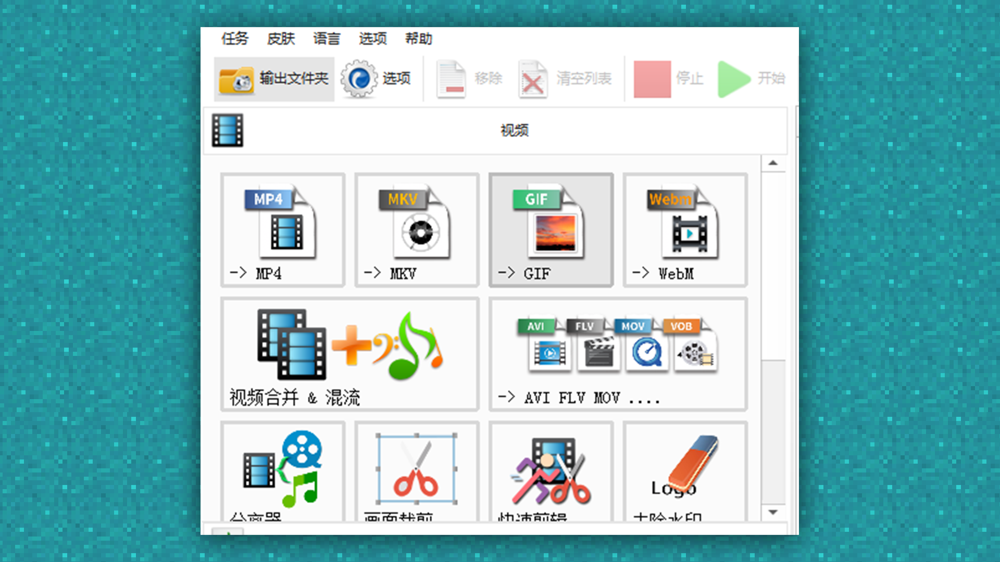

--- 
front: https://mc.res.netease.com/pc/zt/20201109161633/mc-dev/assets/img/4_1.f9a493bc.png 
hard: Advanced 
time: 15 minutes 
--- 
# Promotional video: Export specifications and format conversion 
#### Author: Ancient Stone 
#### Tag: Video Export Specifications 
#### Promotional video: Export specifications and format conversion 

Regarding video export, developers often have trouble understanding the format of the video itself. 

Because different editing software have different editing and exporting methods, how to export the correct format and how to convert the format have become a headache for everyone. 

In fact, the formats of regular uploads are MP4 or AVI, which are the most common formats. 

But the video exported by AVI is very large, which cannot meet the requirements of the video upload size limit of the developer platform. So at this time, we will choose to convert the format to compress the size of the video, but remember not to compress the quality of the video. 

The software we use here is Format Factory: 

 

Drag the exported AVI video directly into the format conversion software to convert the video format. For example, if we need to convert AVI to MP4 now, we can select MP4 and then drag the video to be converted into it and click OK. 

 

 

Click OK and it's done 

 

Wait for the conversion to complete, and we can get a video in MP4 format~ 

