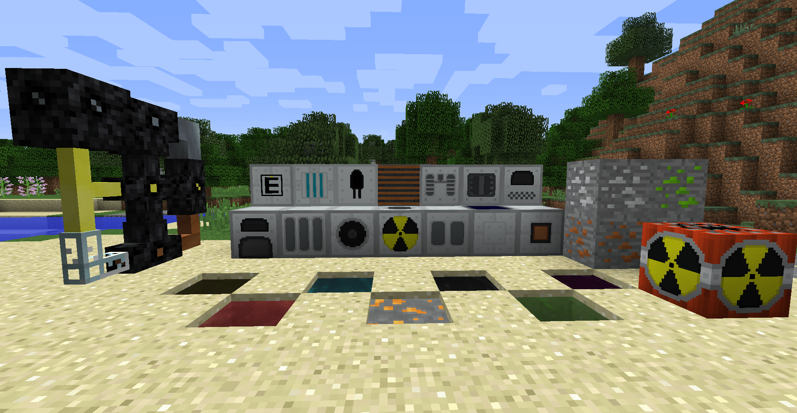
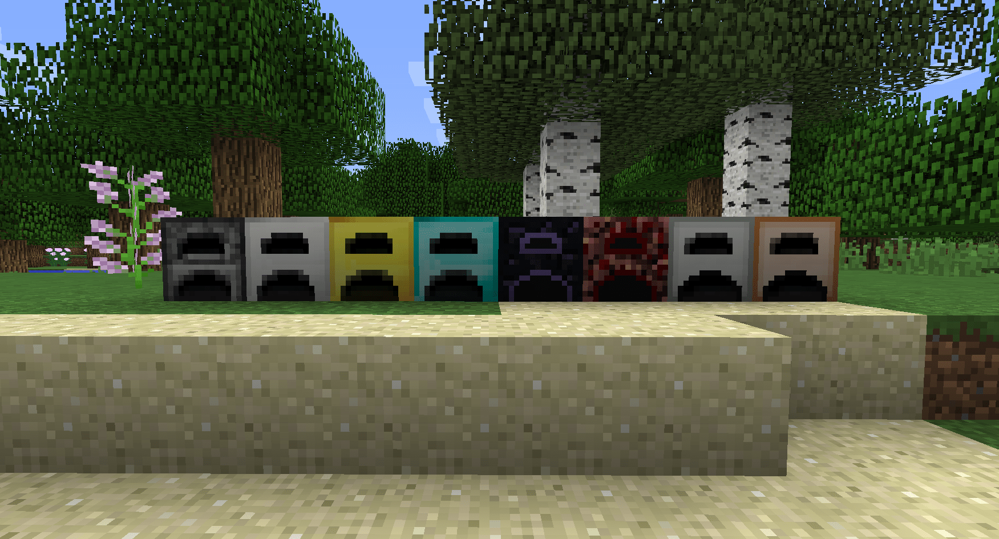

--- 
front: 
hard: Getting Started 
time: 5 minutes 
--- 
# What kind of gameplay requires novice guidance? 

Almost all gameplay components require the help of novice guidance to give players a better gaming experience; some gameplay does not require novice guidance, so what kind of gameplay does it require novice guidance? 

## There is a core gameplay, and players will have an activity cycle when playing the game 

Such a component will have a core gameplay, and players will develop around the core gameplay and add multiple elements on this basis; combine various elements to continuously expand the gameplay. 

For example, in the "Industrial" module of the PC version, players need to find ways to mass-produce resources and reduce resource consumption by building machines. Finding the optimal solution and a different gameplay from others is the charm of the industrial module. 

 

There are a lot of machines, minerals and other elements in the industry. If there is no novice guide, many players may encounter difficulties at the beginning of the game, or even be unable to play and be discouraged. Therefore, this kind of gameplay requires novice guide. 

## The purpose of creating a novice guide experience 

If it is just to enable players to understand the game content faster, there may not be too much need to spend too much effort to create the most perfect novice guide; in fact, there are many other purposes for novice guides: 

- Leave a good first impression on players 
- Enable players to master the essentials and experience the game quickly instead of being discouraged 
- Attract players to continue playing as much as possible 

In fact, these purposes can be summarized as giving players a better game experience. When there is insufficient or no guidance at all, players will struggle because they cannot understand and the game progress cannot be advanced; if there is too much guidance, they cannot experience the game from a normal player's perspective and are guided step by step like training. 

## When the gameplay is not enough to support a core gameplay, it does not necessarily require a novice guide 

Some smaller components sometimes do not necessarily require a novice guide. For example: more weapons, more monsters, etc. In most cases, such components usually have only one main line of gameplay, and players only play along this line. That is, collection > synthesis > ability improvement; the game process is short, and the amount of information that players need to understand is also small. 

 

For example, the "More Furnaces" module adds additional special furnaces, which use the original ordinary furnace and other materials for synthesis activities. The special furnace increases the number of grids and the firing speed on the basis of the ordinary furnace. Its content is basically obtained directly by the original synthesis, collection, and creation backpack. Players can directly understand all the content. Therefore, if you want to do a novice guide here, you need to actually consider whether it is necessary. 

