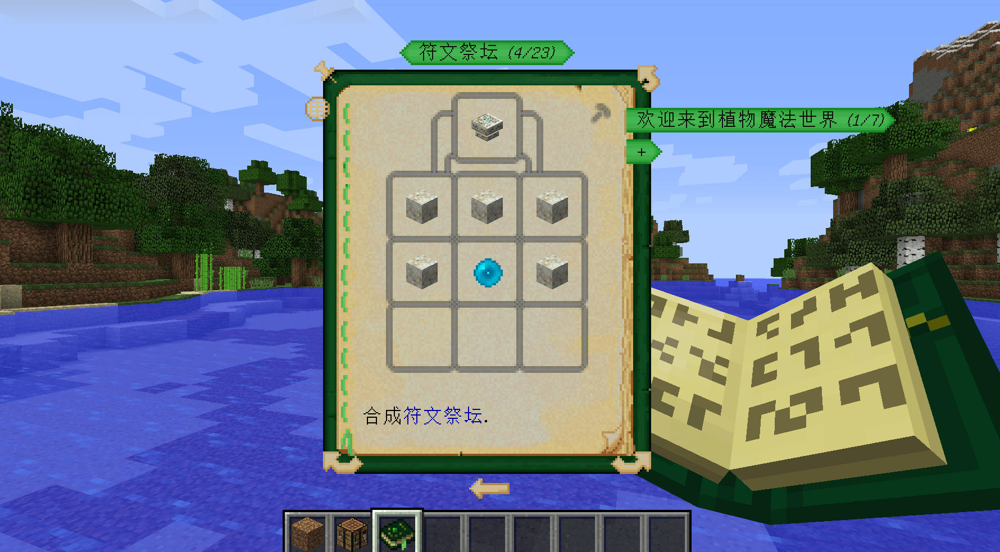
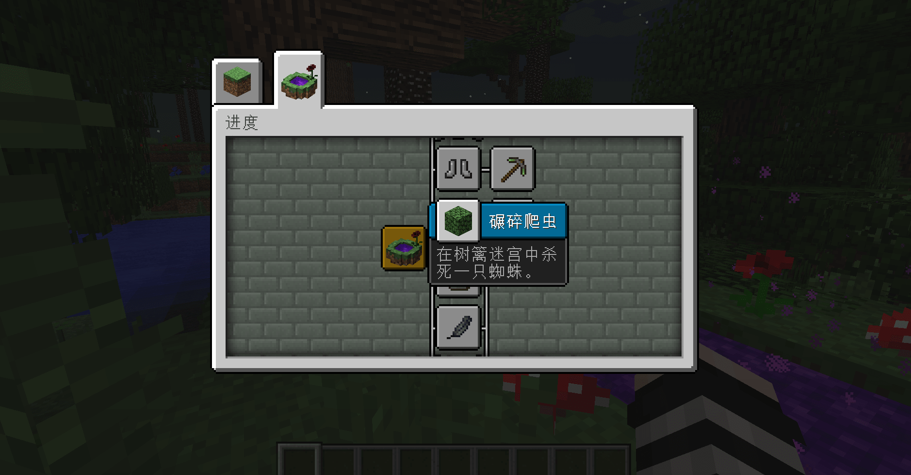
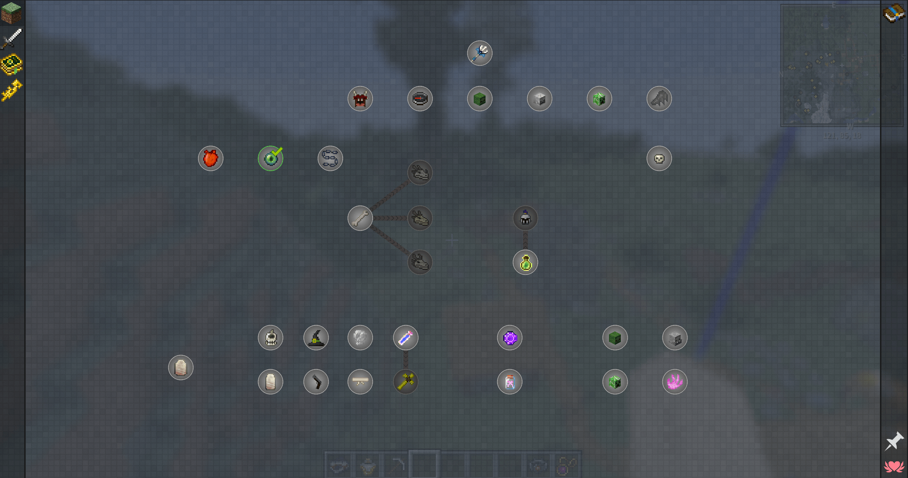
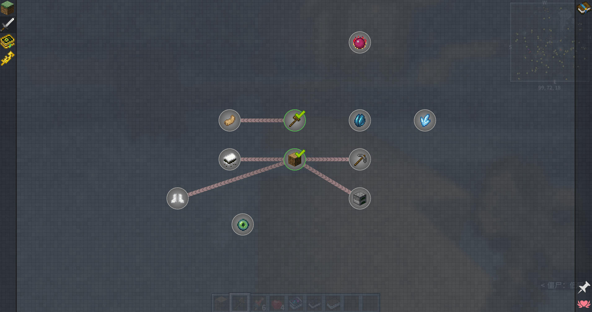

--- 
front: 
hard: Advanced 
time: 10 minutes 
--- 
# The manifestation of the new player's guide in the past in the gameplay of Minecraft 

In the original Minecraft, players basically cycled through the method of gathering > synthesis > strengthening abilities. Therefore, if the components are also designed in this way, players can naturally guide themselves with the gameplay of Minecraft itself; for example, a certain "more weapons" module adds dozens of new weapons. When players collect materials, they can synthesize these weapons to strengthen their abilities. 

 

## Gameplay manual 

Putting all the gameplay content and strategies in a book for anyone to refer to is more direct and comprehensive than a variety of interesting and interesting guidance methods. Therefore, the gameplay manual is loved by many authors and players. We can see this kind of guidance in many large-scale terminal game modules and mobile game components. 

 

For example, in the "Plant Magic" module of the PC version, a plant magic dictionary can be synthesized using a sapling and a book. When the dictionary is opened, it records all aspects of the gameplay of this module. 

 

On the first page of the dictionary, the usage of the dictionary is introduced. "You can browse the book by using the arrows at the bottom of the page, the mouse wheel, or the arrow keys on the keyboard." This simple sentence is actually an important guide. After all, if you can't even read the book, how can you understand the content in the book? 

 

The function of the directory is also very important. Players can use the directory to accurately find the content they want to learn. At the same time, the content is divided into small chapters and displayed through titles. 

 

In the gameplay manual, common forms are divided into: text information, step-by-step pictures and text, embedded synthesis table, and physical paper dolls. 

These forms also work on different gameplays. For example, the embedded synthesis table can very intuitively display the synthesis formula of items: 

 

## Rule-based achievement system 

In the PC version, Minecraft has a long-standing system: achievements. Open the achievement menu, you can see achievements connected by one or more lines. Each achievement has an icon, title and goal, and players can advance the game progress based on the achievements. 

 

In the "Dusk Forest" module of the PC version, there is also a similar achievement system. When completed, a prompt will be displayed in the upper right corner; open the achievement bar to see all the game process goals. 

 

However, compared with the goal-achieving achievement system, it does not emphasize keeping the player's gameplay fresh; instead, it is often used to introduce the game process. It sets restrictions on how players can achieve their goals, and encourages players to solve problems one by one and explore more unknown possibilities. 

 

## Mission Manual

Quest manuals are quite common in some large integrated packages of PC games. They are not only used as guides, but also as independent task systems to promote game development in most cases. These tasks may involve the content of multiple modules. 

 

This guidance method helps to arrange the learning order of players. When an integrated package comes with multiple module gameplays, it is necessary to pay attention to the player's ability to accept new information and learning speed. 

 

In the early stage of the game, there are usually some very simple and easy-to-complete tasks; only after completing these tasks can you move forward, otherwise you cannot continue the game process. It has a very strong guiding nature, which can allow players to have clear goals in the game; they are guided throughout the game process. 

