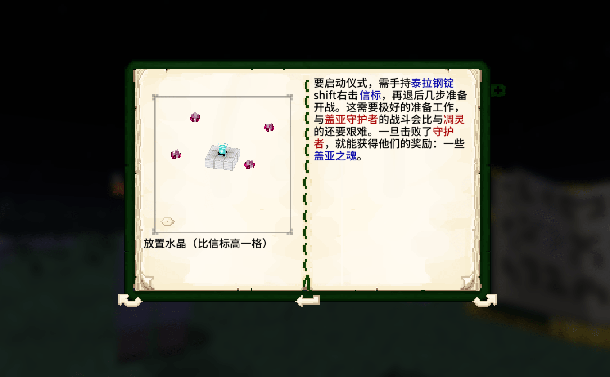

--- 
front: https://nie.res.netease.com/r/pic/20220408/7838f1a5-09a4-4a2b-9ec8-641d2dc39b03.png 
hard: Advanced 
time: 5 minutes 
selection: true 
--- 
# Guidance core of small gameplay 

Next, we will divide the gameplay into small, medium and large, and analyze how to distinguish the gameplay of different sizes and how to properly establish the guidance core. 

## Standards for small gameplay 

**In most cases, the content of the gameplay design is very close to the Minecraft game itself; **During the game, you can understand the content of the components based on the game knowledge of the original Minecraft. (Many developers will naturally lean towards the original version when designing gameplay) 

 

**Contains two or more gameplay points, and there is a gameplay loop; **In the original game, the most easy-to-understand gameplay loop is: exploration > collection > synthesis > enhancement. The most attractive part of Minecraft is that there is a multiplication relationship between gameplay and gameplay. Simple gameplay can generate a lot of new gameplay after reaction; such as the coordination between redstone and various blocks and creatures. 

 

For a small gameplay, it mainly has two or more gameplay points and can generate a loop; let’s take the "mutant creature" module as an example. The core gameplay and loop of this module are: discover and fight mutant monsters > obtain monster loot > synthesize equipment to strengthen yourself. 

## Guidance for small-scale gameplay 

Guidance for small-scale gameplay does not require excessive design, because the gameplay itself requires players to understand less content and is shallower in depth; if the gameplay is also very close to the original style, excessive guidance may even reduce the player's sense of freshness. Therefore, we should try to rely on the original guidance design: 

 

For example, if there are new creatures in the gameplay, the creatures are designed to be generated naturally under certain circumstances; for example, they will be generated together with monsters at night, so players can directly discover such creatures during the game and can attack or interact with them. This is very close to the original system. 

 

If the newly added creatures in the gameplay do not spawn naturally, but are summoned and spawned using a special method, and if the spawning method is relatively complicated, you can use an easy-to-understand gameplay manual to guide the players; 

------ 

In short, for small-scale gameplay, you can first organize the gameplay points in the components and summarize them into the original system, and use the original gameplay to explain the rewards that players get after their efforts; 

