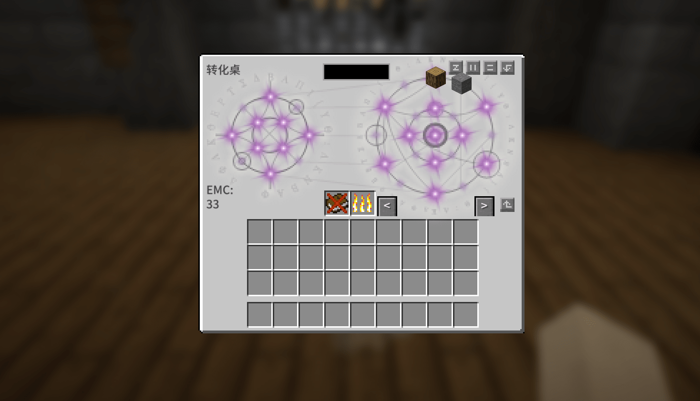
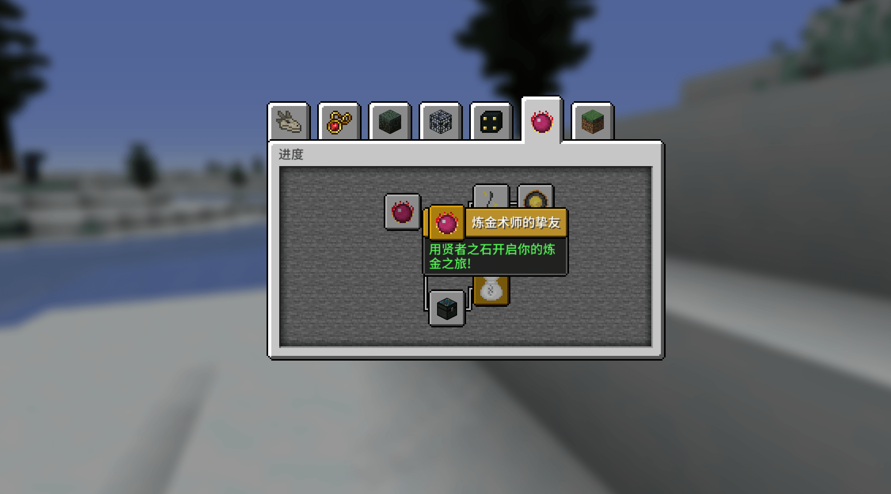
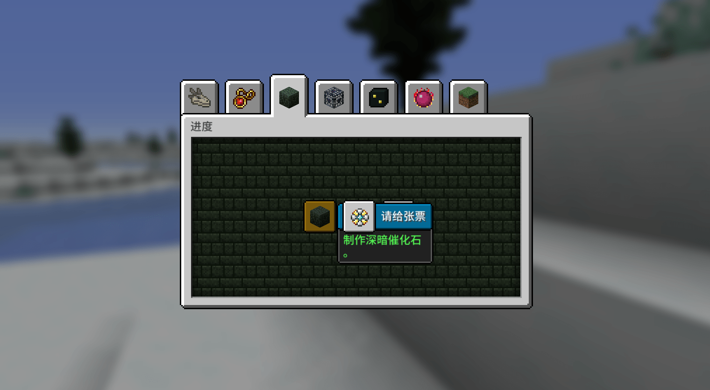

--- 
front: 
hard: Advanced 
time: 5 minutes 
--- 
# The core of medium-sized gameplay 

The biggest difference between medium-sized and small-sized gameplay is **"whether there is a self-created game system"**. Part or all of the gameplay content is separated from the original Minecraft gameplay, forming a gameplay cycle; at the same time, the gameplay process is more linear and smooth. 

 

The "Equivalent Exchange" module adds a new "currency": EMC value. You can use the exchange table to convert items in the game into EMC value, or you can use EMC value to convert any item. (Explore and Collect > Convert EMC > Use EMC) 

## Guidance for medium-sized gameplay 

Self-created and innovative game systems will bring great surprises and fun when they are slowly discovered by players. Therefore, the core of guidance needs to make people have behavioral reflexes, and use a phased approach to clearly convey it, which will help players slowly understand the gameplay during the game. 

 

Therefore, hiding the guidance under each goal, but not telling all the goals to the player at the beginning; using a rule-based achievement system is a very good way to guide. 

 

Providing achievement guidance implicitly at different times, players can slowly discover the gameplay during the exploration process, and gradually, and finally deepen and understand all the gameplay. 

------ 

In short, the gameplay is broken down into goals that players need to achieve. It does not have to be solidified and completely use rule-based achievements; it is also completely appropriate to use creativity and adapt the guidance form based on this as the core. 

