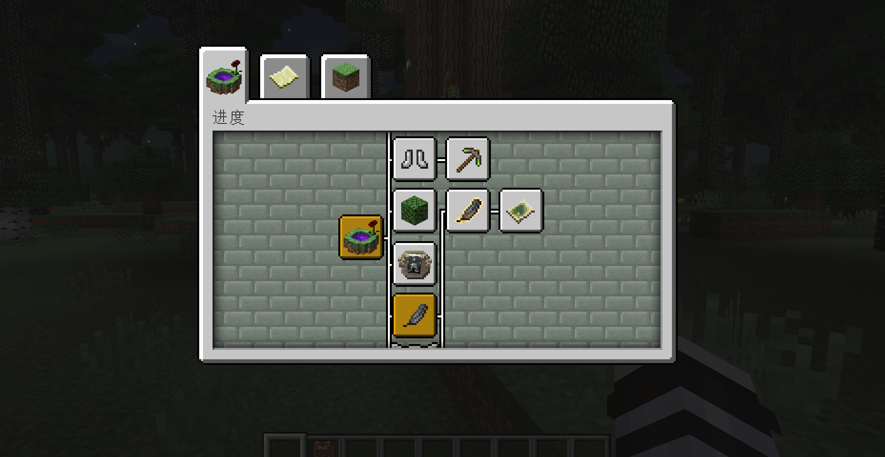

--- 
front: https://nie.res.netease.com/r/pic/20220408/b5370e55-389a-40c4-af25-d9599ec8bbfc.png 
hard: Advanced 
time: 5 minutes 
selection: true 
--- 
# The core of large-scale gameplay guidance 

The small-scale and medium-scale gameplay standards and their possible guidance methods are introduced respectively; large-scale gameplay has more content, and the guidance design that needs attention is also more complicated. 

## Large-scale gameplay standards: 

- With a relatively clear world view 
- The gameplay is constantly expanding and stacking, forming more than one gameplay loop 
- There are crossovers and jumps in the game process 
- The gameplay can be freely and flexibly adjusted according to the requirements of the players to achieve the goal 
- Make extensive use of self-created game systems 

 

"Dusk Forest" is an old large-scale gameplay module. It has been praised and repeatedly experienced by Minecraft players for its unique and clear world view. Therefore, whether a large-scale gameplay has a relatively clear world view is still relatively important. 

The gameplay loop and gameplay process have been introduced in detail in the previous small and medium-sized gameplays, so I will not elaborate on them here; 

Innovative game systems are also very important criteria for judgment. Gameplay that is too bland or "low-innovation" is also difficult to be included in large-scale gameplay. 

 

**Special collection methods in the Mysterious Age module* 

## Guidance for large-scale gameplay 

There are many settings that need to be explained in large-scale gameplay, and there is a certain depth of content. It may not be the best effect to give all of them to players directly, so the core gameplay should be given priority guidance. In the subsequent gameplay experience, it depends more on the feedback from the design, and the guidance may not always be online. 

 

In "Dusk Forest", the more intuitive guidance is the achievement system of [Progress], which lists the key nodes of each game into achievements. 

 

In the early stage of the "Mysterious Age" module, there will only be some tasks for the core gameplay in the task manual. As players become familiar with the core gameplay, the subsequent multiple stages use game design to let players remember the mechanism. 

 

**Guidance prompts that appear when obtaining specific items in the Mysterious Age module* 

------ 

With more game content, too much game guidance can easily backfire; in addition to providing necessary core gameplay guidance, learning how to adapt to the game and change the rules should subtly influence players in the actual game, which is a relatively ideal state of guidance design. 

How to design a good guide for new users requires developers to continuously research and experiment. 

