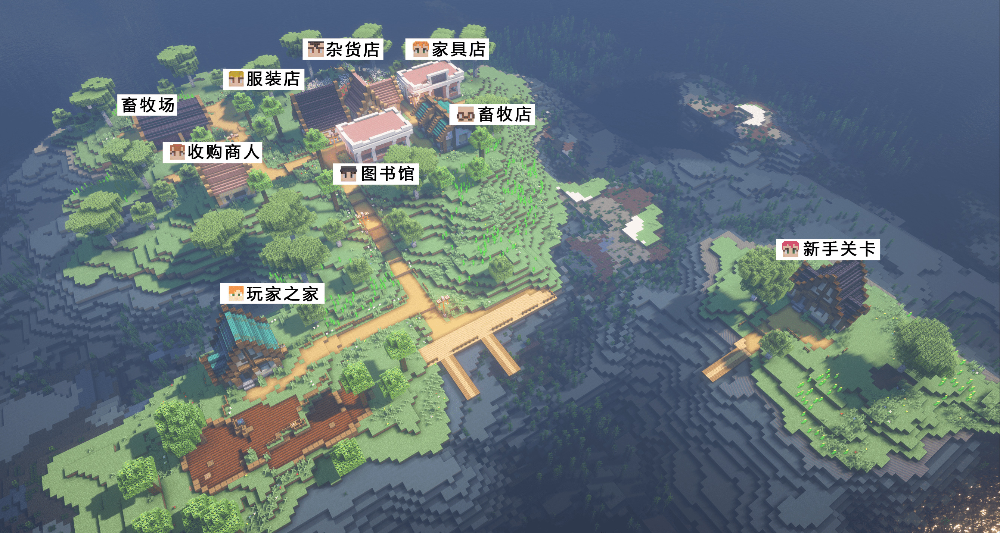

--- 
front: https://nie.res.netease.com/r/pic/20220408/67103a4f-1246-40d2-ae22-a7ba0518e16c.png 
hard: Getting Started 
time: 5 minutes 
selection: true 
--- 
# Why does the gameplay map need a novice guide? 

Gameplay maps are more limited and regular than ordinary gameplay components. That is why gameplay maps need good guidance; what are the benefits of guidance? Why is a novice guide needed? 

### Players can understand the core gameplay better and faster 

The most important point is that the guidance needs to enable players to understand the gameplay of the map without spending a lot of learning time to understand how the map is played; it can also allow players to remember the gameplay of the map more deeply. 

### Integrate the map background to enhance the sense of immersion in the game 

The proper use of the novice guide can make players understand the background of the map better and have a clearer understanding; at the same time, use some plots and text descriptions with background colors to integrate players into the story of the map and enhance the sense of immersion. 

 

For example, in the quarterly gameplay "Three Strikes on the White Bone Demon", the plot is used to understand the gameplay background through dialogue with other gameplay characters, so that players can know at the first time that they are in the world of Journey to the West and play the role of Wukong in the journey to the West. 

### Novice guide is very important, but not all gameplay maps need it 

If the core gameplay of the map is open survival, its fun is to require players to explore the world aimlessly and constantly discover new gameplay during the exploration. Then whether the novice guide is needed depends on the author of the gameplay map to judge; but it is not recommended to completely abandon the novice guide for gameplay maps with core gameplay. 

 

Take [My Seaside Farm](../../20-Gameplay Map Tutorial/Chapter 00: Example Download/Example Download.md) as an example. The main gameplay is that players can win by planting crops, raising livestock and making enough money on the island within the specified time! This goal needs to be told to the players in the novice guide. 

 

### Clarify the game content and attract players to continue in the early stage of the game 

Showing some outstanding and bright game content in the novice guide can greatly attract players to continue the game and look forward to the subsequent game content. 

