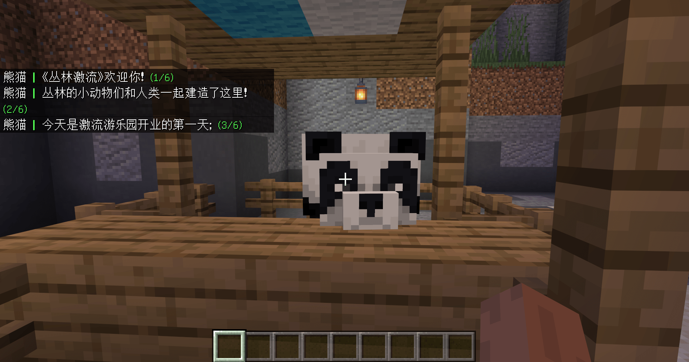

--- 
front: 
hard: Getting Started 
time: 10 minutes 
--- 
# What forms can be used to guide novices? 

There are many forms of guidance. Each developer has his or her own unique understanding of guidance. How to maximize the role of guidance requires developers to design carefully; this section will introduce a variety of guidance forms and give examples. 

Common gameplay map guidance forms can include: guidance level, NPC dialogue, plot mission, camera language, guidance manual, and others 

## Guidance level 

Disassemble some gameplay content and guide players to operate step by step in the level to familiarize themselves with the core gameplay of the game. Usually, the guidance level will appear before the game officially starts; if the gameplay is complex and there is not only one core gameplay, there can be multiple guidance levels and they will appear at different stages of the game. 

 

In [My Seaside Farm](../../20-Gameplay Map Tutorial/Chapter 08: Adding a Guide Level at the Beginning/Course 01. Using MODSDK to Customize NPC Chat Dialogue.md), the player will first appear on the Novice Island. The player needs to talk to the NPC to briefly understand the gameplay background of the map; then, under the guidance of the NPC, complete some simple operations: planting vegetables, collecting stones, and upgrading buildings; these are all loop gameplay in the official game. 

 

After completing these simple operations, the player can take a boat to leave the Novice Island and officially start the game. 

## NPC Dialogue 

In some RPG/survival-type gameplay maps, there are often some NPC characters related to the plot or story background. Through these NPC dialogues, players can be reminded of the game content that they need to pay attention to; at the same time, adding dialogue plots can also bring in the background of the game and enhance the player's sense of involvement in the map. 

 

 

## Story Quests 

This form of guidance should be familiar to most players and developers. Many maps and games other than Minecraft have story quests to a greater or lesser extent. 

For maps with story quests as the main line throughout the entire gameplay, there is no need for too much guidance. Players can explore the game step by step according to the quest prompts. Of course, quest prompts can also be considered a form of guidance. 

 

## Camera Language 

By controlling the player's camera, use the camera language to convey information and guide the player. 

For example, directly control the player to look at a certain place and directly guide the player to the target location; although it is relatively blunt, it is also the most intuitive and simple. 

## Guidance Manual 

Place a guidance manual in the game lobby and list the game content in the manual for players to read; you can learn almost all the game content before starting the game. Compared with other guidance forms, this is one of the simplest guidance and is also very popular among developers and players. It is very suitable for small game maps. 

Of course, you can also provide a guide manual during the game, and players can read it at any time during the game. 

## Others 

Add guidance in some places where players need to wait, such as adding tips on gameplay skills when players die or revive in PVP maps. 

 

Or add jumpy text prompts appropriately, and display them on the player's screen every once in a while or when the player reaches a certain stage. 

Although it is very blunt and direct, it will produce different effects when combined with other forms of guidance. 

