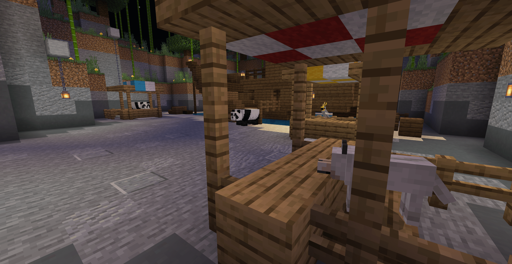
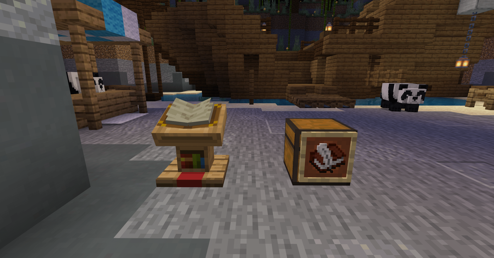

--- 
front: 
hard: Advanced 
time: 40 minutes 
--- 
# Add guides to the mini-game map 

Let's make a mini-game map DEMO and add some guides to the lobby of this map. 

Click [link](https://g79.gdl.netease.com/Jungle_Demo.zip) to download the map demo of this chapter. 

## Add NPCs to the lobby 

First, make a simple lobby scene. The map name is "Jungle Rapids", which is a relaxing "water racing" gameplay map; and the game scene setting is an amusement park style, so add several amusement park stalls in the lobby, and the guide NPC will be placed here. 

 

Add several NPCs in the form of small animals in the lobby: panda, parrot, wolf. 

> For a gameplay map with a game background or world view, it is also important to unify the style of all game elements; 

 

## Create a UI and add a guide manual 

The guide manual can be presented in many ways. The simplest way is to write the guide text on the [Book and Pen] and put it in a more "conspicuous" position in the game. However, this time we placed an NPC, so we need to make a UI to display the UI when the player interacts with the NPC. 

 

Open the interface editor of the Minecraft development workbench and create the guide manual interface and the welcome interface; 

 

The welcome interface is mainly filled with some basic introductions and simple guides for the map; of course, what content is actually needed is still determined by the guide design and developer habits. 

The guide manual needs multiple pages, and the gameplay content is listed here for players to read and learn. In most cases, mini-game maps do not need a manual, because both the scene and the gameplay are limited. Players will definitely discover and experience them during the game. After all the content is understood by the players, they may lose a certain sense of freshness when they actually play. 

 

 

**After making the UI, we need to "connect" the UI with the NPC:** 

Create the UI script file FlumeRideInfoUI.py and inherit the ScreenNode class 

```python 
# -*- coding: utf-8 -*- 
import mod.client.extraClientApi as clientApi 
ViewBinder = clientApi.GetViewBinderCls() 
ViewRequest = clientApi.GetViewViewRequestCls()

ScreenNode = clientApi.GetScreenNodeCls() 

class FlumeRideInfoUI(ScreenNode): 
def __init__(self, namespace, name, param): 
ScreenNode.__init__(self, namespace, name, param) 
``` 

Create FlumeRideServerSystem.py, FlumeRideClientSystem.py 

```python 
# -*- coding: utf-8 -*- 

import mod.server.extraServerApi as serverApi 
ServerSystem = serverApi.GetServerSystemCls() 

class FlumeRideServerSystem(ServerSystem): 
def __init__(self, namespace, systemName): 
ServerSystem.__init__(self, namespace, systemName) 
# Get the NPC creature ID placed in the lobby in advance and save it here to determine the NPC that the player interacts with 
self.npcIdList = {"panda": "-85899345885", "panda2": "-158913789845", "parrot": "-158913789915", "wolf": "-158913789911"} 

nameSpace, systemName = serverApi.GetEngineNamespace(), serverApi.GetEngineSystemName() 
# Listen for PlayerAttackEntityEvent events 
self.ListenForEvent(nameSpace, systemName, "PlayerAttackEntityEvent", self, self.PlayerAttackEntityEvent) 

# Triggered when a player attacks a creature 
def PlayerAttackEntityEvent(self, args): 

# The creature ID of the player attack obtained by the event 
playerId = args['playerId'] 
entityId = args['victimId'] 

# Determine different NPC creatures 
if entityId == self.npcIdList["panda"]: 
# Send events to the client, open the UI, and transmit the dictionary parameter UIType to determine the creatures that the player interacts with to open different UIs 
self.NotifyToClient(playerId, "OpenGameInfoUI", {"UIType": "panda"}) 

elif entityId == self.npcIdList["panda2"]: 
pass 

elif entityId == self.npcIdList["parrot"]: 
pass 

elif entityId == self.npcIdList["wolf"]: 
self.NotifyToClient(playerId, "OpenGameInfoUI", {"UIType": "wolf"}) 

``` 

Add the event of the player attacking the creature in the server script and judge. If it is an NPC in the lobby, transmit the event to the client to create the UI. 


```python
# -*- coding: utf-8 -*-

import mod.client.extraClientApi as clientApi
ClientSystem = clientApi.GetClientSystemCls()

class FlumeRideClientSystem(ClientSystem):
    def __init__(self, namespace, systemName):
        ClientSystem.__init__(self, namespace, systemName)
        print "Client initialization"
        nameSpace, systemName = clientApi.GetEngineNamespace(), clientApi.GetEngineSystemName()
        # Listen to the UiInitFinished event
        self.ListenForEvent(nameSpace, systemName, "UiInitFinished", self, self.UiInitFinished)
        # Listen to the OpenGameInfoUI event passed by FlumeRideServerSystem
        self.ListenForEvent("FlumeRide", "FlumeRideServerSystem", "OpenGameInfoUI", self, self.OpenUI) 

# OpenGameInfoUI event passed by FlumeRideServerSystem 
# When the player interacts with the NPC, determine the type of the NPC being interacted with and open the corresponding UI 
def OpenUI(self, args): 
UIType = args['UIType'] 
if UIType == "panda": 
clientApi.PushScreen("FlumeRide", "FlumeRideGameInfo") 
elif UIType == "wolf": 
clientApi.PushScreen("FlumeRide", "FlumeRideGameBook_1") 

# UI initialization is complete, register the UI 
def UiInitFinished(self, args): 
clientApi.RegisterUI("FlumeRide", "FlumeRideGameInfo", "Script_FlumeRide.uiScript.FlumeRideInfoUI.FlumeRideInfoUI", "GameInfo.main") 
clientApi.RegisterUI("FlumeRide", "FlumeRideGameBook_1", "Script_FlumeRide.uiScript.FlumeRideInfoUI.FlumeRideInfoUI", "GameBook.main") 
clientApi.RegisterUI("FlumeRide", "FlumeRideGameBook_2", "Script_FlumeRide.uiScript.FlumeRideInfoUI.FlumeRideInfoUI", "GameBook_2.main") 

``` 

Now, we can open the UI interface by attacking the creatures in the lobby. 

 

Simply modify the UI file and bind the close button and the page-turning button of the guide manual to a function in the FlumeRideInfoUI.py script file. 

```json 
// ... 
// UI file 
// Close button control 
"GameInfoButton@common.button" : { 
// ··· 
// Function triggered when the bound button is pressed %ScreenNode script. Function name 
"$pressed_button_name" : "%FlumeRideInfoUI.ClickedCloseButton", 
// Need to be deleted 
"button_mappings" : [], 
// ...

}, 
// The same goes for the page turn button 
``` 

```python 
# -*- coding: utf-8 -*- 
# ... 
class FlumeRideInfoUI(ScreenNode): 
def __init__(self, namespace, name, param): 
ScreenNode.__init__(self, namespace, name, param) 

# Bind the close button 
@ViewBinder.binding(ViewBinder.BF_ButtonClickUp) 
def ClickedCloseButton(self, args): 
clientApi.PopScreen() 

# Bind the page turn button 
@ViewBinder.binding(ViewBinder.BF_ButtonClickUp) 
def ClickedPageTurnButton(self, args): 
GameBook1UI = clientApi.GetUI("FlumeRide", "FlumeRideGameBook_1") 
GameBook2UI = clientApi.GetUI("FlumeRide", "FlumeRideGameBook_2") 
if GameBook1UI: 
clientApi.PopScreen() 
clientApi.PushScreen("FlumeRide", "FlumeRideGameBook_2") 
elif GameBook2UI: 
clientApi.PopScreen() 
clientApi.PushScreen("FlumeRide", "FlumeRideGameBook_1") 

``` 

 

## Add NPC dialogue 

Next, add a dialogue for another NPC, briefly describe the map background and guidance. 

```python
# -*- coding: utf-8 -*-

import mod.server.extraServerApi as serverApi
ServerSystem = serverApi.GetServerSystemCls()
commandComp = serverApi.GetEngineCompFactory().CreateCommand(serverApi.GetLevelId())

class FlumeRideServerSystem(ServerSystem):
    def __init__(self, namespace, systemName):
        ServerSystem.__init__(self, namespace, systemName)
        #...
        #Listen to the PlayerAttackEntityEvent event
        self.ListenForEvent(nameSpace, systemName, "PlayerAttackEntityEvent", self, self.PlayerAttackEntityEvent)
        # Listen to the ClientLoadAddonsFinishServerEvent event

self.ListenForEvent(nameSpace, systemName, "ClientLoadAddonsFinishServerEvent", self, self.DataInit) 

# Triggered when the player client is loaded, create player data 
def DataInit(self, args): 
# Player ID obtained by the event 
playerId = args['playerId'] 
# Get the player's data 
playerDataComp = serverApi.GetEngineCompFactory().CreateExtraData(playerId) 
pandaMsgData = playerDataComp.GetExtraData("pandaMsg") 
# If this player has no data, set one 
if not pandaMsgData: 
playerDataComp.SetExtraData("pandaMsg", 0) # Used to determine the player's dialogue stage 

# Triggered when the player attacks a creature 
def PlayerAttackEntityEvent(self, args): 

def Panda2Guide(): 
# Get the player's name 
playerNameComp = serverApi.GetEngineCompFactory().CreateName(playerId) 
playerName = playerNameComp.GetName() 
# Get the player's pandaMsg data 
playerDataComp = serverApi.GetEngineCompFactory().CreateExtraData(playerId) 
pandaMsg = playerDataComp.GetExtraData("pandaMsg") 
commandComp.SetCommand("playsound random.orb " + playerName + " ~ ~ ~ 3 1 1") 
# Trigger different dialogue branches according to the player's current dialogue stage 
if pandaMsg == 0: 
# Generate dialogue using the command interface 
commandComp.SetCommand('tellraw ' + playerName + ' {"rawtext":[{"text":"Panda §a§l| §r§f《Jungle Rapids》Welcome you! §a(1/6)"}]}') 
elif pandaMsg == 1: 
commandComp.SetCommand('tellraw ' + playerName + ' {"rawtext":[{"text":"Panda §a§l| §r§fThe jungle animals and humans built this place together! §a(2/6)"}]}') 
elif pandaMsg == 2: 
commandComp.SetCommand('tellraw ' + playerName + ' {"rawtext":[{"text":"Panda §a§l| §r§fToday is the first day of the opening of the rapids amusement park; §a(3/6)"}]}') 
elif pandaMsg == 3: 
commandComp.SetCommand('tellraw ' + playerName + ' {"rawtext":[{"text":"Panda §a§l| §r§fMiss Parrot will teach you how to be more flexible on the water track §a(4/6)"}]}') 
elif pandaMsg == 4: 
commandComp.SetCommand('tellraw ' + playerName + ' {"rawtext":[{"text":"Panda §a§l| §r§fYou can also ask Mr. Wolf about everything about the jungle rapids. He knows everything §a(5/6)"}]}') 
elif pandaMsg == 5: 
commandComp.SetCommand('tellraw ' + playerName + ' {"rawtext":[{"text":"Panda §a§l| §r§fOf course, don't forget to invite your friends to enjoy this happy game time together! §a(6/6)"}]}') 
# Reset data and return after the last dialogue 
playerDataComp.SetExtraData("pandaMsg", 0) 
return 
# Update current data +1 
pandaMsg += 1
            playerDataComp.SetExtraData("pandaMsg", pandaMsg)

        playerId = args['playerId']
        entityId = args['victimId']

        if entityId == self.npcIdList["panda"]:
            #...

elif entityId == self.npcIdList["panda2"]: 
Panda2Guide() 
elif entityId == self.npcIdList["parrot"]: 
# ... 
elif entityId == self.npcIdList["wolf"]: 
# ... 

``` 

 

Using [commands] to achieve this dialogue effect is relatively weak in expression. It would be better if it were replaced by UI; but it would be very simple to implement. If you are not familiar with UI, you can use this method. 

## Control the camera to introduce the content 

There is one last NPC left: the parrot; it will lead the player to watch and explain the scenes and content in the game. 


```python
# -*- coding: utf-8 -*-

import mod.server.extraServerApi as serverApi
ServerSystem = serverApi.GetServerSystemCls()
timerComp = serverApi.GetEngineCompFactory().CreateGame(serverApi.GetLevelId())
commandComp = serverApi.GetEngineCompFactory().CreateCommand(serverApi.GetLevelId())

class FlumeRideServerSystem(ServerSystem):
    def __init__(self, namespace, systemName):
        ServerSystem.__init__(self, namespace, systemName)
        #...
        
    def DataInit(self, args):
        #...
        if not pandaMsgData: playerDataComp.SetExtraData("pandaMsg", 0) 
# Add new data to determine the stage of the parrot's explanation 
playerDataComp.SetExtraData("parrotMsg", 0) 

def PlayerAttackEntityEvent(self, args): 

def ParrotGuide(): 
# Get the player's name 
playerNameComp = serverApi.GetEngineCompFactory().CreateName(playerId) 
playerName = playerNameComp.GetName() 
# Get the player's parrotMsg data 
playerDataComp = serverApi.GetEngineCompFactory().CreateExtraData(playerId) 
parrotMsg = playerDataComp.GetExtraData("parrotMsg") 
# Trigger different explanation branches according to the player's current explanation stage 
if parrotMsg == 0:

# Teleport player 
commandComp.SetCommand("tp " + playerName + " 29.5 80 -242.5 -20.4 31.4") 
# Send event to client to lock player's control 
self.NotifyToClient(playerId, "PlayerCamera", {"Camera": "Lock"}) 
# Generate dialogue using command interface 
commandComp.SetCommand('tellraw ' + playerName + ' {"rawtext":[{"text":"Parrot §e§l| §r§fThis is a motorboat, you need to drive it to gallop on the jungle river §a(1/3)"}]}') 
elif parrotMsg == 1: 
commandComp.SetCommand("tp " + playerName + " 23.6 79 -252.5 54.1 16.4") 
commandComp.SetCommand('tellraw ' + playerName + ' {"rawtext":[{"text":"Parrot §e§l| §r§fIn the jungle, you will see the lucky Q block. Shooting it with a crossbow will cause a random event §a(2/3)"}]}') 
elif parrotMsg == 2: 
commandComp.SetCommand("tp " + playerName + " 33.4 112 -136.4 -162.6 -7.8") 
commandComp.SetCommand('tellraw ' + playerName + ' {"rawtext":[{"text":"Parrot §e§l| §r§fSkillfully control the motorboat, accurately shoot the lucky Q block, and rush through the jungle! §a(3/3)"}]}') 
elif parrotMsg == 3: 
commandComp.SetCommand("tp " + playerName + " 22 68 -254 -114.8 0.9") 
# After the explanation, unlock the player's control 
self.NotifyToClient(playerId, "PlayerCamera", {"Camera": "UnLock"}) 
# Reset the stage data and return 
playerDataComp.SetExtraData("parrotMsg", 0) 
return 
commandComp.SetCommand("playsound random.orb " + playerName + " ~ ~ ~ 3 1 1") 
# Update the current data +1 
parrotMsg += 1 
playerDataComp.SetExtraData("parrotMsg", parrotMsg) 

playerId = args['playerId'] 
entityId = args['victimId'] 

if entityId == self.npcIdList["panda"]: 
# ... 
elif entityId == self.npcIdList["panda2"]: 
# ... 
elif entityId == self.npcIdList["parrot"]: 
# Trigger ParrotGuide four times, using the timer interface to achieve delayed triggering 
ParrotGuide() 
timerComp.AddTimer(10, ParrotGuide) 
timerComp.AddTimer(20, ParrotGuide) 
timerComp.AddTimer(30, ParrotGuide) 
elif entityId == self.npcIdList["wolf"]: 
# ... 
``` 

```python 
# -*- coding: utf-8 -*- 

import mod.client.extraClientApi as clientApi 
ClientSystem = clientApi.GetClientSystemCls() 

class FlumeRideClientSystem(ClientSystem): 
def __init__(self, namespace, systemName): 
        ClientSystem.__init__(self, namespace, systemName)

# Listen for PlayerCamera events from FlumeRideServerSystem 
self.ListenForEvent("FlumeRide", "FlumeRideServerSystem", "PlayerCamera", self, self.PlayerCamera) 

# Used to lock and unlock player control 
def PlayerCamera(self, args): 
# Get the player control interface 
controlComp = clientApi.GetEngineCompFactory().CreateOperation(clientApi.GetLevelId()) 
if args["Camera"] == "Lock": 
controlComp.SetCanAll(False) 
elif args["Camera"] == "UnLock": 
controlComp.SetCanAll(True) 
``` 

This form is very intuitive and vivid; the camera can be static or dynamic; the blocks, creatures and other contents in the camera can also be enhanced through animation. Very suitable for design guidance! 

## Others 

Adding logos to some interactive or gameplay entities and blocks will be more intuitive: 

 

