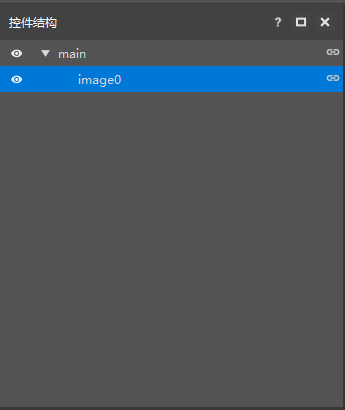

# What you need to prepare for UI production 

## Prepare tools 

### My World Development Workbench (MC Studio) 

**【Official download address: [https://mc.163.com/dev/](https://mc.163.com/dev/)】** 

This is an auxiliary software that can help us visually edit the game interface. It can import our drawn materials in real time for editing in the software, and directly display many interfaces that could only be adjusted in code or other software in the past in the game interface, so that creators can see the interface effects they have drawn more intuitively. 

 

- **The main interface of the interface editor of My World Development Workbench (MC Studio). ** 

#### Toolbar 

 

It integrates various types of interface control tools. We only need to click the icon above according to the function we need, and a corresponding function button will be automatically added to the interface. 

#### Interface file list 

 

To operate in the interface editor, you must have an interface file, which can be newly created or imported in json format for editing. 

### **Control structure** 

 

This function is mainly to make what we create more intuitive and convenient for finding and modifying. The structural arrangement of controls will affect the use in the game, and the creator needs to arrange them carefully. 

### **Interface properties** 

 

To adjust the properties of each interface in detail, the creator can choose to directly drag the corresponding control with the mouse to adjust the position, or select the control and adjust the detailed value in the property bar on the right. 

### **Interface properties** 

 

Mainly used to store interface images created by players themselves, so that players can more quickly select the required images for modification and use. 

## Image editing software 

Here we mainly recommend two commonly used software on computers. As for other image processing software, as long as you are used to it, you can use similar software even on your mobile phone to achieve the desired effect. 

### PhotoShop 

 

Currently the mainstream image processing software, not only draws pixel patterns, but also processes images more conveniently than other software. 

### Aseprite 

 

A software specifically used for drawing pixel maps, the main feature is the drawing of pixel images, which is easier to use than PS and more suitable for drawing graphics.