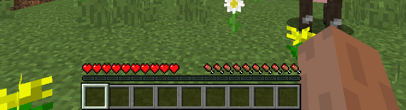

# Typical UI positioning and examples 

## High-frequency viewing but no interaction 

As the name implies, this type of UI requires players to pay attention to it frequently, but they do not need to operate it. This type of UI is generally used to display various values related to players in real time. This type of UI needs to ensure that players can easily view it without being blocked and without confusion. It usually needs to update the content dynamically. 

### Health bar/hunger value 

The original health bar and hunger value are the most typical content that needs to be viewed frequently, but does not require players to interact. Players need to quickly understand their own status. 

 

### Equipment durability 

Intuitively reflects the durability value of the equipment. The original version only uses a method similar to a progress bar to display it. Some developers obtain the equipment durability value and display it in other positions on the screen to more intuitively display the specific durability value of the equipment. 

 

### Minimap 

This is part of the module content, which can help players explore the world better. Through the minimap, players can know their location more intuitively, which is convenient for players to explore. 

 

## High-frequency viewing and interaction 

Players need to see the content intuitively and interact with the content. This type of content usually accounts for a small proportion of the UI, and is mainly concentrated in the area that is easy to click. 

### Quick Inventory 

The quick inventory is a typical high-view and interactive area in the original version. Players need to frequently check the inventory to quickly determine the next target. Commonly used props will also be placed in the quick inventory for easy switching. 

 

### Component Level 1 Button 

Operation buttons require players to click a lot to control the character. At the same time, players can also judge the current status of the character based on the button feedback. Some modules also use button UI to release skills, making it more convenient for players to operate. 

 

## Low-frequency viewing and interaction 

The content that needs to be viewed occasionally is mostly the secondary menu button entered through the primary menu, which is mostly used for backpacks and the UI interface opened after interacting with other items. 

### Game Settings Button 

Game settings are very common low-view buttons. Players usually click them only when they need to set up the game. After clicking, they enter the full-screen UI mode and cannot operate the character, so players will not click buttons a lot. 

 

### Backpack button 

The backpack is also entered by clicking the button next to the quick item bar. When the backpack UI is opened, the player cannot operate the game character, so that after entering the backpack mode, the player can adjust the items in the backpack more conveniently and attentively. 

