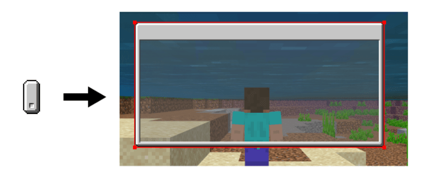
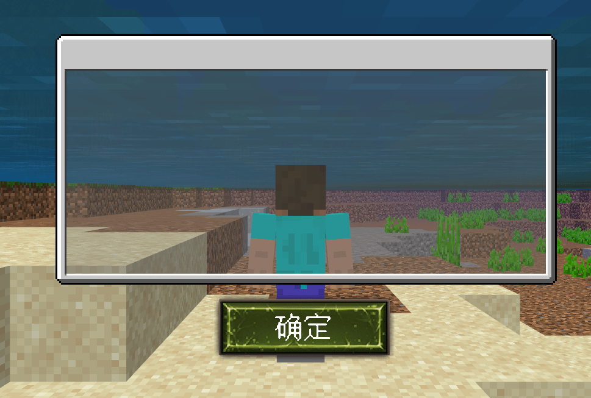

# Points to note 

## Use the Nine-grid to create adaptive content 

The Nine-grid is a method often used to draw UI. The benefits of the Nine-grid are: 

- It is simple to draw, but it requires a certain amount of imagination. You need to consider what it will look like after using the Nine-grid when drawing. 

- The size can be stretched at will, and the edges will change with the length and width. 

- The image resolution is small and takes up less memory. 

The original version of Minecraft has a large amount of UI content that is made using the Nine-grid method. The Nine-grid only needs to set the pixels of the four edges to adapt to the screen, which is very convenient for later modification and material reuse. 

 

## Shows a clear sense of pixels 

Because the game's main UI interface is a 16x16 resolution, the lack of pixel sense caused by too high a resolution is more abrupt for players. 

For hand-drawn pixel UI, it is recommended that the resolution should not exceed 32x32. If it exceeds this, the pixel sense will not be so strong, and the overall UI style may be out of touch with the original because the UI looks too smooth. 

 

## Pay attention to the safe area of the screen 

Try not to set the UI or close button on the edge of the screen and set the button very small, because some screens have a safe area concept, especially curved screens. The safe area is a special area set by the mobile phone to prevent players from touching the edge and making mistakes. Clicking this area is invalid. 

Therefore, when designing the button position, try to keep a certain distance from the edge of the screen to prevent the button from being unable to be clicked on some models.