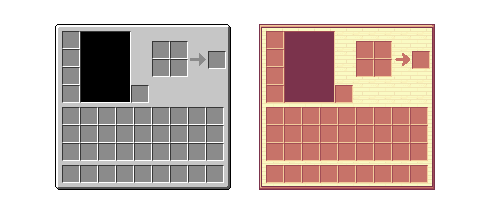

# Combination of UI design and theme elements 

## Cartoon casual style 

In Chapter 7, we discussed how to express cartoon casual style. Cartoon style is actually to increase saturation, and then keep the texture as simple as possible, without too many complex patterns. 

### UI design style 

Here we take the original backpack bar as an example 

 

We did not modify this UI, but just changed the color. The right side was changed to a warm orange-red color with a higher saturation than gray, which gives people a more cartoon-like feeling than the original item bar frame. 

If you want to further differentiate the original UI, you can make some bigger adjustments, such as modifying the border and adding some wood textures in the blank space. 

 

Of course, if you want to emphasize your personal style, you can even draw some subjective pixel paintings in the area where the character paper dolls are placed to add some atmosphere. 

 

The above are just some tips for drawing the original material. In the custom UI, we can be more bold when designing and make something that doesn't look so square on it. 

 

The above is a cartoon-style material pack made according to the style of the material. The texture of the entire material is modified by drawing some simple patterns.