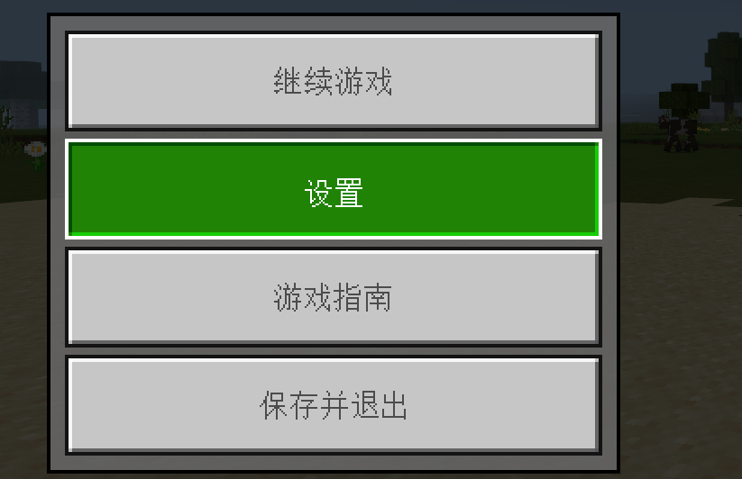

# Common UI Use Cases 

## Button 

The button we usually refer to is a UI that gives feedback after a click. For example, the OK button is a very common way to use the button function. But in fact, most of the interactions in the UI are composed of different button components. It is not only the buttons that give user feedback that are button components, so we need to selectively use button functions according to different scenarios. 

### Default: Button Appearance When No Operation 

The appearance of the button when there is no operation. If the button cannot be filled with text, the pattern of the button itself needs to be recognizable enough, and others can roughly understand the function of the button through the button pattern. 

 

The original button uses color and drawing methods to make this button look like it is protruding, which can easily make people think that this picture is clickable. 

### Press: Button Appearance Feedback after Pressing 

When the button is pressed, it needs to give the user interactive feedback, which is commonly changed by changing the color and size of the button. When pressed, it needs to be more obviously different from the normal button. 

 

After the original button is pressed, the surrounding stroke color turns white, and the original gray-white button turns green to be more conspicuous. The color drawing also changes from convex to concave. It can be seen that the edge above the pressed button icon is dark, and the lower half is bright. The color is the opposite of the normal button, which gives people a concave feeling visually. 

### Highlight: Distinguish the appearance of other similar buttons (for mouse operation) 

Highlighting is generally used to feedback the button module where the user's mouse is currently hovering. At the same time, it reminds the user that the button here is in a state where it can be clicked and interacted. The highlight needs to be clearly different from the default button appearance, but it also needs to be different from the appearance of the pressed button. 

 

When the mouse hovers over the original button, it will display the same green color as when it is pressed. It is basically the same as when it is pressed. The difference is that the highlight is drawn in a way that the upper edge of the button is bright and the lower edge is dark. This gives the user a convex visual effect, which can reasonably distinguish the appearance of the highlight and the pressed button. 

### Disable: Unusable button 

Remind the player that this button cannot be interacted with. Generally, the color of the disabled button is as close to the background color as possible, which is more inconspicuous than the clickable button. At the same time, the disabled button will not have any highlight feedback when the mouse hovers over it, and there is no interactive feedback when it is clicked. 

 

The original disabled content uses a light gray close to the dark gray of the background, which is more inconspicuous than the clickable button. At the same time, some disabled content is drawn in a concave way to distinguish it from the ordinary clickable buttons, so that users can understand at a glance which button is clickable and which button is not clickable. 

## Text 

Text is necessary for beautifying the layout and enriching the content. When the picture cannot clearly convey all the required information, text is needed to supplement the information that the picture cannot display. Therefore, text is an indispensable part of the UI. Let's take a look at the basic methods of using text. 

### Use of rich text 

Pure text is relatively boring to read, so you can insert some pictures in the text, including some jump links to help users read and understand more conveniently. 

 

The original game guide displays the UI icons directly in the middle of the text, which is easier for players to understand than text. 

### Font/font size selection 

Usually, we use the default font and font size. Generally, there is no special need to set the font size. If the font size needs to be different, it is best not to exceed 2 times the size difference, otherwise the larger text will be too eye-catching and the smaller text will be ignored. 

### Text layout design 

Any text is not easy to read without typesetting. The simplest typesetting is to wrap the line, distinguish the title and content, and separate the large paragraphs that have no connection between them. 

 

## Scroll list 

 

### Imply slidable 

The length of the scroll list should not just display all the content. It needs to display half of the content. For example, the length of the sliding box should not display 8 lines of items, but 7 and a half lines of items. In this way, users can naturally associate the half-cut content with sliding down the screen to view the incomplete content. 

## Affixes (Tips) 

 

### Improve the aesthetics of the design 

Usually, Tips are invisible. Players can only display the information we want to know by clicking on a specific UI. And when it is displayed for a period of time or clicks on other UIs, it will be hidden and will not block players from observing the main UI content. Because displaying a large amount of text descriptions in the UI is very detrimental to the aesthetics, so for a lot of information that requires text descriptions but does not need to be displayed on the UI for a long time, we can consider making it into Tips to simplify the UI and improve the aesthetics of the UI.