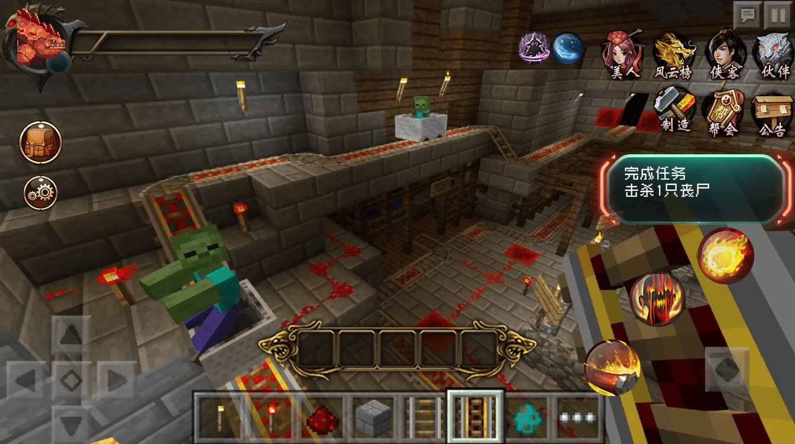
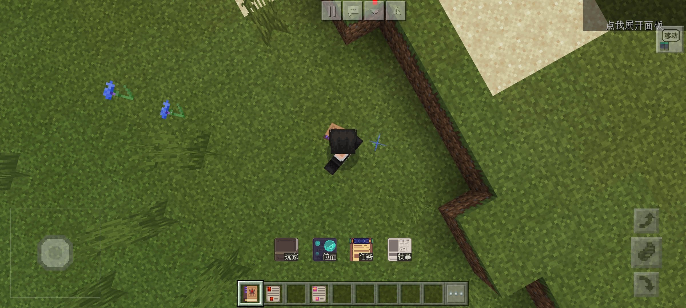

# Points to note in UX design 

## Note content 

We need to consider UX design when designing UI. UX stands for user experience, because all our UIs are user-oriented. Only by being relatively reasonable can we improve the user's gaming experience. 

### Reduce the number of primary UI interfaces 

My world is a game with a large number of derivative modules, so developers should try to keep the primary interface as tidy as possible, put some UI interfaces that do not need to be displayed in real time and have low review rates into the secondary or tertiary UI, and make the primary UI as simple as possible to have better component adaptability. If every developer puts all his UIs on the primary interface, then players only need to add a few components to cause the entire screen to be a different UI. 

 

（Negative example)
 

The component <Weird Record> takes this into account in UI design, so the primary interface is also hidden. The primary menu will only pop up from the inventory when the player holds the Weird Record. Although the interface of Weird Record is simple, because it is a component with an RPG style, the player's health cannot be perfectly displayed by the original red heart. Therefore, they added a simple health bar and hunger bar to the player in the position of the original health bar, which is more convenient for players to display large values of health. At the same time, they considered the compatibility with other components and reserved commands. Players can hide the health display of Weird Record by entering commands, so that there will be no conflict with other components to the greatest extent. 

 

### Keep the menu interface in the same position as much as possible 

A typical example is the close button. If the close button of your first-level menu is on the left, and your second-level menu close button suddenly changes to the right, and the third-level menu button moves to the middle of the screen, the user needs to click all over the screen when clicking the button, which undoubtedly increases the difficulty of the user's click. 

### Reduce the steps that require a lot of operation 

Designs that can be achieved in one step should not be completed in many steps. For example, if your component is transmitted through the UI, and players often use this transmission function, then you should not put the transmission interface in the third or fourth level interface, and do not let players open the main interface UI first, then find the transmission category in a bunch of categories, and then use the search button to enter the coordinate name in a bunch of transmission points to find the location they want to transmit to for operation. We should directly find the required transmission function under the first-level menu or the second-level menu, and determine the display order of the transmission points according to the time when the player sets the transmission point and the frequency of use, so as to help players quickly find the desired transmission target. 

### Consider the operating habits of different terminals 

The operating habits of the computer and mobile terminals are very different. 

Computer game players mainly rely on the keyboard to operate, while most mobile players rely on finger clicks on the screen. 

The computer player's display is larger, so it can support more UI display, while the mobile terminal needs to try to avoid too much UI display on the screen to cause players to touch it by mistake. 

The computer module needs to mark on the UI which key on the keyboard can directly open the UI, while the mobile phone does not need it. However, the computer version needs to be distinguished from the original keys and cannot occupy the keys used by the original keys. 

## Benefits of unified UX standards 

### Reduce player learning costs 

Here is the simplest example. On the computer side, WASD is generally used as the control direction key. Basically, all 3D games control the movement of the character in this way, and the space bar is for jumping. Therefore, most of the basic operations do not need to be re-learned by players. Players only need to learn some of the game-specific keys based on their original experience to quickly master the game. 

The same is true for mobile terminals. All MOBA game skills are on the right, so all players who are good at this type of game can quickly get started no matter which MOBA mobile game they go to. They only need to understand the differences between heroes and do not need to familiarize themselves with the most basic operations again. 

When we design UI, we must also follow certain design standards. For example, in the mobile game Minecraft, the most common behavior is to open the backpack. Players only need to click the shortcut backpack key to open the backpack. 

If we design the game so that players need to place the backpack in the inventory on the ground before opening it, such cumbersome steps will undoubtedly break the common sense habits of most players. Most players will subconsciously look for the button to open the backpack but cannot find it. Some people may suspect that there is a bug in the content created by the author because they cannot open the backpack according to the usual operations.