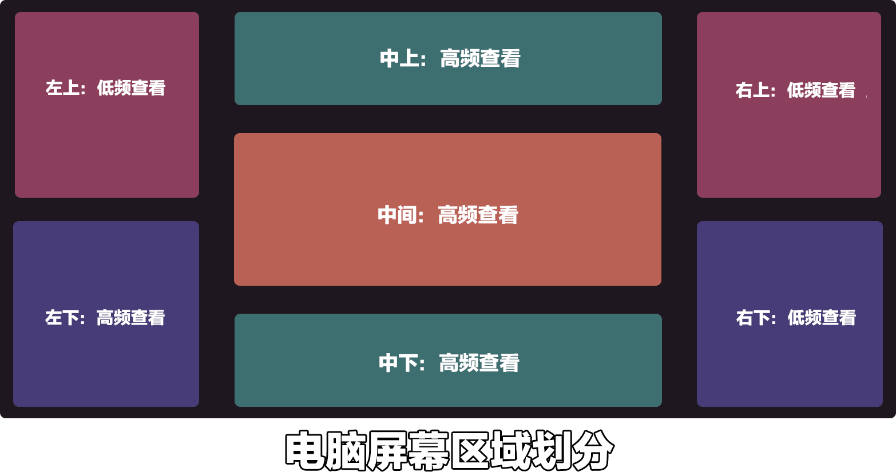

# UX design standards for PC 

## Different positioning of different areas of the screen 

 

Compared to mobile game players, PC players divide the areas more arbitrarily. Whether it is high-frequency viewing or low-frequency viewing, as long as there is a new UI added to this area, players will notice it. They can also quickly adapt to the change of a low-frequency viewing area to a high-frequency viewing area. Therefore, as long as the developer does not block the original UI, the entire screen can be used for UI layout. 

### Middle: High-frequency viewing 

The middle is the area where players will look at high frequency. Because the main visual center of the player is in the center, the center is not suitable for a particularly large-scale permanent opaque UI. This type of UI will completely block the player's game vision, causing the player to be unable to see the game content in front. 

### Lower middle/upper: high-frequency viewing 

The lower middle is where the quick item bar and health are displayed. Players will often check to confirm their own status, so this is the area that players are accustomed to checking. If there is content related to player attributes and requires players to check frequently, it can be placed in this area. 

The upper middle area is also an area that players can easily notice. This area is generally used to display the BOSS health bar in the original version, so the upper middle area is very suitable for displaying some small-volume game information. 

### Lower left/lower right corner: high-frequency/low-frequency viewing 

The lower left corner of the game is the chat box. If it is in online mode, there will be frequent pop-ups, so players will check the content in the lower left corner more often. It is not suitable to make a large-scale obstructed UI here, which may cause players to be unable to obtain the latest chat information. 

The lower right corner is currently only used to display sound, and most players will not turn it on, so the frequency of viewing is not very high. It is more suitable for developers to place some menu buttons that do not need to be checked all the time. 

### Upper left and right corners: low-frequency viewing 

The upper left and right corners do not have much content in the original version. The upper right corner will add some buff icons after the player is affected by the buff, which needs attention. The upper left and right corners are very suitable for adding some large-scale UI, and these UIs will not excessively block the player's game content. 

## Recommended placement of common UI 

### First-level menu button: lower right and lower left 

The lower left and lower right are relatively less used areas of the original UI. Compared with the lower left, the lower right is more suitable for adding some Easter egg buttons to be displayed there. 

It is best to leave the corresponding button on the menu icon of the computer directly, so that players can directly understand what button to press to open the desired UI interface through the icon. 

### Player attribute information: upper left/above the quick item bar 

The player's attribute information is also content that players need to check frequently, so the attribute information is best placed in the area where players will check frequently. More complex attribute collections can be placed in the upper left corner. The upper left corner can be placed with more complex patterns above the quick item bar without blocking the line of sight.

### Minimap: Upper right/Upper left 

The minimap takes up a large area, usually a relatively blank area, while the upper right and upper left are both very good locations, allowing players to check their position at any time without causing too much obstruction. 

### Skill button: Left side/above the quick inventory bar 

The left side is more suitable than the right side because the right side may be blocked by the buff icon, while the left side only has a chat box, and the chat box height can be adjusted, so it will not block the skill icon. 

Skill icons can also be placed above the quick inventory bar. Like the left side, they are areas that players often pay attention to, so they can better observe information such as skill cooldown time. 

## Common issues to note 

### Adaptation of different resolutions 

Most people play windowed games on the computer, and the window can be stretched, so the computer may have a game window of any proportion. When we locate a UI position, it is best to locate it based on the current screen length and width. 

It is not recommended to scale the icon size with different resolutions. If it is scaled with the size, the pattern may be compressed and stretched to distortion. The icons should be rearranged with the window, such as a row of icons on a large screen and two rows of icons on a small screen. 

### Key bindings for the original version of Minecraft (need to be avoided) 

The original version of Minecraft has occupied a lot of keys, unless the function is covered, for example, we hope that after the player opens the backpack, it will not open the original backpack UI, but open the backpack UI of our component, so that we can cover the keys. In most cases, our keys should not conflict with the original keys. 

### Recommended custom key interaction bindings 

Skill key recommendations: Skills are keys that need to be clicked frequently, and should be as close to the ASDW direction keys as possible, so that players can operate them more easily, such as R/T/G/H/Z/X/C/V. 

Some function menu keys, players do not need to operate these keys frequently, so we should try to set these keys at a farther distance, and try to separate them from the long-pressed buttons by one key, so as to prevent players from accidentally touching them. Therefore, we recommend U/I/O/P/J/K/L/N/M for the function menu keys. 

### Do not use the mouse to operate the HUD interface 

In the client game, the HUD interface content is operated by keys. Try not to design operations that require mouse clicks to click on the HUD interface. Operations in the GUI can be operated with the mouse. 

### Learn from common games (reduce the learning cost of players) 

There are many mature works that can be referenced on the computer side. You only need to choose mature large-scale client games to learn according to the type of your own components to achieve a good design effect.