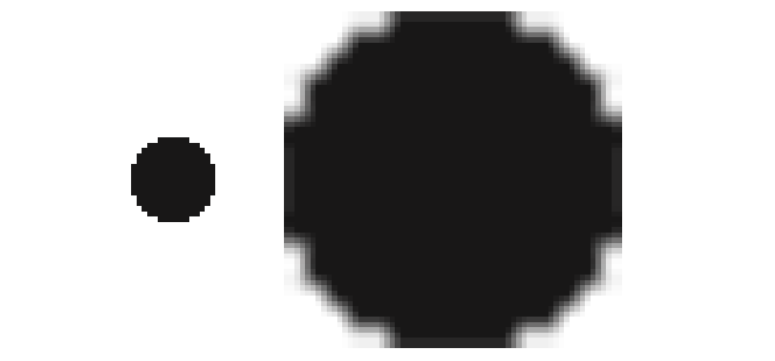
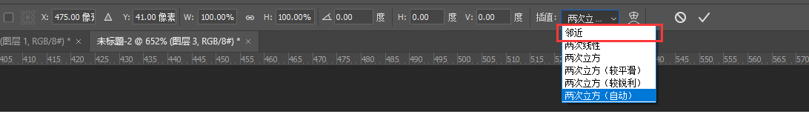
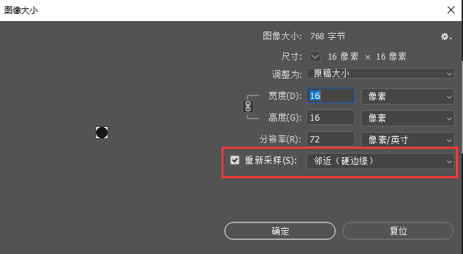
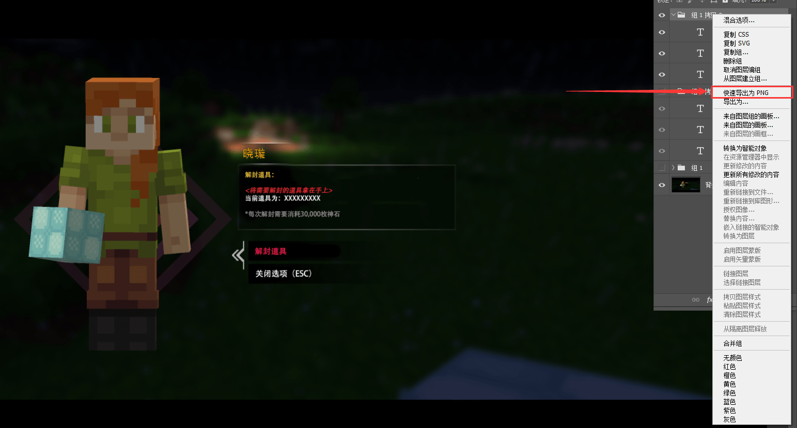
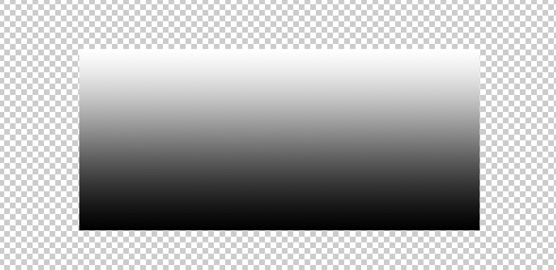
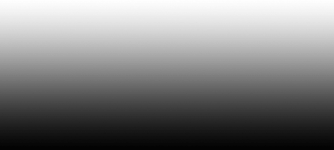
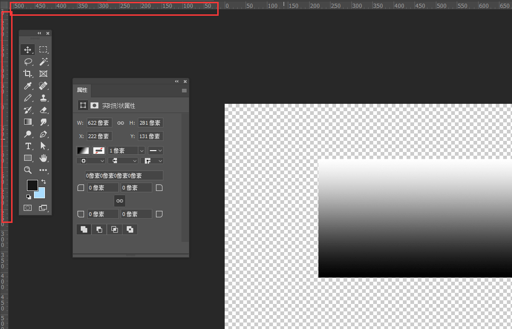
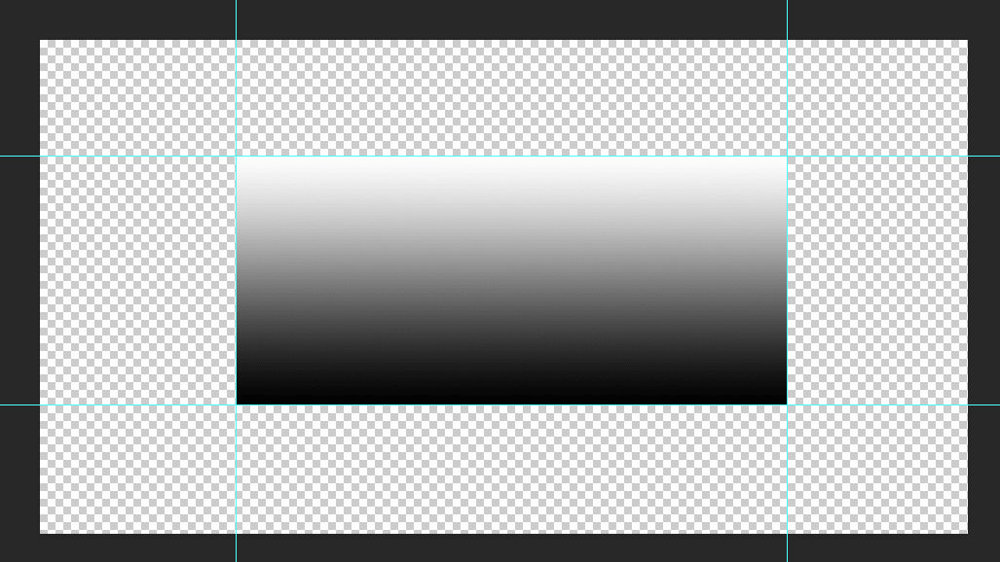

--- 
front: https://nie.res.netease.com/r/pic/20220408/42506aab-a899-4d62-b2c9-ea0a68d6480c.png 
hard: Getting Started 
time: 15 minutes 
selection: true 
--- 
# Tool Usage 
## Common Functions 

Because Photoshop is more convenient for post-processing pictures, although it seems to have many complex functions, in fact, only a few of them need to be mastered to draw pixel pictures, so I will briefly talk about the functions that may be used to draw pixel UI. 

### Pixel grid on/off 

Pixel grid can be turned on or off in View-Display-Pixel grid 

 

It can be seen that after turning on the pixel grid, there will be white lines between each pixel as a distinction. Many novices will think this is a good auxiliary method, but in fact these thin lines will cause some differences in color. For example, these two circles are also drawn in pure black, but the black circle on the left with the pixel grid turned on is obviously grayer than the circle on the right with the pixel grid turned off. This can easily lead to visual errors and make the drawn pattern deviate from the expected color. 

### Pixel image scaling 

Pixel image scaling is also a problem that many novices will encounter. How to use PS for lossless scaling, you can use **Neighbor interpolation** in scaling mode. 

#### Use interpolation when scaling: adjacent 

Many novices use the default mode when scaling images. When the 16*16 pixels are enlarged to 64*64, the edges will be blurred, and the whole image will look very blurry. 

 

In fact, you only need to select adjacent when scaling, so that the scaled image will not have blurred edges. 

 

 

Similarly, when enlarging the size of the entire graphic, if you don't want the image to be blurred at the edge, the resampling position should also be changed to adjacent 

 

### Quickly export images 

When we make UI, there will be a large number of layers. It will be very troublesome to export each layer independently. At this time, we only need to find the layer box, right-click the content we want to export, and select Quick Export to PNG. In this way, the exported image will not have extra transparent content 

 

Images exported using the overall export function

 

Images exported using layers 

 

### Cutting with auxiliary lines 

Sometimes when we draw UI, we need to align other UI to make the UI look neater. PS has its own adsorption function, but using the adsorption function alone cannot automatically match all edges, so at this time we may need to make auxiliary lines 

CTRL+R to open the ruler, and your PS will have the following two rulers. 

 

Click the ruler with the mouse and drag it, and you can directly drag out an auxiliary line. The auxiliary line will not be exported, it will only help you align the image in PS. 

 

### Change color properties 

When drawing pixel content, the commonly used functions are **Image-Adjustment-Brightness/Contrast** and **Hue/Saturation**. 

#### Brightness/Contrast 

Brightness is to adjust the brightness of the overall color. The higher the brightness, the brighter the color looks. 

Contrast is to adjust the contrast of the overall color. The higher the contrast, the whiter the white will be, the blacker the black will be, and the overall contrast will be more obvious. 

#### Hue/Saturation 

Hue is to change the color. For example, red can become blue or green after changing the hue. 

Saturation refers to the purity of the color. The higher the saturation, the brighter the color looks.