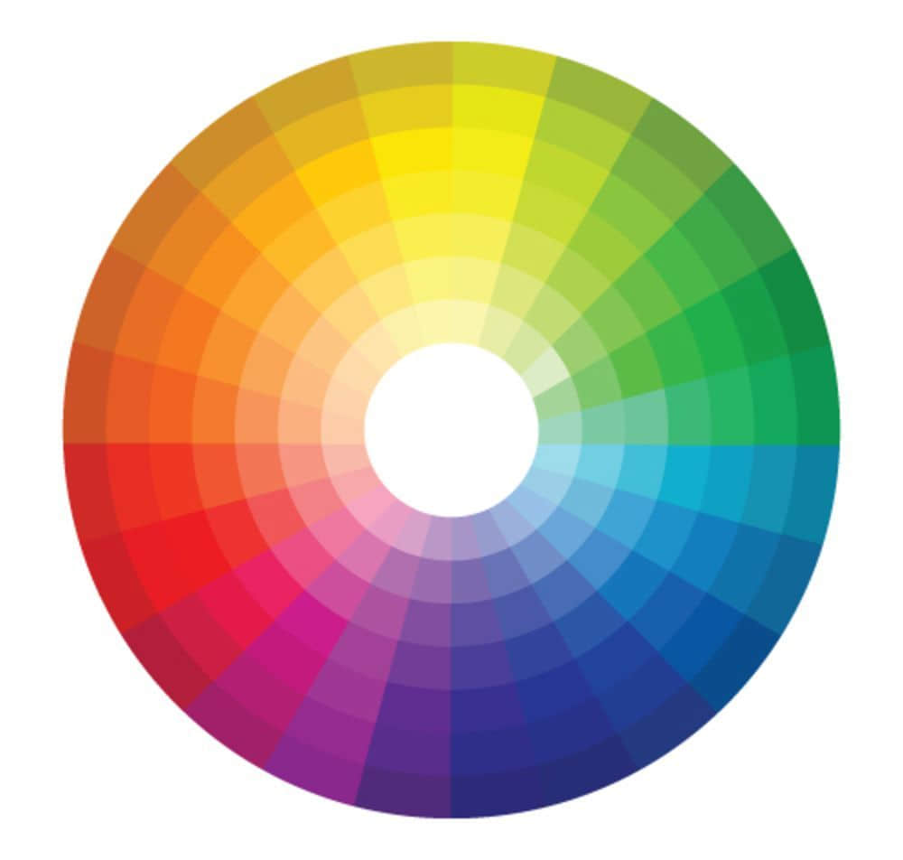
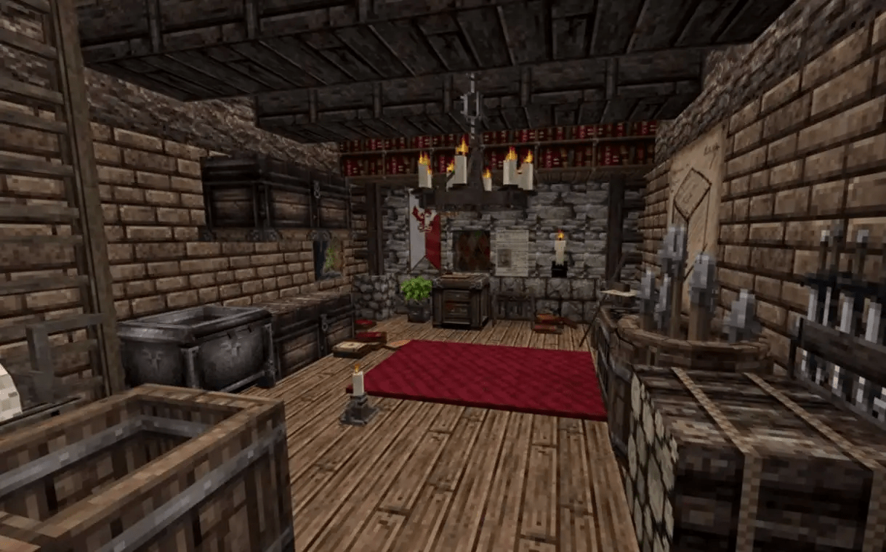

--- 
front: https://nie.res.netease.com/r/pic/20220408/c1b0e183-0ec9-45ae-ba3e-5fa906326d95.png 
hard: Getting Started 
time: 10 minutes 
selection: true 
--- 
# Introduction to Art Concepts 
## Art Concepts 
This chapter will briefly introduce some of the content you will encounter when drawing pixels. This chapter is more about art, and it is very important for how to draw an original and exquisite UI. 

### Hue 

Hue is simply what we usually call color. What color the user sees depends on the hue of the color. All colors except black, white and gray have hue attributes. 

The main purpose of talking about hue is to expand the concept of cool and warm colors with everyone. For example, we generally call blue and purple in hue cool colors, and users will feel cooler when they see these colors. In contrast, colors such as yellow and red are called warm colors, and users will feel warmer when they see these colors. 

When drawing UI, we need to pay attention to not mixing warm and cold colors, but maintaining an overall color style, so that your picture will look more integrated. 

 

### Saturation 

Saturation is often referred to as the vividness of the color. The higher the saturation, the brighter the color looks. When the saturation is zero, the colors are black, white and gray. 

The higher the saturation, the brighter the work, and the easier it is to be noticed. 

However, when drawing UI in the beginner stage, it is recommended to use colors with lower saturation as much as possible. In this way, even if the colors are used more mixedly, the drawing skills and the use of colors are not well mastered, at least the picture will not look too messy when the saturation is not high. 

 

### Color brightness 

Brightness is also easy to understand. It is the brightness. The higher the brightness of a color, the brighter it looks. The lower the brightness of a color, the darker it looks. Any color is white when it is brightest and black when it is darkest. 

When drawing UI, you should also grasp the contrast between brightness. The contrast between brightness is determined according to the style. Because pixels need to have a certain degree of connectivity, the brightness contrast will not be too large, but the brightness contrast between them is also visible to the naked eye, rather than almost invisible brightness changes. 

 

### Texture complexity 

We usually call it resolution. The higher the resolution of a surface, the more complex the content that can be drawn on this surface. The original version is a surface with 16x16 pixels. Some materials with more realistic drawing can reach 64x64 pixels. Even some textures that make players completely unable to see the sense of pixels can reach 1024x1024 resolution.

The complexity of the material texture is mainly affected by two elements. One is the number of colors. The more colors, the more complex the texture looks. The other is the drawing structure. Only a few different colors and some drawing techniques are needed to draw very complex material textures. 

Determine the complexity according to your own material style. The more realistic the material, the more complex it is. The more cartoony the material, the simpler it is. 

Jakob.z's block concept material has a high saturation, but the texture is less complex, and looks very cartoon-like. 

 

Yuushya's 16x texture pack is much more complex. 

## Common styles 

### Cartoon style 

Usually, the saturation is high, the brightness is high, and the texture is less complex, so the combination looks very cartoon-like. 

 

### Ancient style 

The ancient style we are talking about usually refers to Chinese style materials. The range of Chinese style materials is very large. You can choose patterns with high saturation and complex textures. You can also choose ink style with low saturation and low texture complexity. 

The ancient style mainly depends on your drawing form and the display of elements. 

 

### Technology style 

Technology style is mainly cold colors, usually high contrast, and the texture of the material is also relatively complex. Technology is mainly black and blue. Cold colors can give people a cold feeling. At the same time, a large amount of black as the background, plus some blue as embellishment, will give people a very technological feeling. 

 

### Medieval style 

Medieval style is generally based on Europe. If we want to express medieval materials, we need more complex textures. By drawing more complex structures, players can feel the sense of reality. At the same time, we will try our best to reduce the saturation of this style. Lower saturation will make players feel more realistic. 

