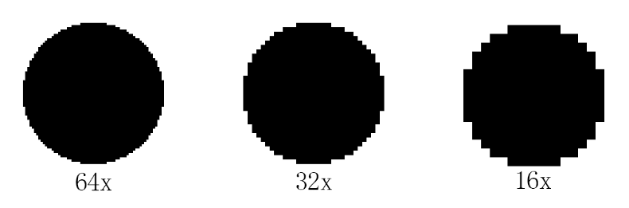
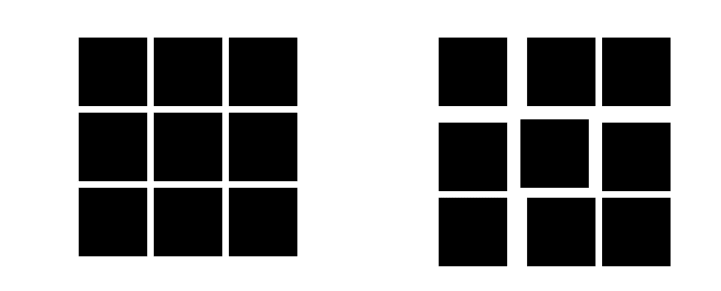
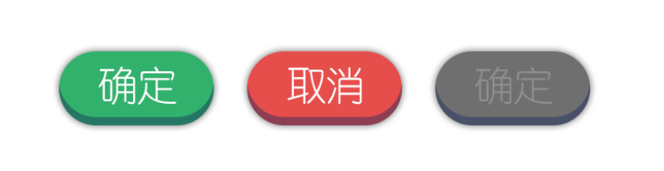

--- 
front: https://nie.res.netease.com/r/pic/20220408/82d22891-db41-49ab-9f75-695db1b83f27.png 
hard: Getting Started 
time: 5 minutes 
selection: true 
--- 
# Standard design 
## Design uniformity 

When designing a UI, design uniformity is very important. The size here includes the size of the icon, the spacing between icons, the size of the text, and the rationality of the colors. Let's take a look at what we need to pay attention to. 

### Image size x 

If you want players to feel a more obvious sense of pixels, the recommended resolution here is an icon of no more than 32x32, because if it reaches 64x64, it will become more realistic, and the relative sense of pixels will be greatly reduced. 

If you have determined your own resolution, try to keep this resolution for drawing. For example, if you draw a UI with a resolution of 16x, and then all your item icons are drawn with 32x, it will look very inconsistent to others, giving people a strong sense of splicing. 

 

### Spacing between each picture 

The spacing between each picture needs to be standardized to make the UI look more neat and comfortable. Determine the spacing between pictures according to their functions. The spacing between the inventory bars of the backpack should not be too large, otherwise it will cause trouble for players to drag items. 

The spacing between skill UIs needs to be far apart, otherwise it is easy to accidentally touch other skills. 

 

### The meaning of color 

The use of color can be seen everywhere in our lives. Many times we don’t even need to look at the content. We can roughly guess what we want to express just by the background text color. 

For example, traffic lights are telling us subtly that green represents certainty, safety, and passability. Yellow means that we need to pay attention and have some reminders. Red means prohibition and warning. 

There are many similar examples in life, so we instinctively have a more subconscious understanding of some colors. 

 

#### Bright and refreshing green represents confirmation 

Most creators choose green or similar colors when drawing UI confirmation buttons or buttons with similar functions, because green is brighter than other colors and easier to notice than gray and white. 

#### Red with warning nature represents cancellation 

Red has a warning meaning in most cases, and most people who see red will carefully observe what is in the red content. Therefore, red is very suitable for some UI background colors that require careful operation. 

#### Gray represents invalid 

Gray is a color with a low sense of presence in most backgrounds, especially the gray that is closer to the background color is more likely to be ignored. This also reminds the player that there is a button here, but it does not take effect.