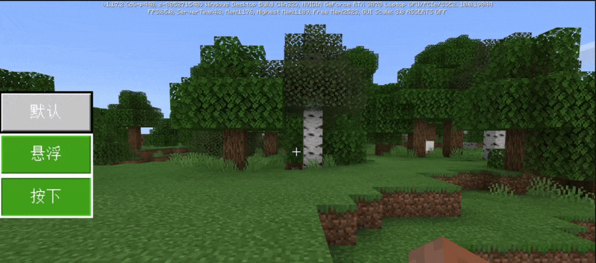

# UI Effects 

The UI effects are mainly to give players a visual feedback and provide a better experience when players interact with the UI. 

## UI Animation 

UI animation is necessary to reflect the high-level sense of UI. If all UIs are directly displayed/closed, it will look very stiff. On the contrary, if there are some excessive animations, the quality of the entire component can be greatly improved, giving people a sense of non-simpleness at the UI level. 

 

### Click Effects 

The click effect is to give players feedback when they click on the UI. Common click effects include 

When clicking, the image uses code to control the image to shrink slightly, which can give users a feeling of pressing a button. 

When clicking on the image, switch to a click color map. For example, the original button is white, and the button becomes green when clicked, giving a feedback. 

### Moving effect 

Some UIs do not need to be displayed in the player's main menu all the time, such as the original backpack. When the player clicks the backpack button, you can observe carefully that the backpack does not open suddenly, but pops up quickly from the bottom to the top. This is a kind of moving animation, which can make the original rigid interface more dynamic, vivid and interesting. 

### Gradual hide/show effect 

This is also a common UI effect. The transparency of the UI is controlled by code to achieve the effect of gradual appearance and component hiding. This is suitable for backpack GUI or UI content far from the edge. If the moving effect is used far from the edge, it may give the player a very cumbersome feeling, so using the animation effect of adjusting the transparency may be more reasonable and comfortable. 

## UI sound effects 

UI sound effects are also a way to improve the sense of luxury. The sound effects of clicking buttons should be as simple as possible and highly recognizable. You can even use the original sound effects directly. 

### Click sound effects 

Click sound effects are the most commonly used feedback sound effects. Usually when we create a button, there will be a default button click sound effect. This sound effect can also be replaced with a more interesting sound effect. For example, when we click the backpack button we created, the original box sound effect is emitted. This may give people a more refreshing feeling than the original click sound effect. 

### Invalid sound effects 

This type of sound effect is mainly for feedback to players. This place cannot be clicked, and the UI will not change, so as to remind players that the click here is invalid.