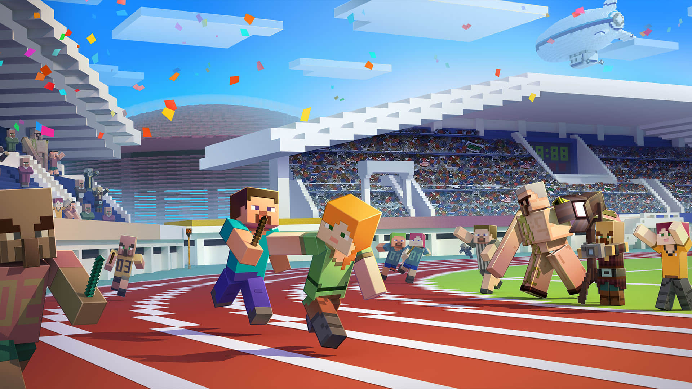
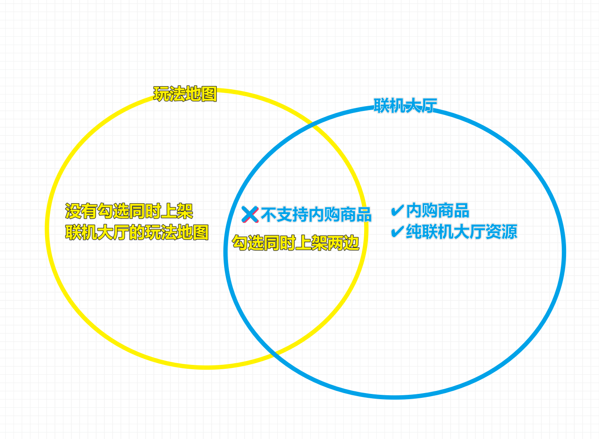
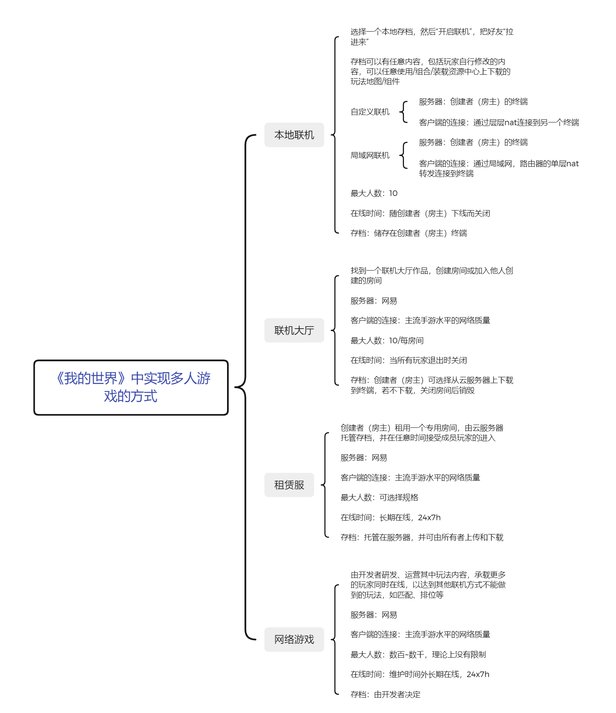
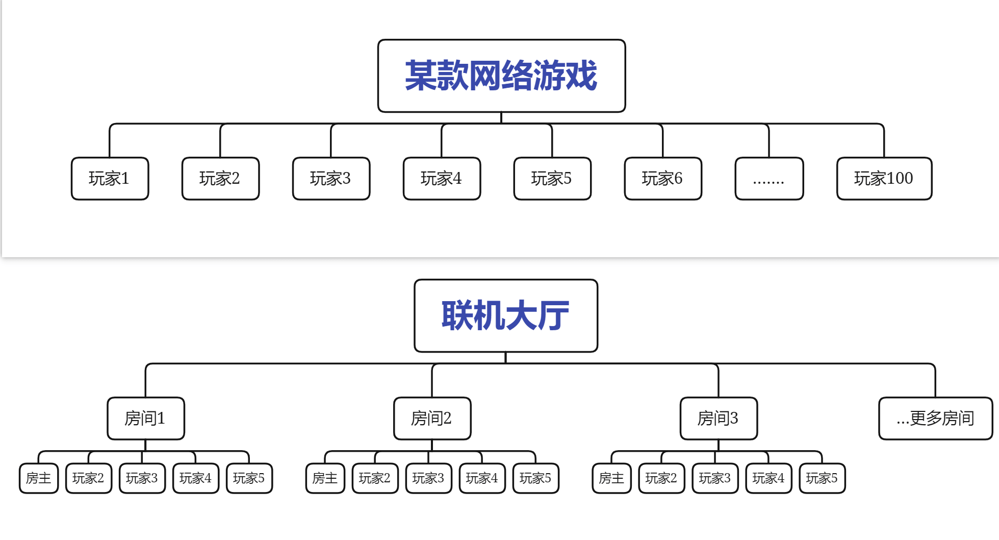
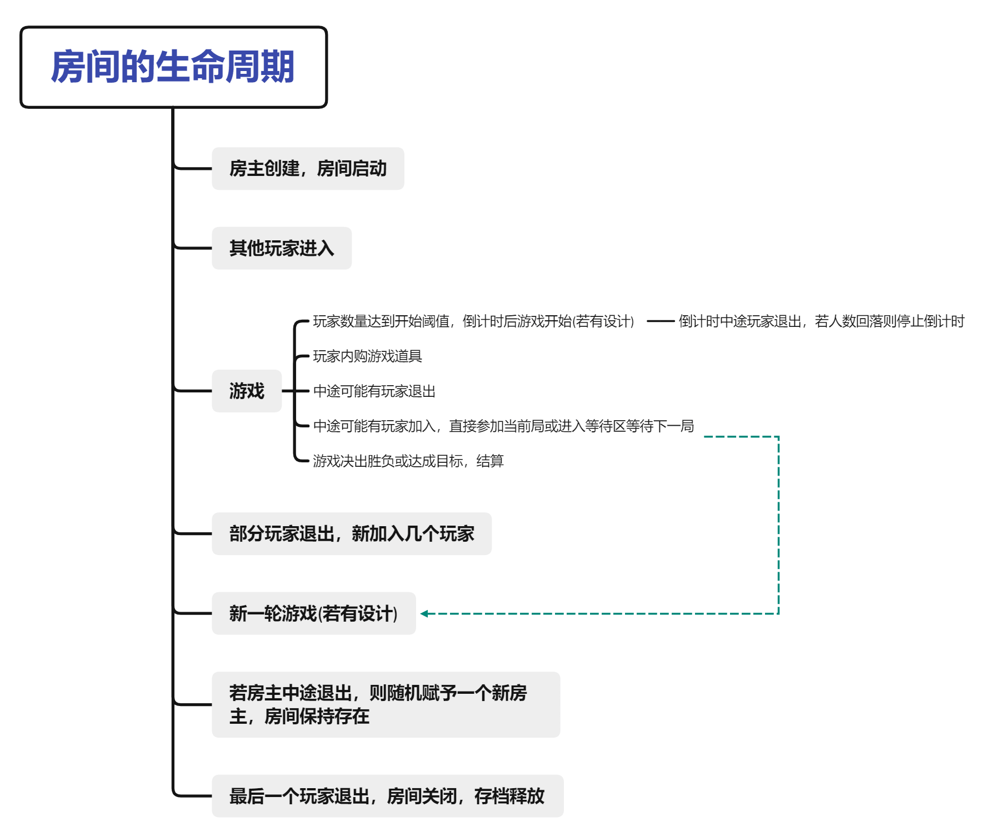
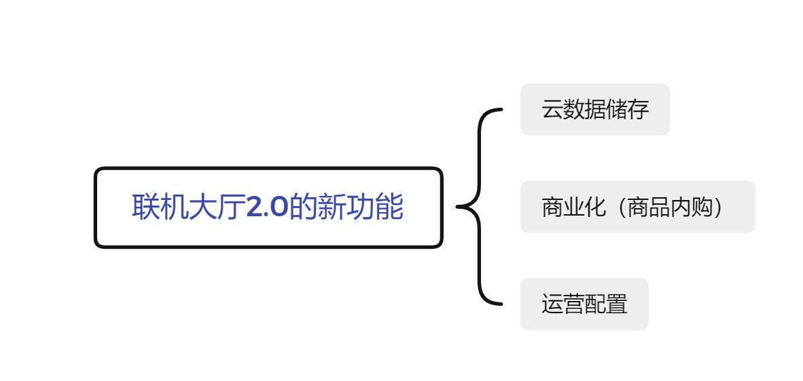
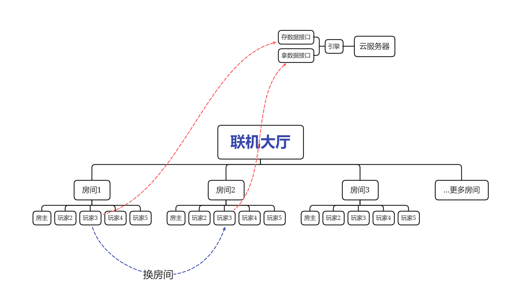
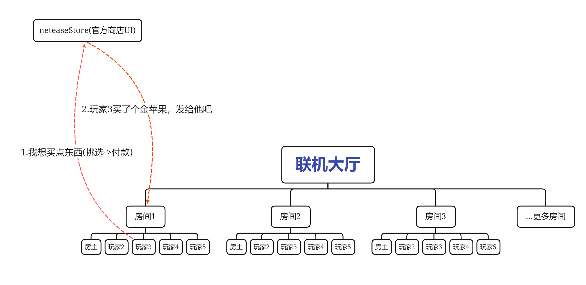
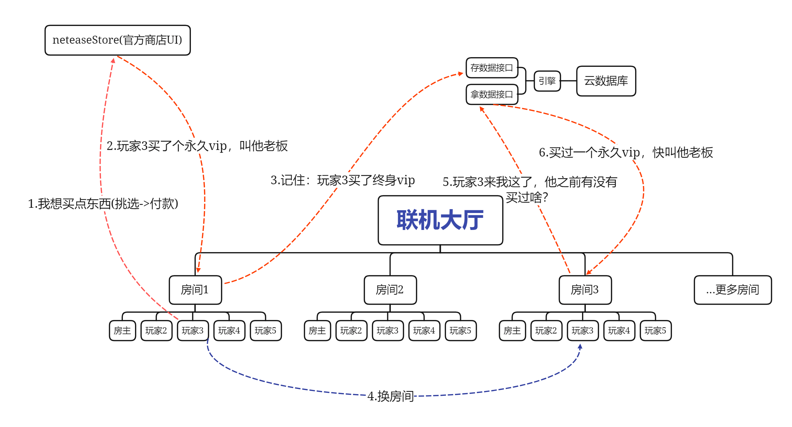

--- 
front: 
hard: Getting Started 
time: 10 minutes 
--- 
# What is the online lobby 

<iframe src="https://cc.163.com/act/m/daily/iframeplayer/?id=63468088e6c041f2578d9204" width="800" height="600" allow="fullscreen"/> 

## Before you start 

Whether it is to enjoy the beautiful scenery together, work together, or compete against each other, the online function makes players not feel alone in the virtual game world. 

When players experience a special difficult survival gameplay map, they think it would be nice to have a partner to challenge together; 

When players want to compete in combat skills, they need a competitive gameplay map and several opponents who also love PVP; 

 

Through the online lobby, players can easily find a satisfactory gameplay, and then immediately meet several partners who are also interested in the same gameplay as you, and like-minded people will join hands to start a wonderful adventure journey. 

**This series of tutorials mainly focuses on how to commercialize the online lobby gameplay, that is, we assume that you already understand [what is a gameplay map](../Gameplay Map Basic Tutorial/1-Gameplay Map is the only choice for pursuing a complete game experience.html), and even have made a complete multiplayer gameplay map. On this basis, we will design and implement several in-app purchase products, and test and put these products on the shelves for players to purchase. ** 

## The relationship between gameplay maps and online lobby 

When releasing new resources in Kaiping, you may be confused about the relationship between gameplay maps and online lobby gameplay: gameplay maps can be listed on the online lobby at the same time, online lobby resources can also be listed on gameplay maps at the same time, but online lobby resources with commercial in-app purchase functions checked cannot be listed on gameplay maps at the same time? What is connected to what, it's so confusing. 

Here comes the answer: To be precise, online lobby gameplay is a special gameplay map. 

The online lobby itself is a mode of operation that provides players with flexible online services. In fact, the room in the online lobby can be understood as a virtualized container, which can theoretically be started with any gameplay map. The gameplay map designed for multiplayer games from the beginning, which may contain in-app purchases, operation logic, and cloud achievement systems, can be called online lobby gameplay (resources). 

 

## The difference between the online lobby and other multiplayer modes 

To understand the online lobby, you first need to know the positioning of the online lobby. In my world, players can connect to each other mainly through the following methods: 

 

Compared with other multiplayer modes, especially local connection, the online lobby has the following characteristics: 

- **The server engine runs on a dedicated cloud server instead of the host's mobile phone, and the network quality and server performance are better. ** Therefore, we are further unconstrained when designing products and can play freely, such as making more exquisite special effects, requiring the server to generate entities in batches, creating and destroying blocks, etc. 
- **More flexible flow between players. ** Compared with rental servers and online games with dozens or hundreds of players, the online lobby consists of rooms, which divide players into smaller parts. Players can exit from one room and join another room at any time; rooms can also start new ones and destroy old ones at any time. This makes it easier for players to meet random strangers, thus realizing the function of randomly matching several players to start a game in online games to a certain extent.  
- **Content is unified and controllable. ** The room in the online lobby is started by the package provided by the developer. Compared with local archive online, the environment is more certain, there will be no unpredictable other components, and better restrictions can be placed on players, and players who do not abide by the rules of the game will not easily destroy the mechanism, playing with TNT flying all over the sky, and losing the original meaning of the gameplay design. At the same time, due to the closed environment, it is possible for you to provide some value-added services as commodities, such as automatic paving in Bed Wars and chain mining during battle walls. 

## Room life cycle 

As mentioned above, the room is the basic unit of the online lobby. Let's use the figure below to understand what happens when a room is started and destroyed. During the development process, you only need to pay extra attention to the impact of changes in the player list when the game reaches various states, and handle it correctly. 

## Advanced creative needs 

The online lobby has been updated with a wave of new features in 2.0, which is enough to push this track to an unprecedented new height. This series of tutorials mainly revolves around commercial discussions, and due to technical needs, cloud data storage will also be involved. 

 

### Cloud data storage 

As mentioned above, players can easily flow between rooms. It is important that players have consistent experience between different rooms, and accumulated scores, backpacks, and assets should be taken away. 

We know that the room carries archives, and archives themselves can store data, but data from different archives cannot be interoperable. So in order to synchronize these data, a third-party medium is needed-a cloud database. 

We don't need to care about what the cloud database looks like, what the principle is, how to connect, and how to operate. The engine has already encapsulated and processed it for us. We only need to call two new interfaces, hand over the data to be stored to the cloud database, and then use the interface to get it back when needed. 

There is only one thing that needs to be paid attention to. Since it is a cloud database, we use the interface to perform HTTP operations in essence, so the callback is asynchronous, and you need to be careful when coding. 

 

### Commercialization (in-app purchase of goods) 

After completing the basic gameplay design, we certainly hope to commercialize the gameplay and let the developers' love resonate. 

In the game, we can attract players or players to actively open the store (neteaseStore). After the player purchases the product, the store will notify your code through the engine. The process is similar to the following figure 

 

Of course, sometimes the products purchased by players need to be **persistent**, so we need to use the power of cloud database, and the process evolves as follows: 

 

In the next chapter, we will learn how to design and implement products. 
