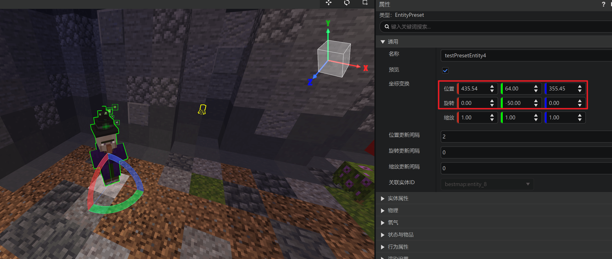

--- 
front: 
hard: Advanced 
time: 30 minutes 
--- 
# Design in-game purchases for gameplay 

<iframe src="https://cc.163.com/act/m/daily/iframeplayer/?id=6346815ac6dfd1bb76f2bfac" width="800" height="600" allow="fullscreen"/> 

**Demo can be downloaded here: [link](https://g79.gdl.netease.com/in_game_purchases_demo.zip). ** 

## Types of products 

When it comes to designing products based on gameplay, planners should not be sleepy. Developers can analyze specific problems based on their own works and design them in a targeted manner. During this period, many possibilities and proposals may come up with your mind. In order to facilitate thinking and sorting, you can distinguish products from two dimensions: 

 

- Single-game products 

This means that this product is only valid in the current online lobby room. If the gameplay is designed to be repeated, then the developer decides whether to clear the effectiveness of the product in the new game. 

If the player exits the room and enters again, as long as the logic system has not been uninstalled, the product can theoretically continue to be effective, or you can choose to make the product invalid when the player exits. 

But in any case, once the room is closed, the memory will be lost and the single-game product will be completely invalid. Developers can still query the player's purchase history of single-game products through the interface. 

- Persistent, permanently effective products 

Persistence means recording the player's purchase of this product in the cloud database, so that even if the player changes rooms or plays this map again after a few days, the logic system can always know that the player (once) purchased this product.

- Persistent, timed effective products 

Timed effective is different from the above permanent effective, and of course it does not conflict with the meaning of persistence. It means that the logic system knows that the player has purchased it, but it does not provide a certain service permanently. It can also be divided into, for example, a certain permission, which takes effect for 10 days from the date of purchase and loses the permission after expiration; or the pass corresponding to the s10 season runs from September 1 to September 30, so no matter when the player purchases this product, he will lose the permission on September 30. 

 

- Consumables 

Generally, there are food, potions, armor, and various props in the form of items. Since the gameplay is generally survival or adventure mode, it is gone after use, which is equivalent to the original logic helping us complete the billing. 

If it is some other form, such as releasing a skill once, this behavior implemented by the logic system can use the cloud database to record the number of consumptions. 

- Non-consumables 

Some common permissions do not need to be counted, such as a certain appearance, title, VIP status, which are recorded by the cloud database to determine whether the player has the permission when used. 

## Reasonable pricing 

We know that players in the "Minecraft" client have two currencies available for consumption - diamonds and emeralds.


 

- **Diamonds** are generally purchased by players with RMB, and are also used as a source of income settlement in Kaiping. Therefore, it is recommended to price high-value goods with diamonds. 
- **Emeralds** are free points accumulated by players through various behaviors in the client and in the game. Emerald income is an important basis for developer points and levels in Kaiping. If you want to improve the developer level, emerald income is indispensable. Therefore, it is recommended to price general-value goods, especially single-game or consumable goods, with emeralds. 

Sometimes, we want players to obtain high-value equivalents through some additional channels, such as giving away 10 diamonds for participating in an event, but obviously you cannot expand the player's source of diamonds, so you can consider designing a new intermediate currency-gold coins. Players use diamonds to exchange gold coins, and then use gold coins to exchange goods. You control gold coins and have the right to give players gold coins. 

As for how to implement gold coins, this tutorial cannot be explained in detail due to the limited space. It is recommended to refer to the official demo of lobbyGoodsMod2.0. 

## Actual combat - designing demo products 

With the above theoretical support, let us design and implement the following in-app purchase products for the career war demo from [the first phase of the creation camp's gameplay map tutorial](../game map basic tutorial/1-game map is the only choice for pursuing a complete game experience.html). 

The gameplay of career war (KitPVP) is very simple. Choose a profession and kill as many other players as possible. This demo provides three professions: tank, archer, and warrior. 

 

These three basic professions that check and balance each other are relatively classic and reasonable, and are not suitable as in-app purchase products. So we created a new profession: healer, and the model used the original witch as the commodity. The design information is as follows: 

- Healer 

- Position: Auxiliary 

- Armor: Iron Breastplate, Iron Leggings, Iron Boots 

- Weapon: Wooden Sword 

- Items: Splash Damage Potion x3, Splash Healing Potion x3, Splash Health Recovery x1 

- Price: 100 diamonds, cannot be purchased repeatedly 

- Type: Persistent after purchase, permanent effect 

 

It is not enough to have only value-added professions. We can also sell some single-game consumables. The simplest one is of course the original item. Here we use a supply item that comes with the demo: 

- Delicious Fresh Mushroom (testmap:testitem1) 

- Price: 10 Emeralds, can be purchased repeatedly 

Type: Single-game consumables 

 

Now that we have permanent products and single-game consumables, let's design a timed product with an expiration date. Special effects are a good choice because they will not affect the balance in PVP, maintain a good work rating, and provide a good gaming experience for paying players. 

- Halo around the soles of feet 
- Price: 30 diamonds/day, can be purchased repeatedly to stack the duration 
- Type: Persistent, regular product 

 

## Actual combat-making a new profession 

Since the demo originally did not have a healer profession, we have to make a simple one. First, create an entity preset. 


 

Select the witch template, because we want to borrow its model, follow the original author's naming rules, and name it testPresetEntity4. 

 

Check the immune damage in the property column, uncheck the keep AI, and then clean up the unnecessary behavior components, so that the witch becomes an NPC, standing without action and not attacking the player. 

 

 

We can see that there are particle effects on the heads of testPresetEntity1 to 3, so follow the local customs and mount the particle preset to the testPresetEntity4 preset, and adjust the position so that there is a particle effect on the head of the witch model. 

 

Enter the map editor and create a block to place the model. There are only three in the original demo map, so place the fourth one. 

 

In the level editor, place the testPresetEntity4 preset on the stage and adjust the position and rotation. 

 

Okay, the appearance is complete here. When you enter the game, you can see that the model of the healer appears correctly in the position of the fourth profession. 

 

Next, we will start to implement the functions. Originally, the three professions were implemented using command blocks. When entering the profession model, it will be teleported into the game area, given a slow-down effect and professional items. 

Since the in-app purchase logic requires modsdk coding, preset parts are used here to implement it. First, create a new empty part, name it Healer, and inherit the trigger (TriggerPart) 

 

**The trigger is not difficult to understand. It means that we frame an area, and then any entity entering, staying, or exiting this area will be detected by the trigger. ** 

Click the newly created part, the property panel, and modify the following parameters 

- Area. As shown in the figure, when the trigger is mounted under the entity preset, the coordinates will use the coordinates relative to the preset. 

- Listening. Since we only need to detect the player entering (that is, the player intends to choose this profession), leaving and staying are not required, so only check the entry. 

- Listening interval. Since the effect of the original demo using the command block is very fast, in order not to cause a sense of separation, setting this parameter to 1 will be much faster than the default 30. 

 

Mount the Healer part to the testPresetEntity4 preset. 

 

******Click the 👉Area👉Location button in the property panel******, browse the frame we just set, and you can see the effect - the player will be detected when he walks into this frame. 


 

Click the property panel 👉 supporting files 👉 script 👉 edit file button, open the code file of the part, and write the code to accept the detection results: 

```python 
def InitServer(self): 
TriggerPart.InitServer(self) 
self.ListenSelfEvent('OnTriggerEntityEnter', self, self.OnTriggerEntityEnter) 

def OnTriggerEntityEnter(self, e): 
for entityId in e['EnterEntityIds']: 
if entityId in self.GetLoadedPlayers(): 
self.NotifyOneMessage(entityId, 'You try to choose the healer profession') 
``` 

Enter the game and test the effect: 

 

Continue to write the logic of teleporting and giving buffs and items: 

```python 
def OnTriggerEntityEnter(self, e): 
for entityId in e['EnterEntityIds']: 
if entityId in self.GetLoadedPlayers(): 
self.NotifyOneMessage(entityId, 'You try to choose the healer profession') 
self.TurnHealer(entityId) 

def TurnHealer(self, playerId): 
self.NotifyOneMessage(playerId, 'You become a healer') 
for itemDict in self.healerItem: 
self.SpawnItemToPlayerInv(itemDict, playerId) 
dim = self.GetEntityDimensionId(playerId) 
self.ChangePlayerDimension(playerId, dim, (352, 83, 442)) 
self.AddEffectToEntity(playerId, 'slow_falling', 5, 0, False) 
``` 

Enter the game and test the effect: 

 

Then the entire part source code is as follows: 

```python 
# -*- coding: utf-8 -*- 
from Preset.Parts.TriggerPart import TriggerPart 
from Preset.Model.GameObject import registerGenericClass 

@registerGenericClass("HealerPart") 
class HealerPart(TriggerPart):

def __init__(self): 
TriggerPart.__init__(self) 
# Part name 
self.name = "Healer Part" 
self.area = {'min': (-1.0, -1.0, -1.0), 'max': (1.0, 3.0, 1.0), 'dimensionId': 0} 
self.isTriggerExit = False 
self.healerItem = [ 
{ 
'newItemName': 'minecraft:iron_leggings', 
'newAuxValue': 0, 
'count': 1 
}, 
{ 
'newItemName': 'minecraft:iron_boots', 
'newAuxValue': 0, 
'count': 1 
}, 
{ 
'newItemName': 'minecraft:iron_chestplate',
				'newAuxValue': 0,
				'count': 1
			},
			{
				'newItemName': 'minecraft:wooden_sword',
				'newAuxValue': 0,
				'count': 1
			},
			{
				'newItemName': 'minecraft:splash_potion',
				'newAuxValue': 21,
				'count': 3
			},
			{
				'newItemName': 'minecraft:splash_potion',
				'newAuxValue': 23,
				'count': 3
			},
			{
				'newItemName': 'minecraft:splash_potion',
				'newAuxValue': 28,
				'count': 1			}
		]
		self.intervalTick = 1
		
	def InitServer(self):
		TriggerPart.InitServer(self)
		self.ListenSelfEvent('OnTriggerEntityEnter', self, self.OnTriggerEntityEnter)

	def OnTriggerEntityEnter(self, e):

		for entityId in e['EnterEntityIds']:
			if entityId in self.GetLoadedPlayers():
				self.NotifyOneMessage(entityId, 'You try to choose the therapist profession')
				self.TurnHealer(entityId)

	def TurnHealer(self, playerId):
		self.NotifyOneMessage(playerId, 'You became a therapist')
		for itemDict in self.healerItem:
			self.SpawnItemToPlayerInv(itemDict, playerId)
		dim = self.GetEntityDimensionId(playerId)
		self.ChangePlayerDimension(playerId, dim, (352, 83, 442))
		self.AddEffectToEntity(playerId, 'slow_falling', 5, 0, False) 

``` 

However, currently we have hard-coded coordinates, buffs, given items, etc. in the code. Now the custom attribute function of parts allows us to have a better approach. To make this part more extensible, edit the part metadata file: 

```python 
# -*- coding: utf-8 -*- 
from Meta.ClassMetaManager import sunshine_class_meta 
from Meta.TypeMeta import PBool, PStr, PInt, PCustom, PVector3, PVector3TF, PEnum, PDict, PFloat, PArray, PVector2, \ 
PColor 
from Preset.Parts.TriggerPart import TriggerPartMeta 

@sunshine_class_meta 
class HealerPartMeta(TriggerPartMeta): 
CLASS_NAME = "HealerPart" 
PROPERTIES = { 
"gamePos": PVector3(text="Teleport to", sort=12, group="Professional Settings"), 
"effectList": PArray(sort=13, text="Give Status Effect List", group="Professional Settings", childAttribute=PDict(children={ 
"effectName": PStr(text="Original state name", sort=1, default="speed"), 
"duration": PInt(text="Duration", sort=2, default=1), 
"amplifier": PInt(text="State level", sort=3, default=0), 
"showParticles": PBool(text="Show particle effect", sort=4, default=True) 
})), 
"itemList": PArray(text="Give item list", group="Professional settings", sort=14, childAttribute=PDict(children={ 
"itemDict": PCustom( 
sort=0, 
text="Item selection", 
editAttribute="MCItems", 
default=("minecraft:wooden_sword", 0), 
withNamespace=True, 
withAuxValue=True, 
isBlock=None, 
), 
"count": PInt(sort=1, text="Number of items", default=1) 
})), 
} 

```


In this way, the following setting options appear in the attribute panel of the therapist part: 

 

Apply the configuration we just hard-coded in the code: 

 

This will expose the attributes, whether we want to make more other professions in the future or other team members want to modify them, it will be more convenient without having to face the source code. 

Finally, simply modify the hard-coded just now to make the configuration of the attribute panel actually take effect. 

```python
def TurnHealer(self, playerId):
	self.NotifyOneMessage(playerId, 'You became a therapist')
	for item in self.itemList:
		self.SpawnItemToPlayerInv({
			'newItemName': item['itemDict'][0],
			'newAuxValue': item['itemDict'][1],
			'count': item['count']
		}, playerId)
	dim = self.GetEntityDimensionId(playerId)
	self.ChangePlayerDimension(playerId, dim, tuple(self.gamePos))
	for effect in self.effectList:
		self.AddEffectToEntity(playerId, effect['effectName'], effect['duration'], effect['amplifier'], effect['showParticles'])
```

## Practical application - making member special effects 

In addition to purchasing professional rights, we can of course also sell some special appearance services. Let's simply make a special effect bound to the player's skeleton. In order to reduce the workload, enter the content library of **Developer Tool Station** and download a special effect package. 

 

When the editor is open, click to import this special effect package. 

 

Enter the special effect editor. 

 

In the resource management, click the Chinese version of the special effect and select a special effect file: 

 

We want to browse this special effect, drag it to the model attachment bar, and attach it to the bottom bone: 

 


After hooking up, click the play button on the timeline 

 

You can see the special effects playing: 

 

But we want this halo to be under the player's feet, so find the rendering 👉 particle orientation mode in the right property bar and select horizontal 

 

You can see that the special effect has become the correct halo on the sole of the foot: 

 

Okay, after preparing the special effect, return to the preset editor and create a new special effect preset. 

 

 

Select the special effect file in the property column, which is the special effect file we just mounted: 

 

Since this is a product, it needs to be selectively effective for players who have purchased it, so we uncheck the automatic play in the property column: 

 

Attach **Special Effect Preset** to **Player Preset**: 

 

You can see that there is a halo under the player's feet. It is played here because browsing is checked by default. It will not be played in the game. 

 

Because the halo under the feet can easily overlap with the ground, causing depth detection to fail, it is best to add some y-axis coordinate transformations to this type of special effect: 

 

Then uncheck the automatic play above. Now the special effect preset will not play even if it is mounted. A component is needed to control the playback of special effects based on whether the player has permission. Create an empty VipEffect part, name it the member special effect part, and write the code 

```python 
def InitClient(self): 
""" 
@description Client part object initialization entry 
""" 
PartBase.InitClient(self)

self.ListenForEngineEvent(ClientEvent.UiInitFinished, self, self.COnUIInitFinished) 

def COnUIInitFinished(self, e): 
# Here you can judge the permissions and play the special effects 
self.GetParent().ToEffectPreset().Play() 
``` 

Mount the member special effects parts under the special effects preset: 

 

Return to the player special effects, you can see that there are special effects presets under the player presets, and there is a part that controls playback under the special effects presets: 

 

Enter the game and test the effect: 

 

