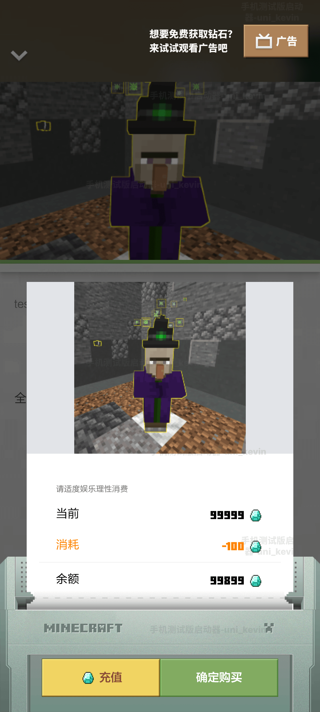

--- 
front: 
hard: Advanced 
time: 10 minutes 
--- 

# Upload and sell goods 

<iframe src="https://cc.163.com/act/m/daily/iframeplayer/?id=63468187c6dfd1bb76f2bfb4" width="800" height="600" allow="fullscreen"/> 

## Upload maps and goods in Kaiping and implement the design of instructions 

When creating resources, select **Online Hall** as the resource category and check the commercial in-app purchase function. 

 

After creation, the resource will appear in the **Online Hall Product Column**. 

 

Click **Add product**. 

 

Optional: Edit product category information. 

 

Edit basic information. 

 

Regarding the implementation instructions, the original intention is to pass the content to the logic system as an identifier to let the code know which product it is. For example, let's write a few characters in the simplest way: 

 

Then when coding: 

```python 
def PlayerBuySometing(self, playerId, buyCommand): 
if buyCommand == 'vip1': 
self.GivePlayerVip(playerId, level=1) 
... 
``` 

The implementation command format supports `str` or `json`. Either one can be used. It is recommended to use `json`. The reason is that if `str` is used, then the product with the modified implementation command cannot be put on the shelf without updating the package body. Modifying a character will cause the service to be unavailable. Although it will not happen under normal circumstances, it is better to have a backup plan. 


Using the `json` format, even if some changes need to occur, as long as the core content does not change, **it will not affect the recognition function itself**. 

 

`json` can contain any fields as long as they serve as identification. It can be code or name or any form, depending on the developer's preference. 

 

Before actually filling in the implementation instructions, in order to ensure that there is no error that cannot be deserialized, it is recommended to verify and compress json in the formatting tool. 

 

 

Add the remaining product information and save the product. 

 

Submit the product for self-testing**, and the online lobby resource itself for self-testing**, and you can see this product appear in the showcase. 

Of course, this is only the showcase of the beta client, and the official version will not put this product on the shelves. If the product is to be put into the production environment, it needs to be submitted for review and then updated to the showcase. For more information about product upload, please refer to <a href="../../../mcguide/26-在线大厅/5-在线大厅作品与商品加载文档.html">Product upload document</a>. 

 

 

 

 

Add the remaining two products as shown above. 

 

 

## Selling goods in the game through neteaseStore 

Speaking of which, do you still remember the `neteaseStore` we mentioned in the last chapter? 

 

After uploading the goods, we hope that players can not only buy them in the window, but also buy them in the game and take effect immediately. At this time, we need to use the neteaseStore frequently mentioned in the previous article, **It is an important medium for selling goods to players in the game**. 

 

neteaseStore can be seen as a UI. There are two ways to open it: 

- By default, it comes with a button in the upper left corner. Click it to open it.


 

- Do not display the built-in button, stimulate the player's purchasing demand through gameplay, and use the <a href="../../../mcdocs/1-ModAPI/界面/原创UI.html#openneteasestoregui">interface</a> to pull up the UI at the right time to guide the player to purchase 

| Parameter name | Data type | Description | 
| :----------- | :------- | :----------- | 
| categoryName | str | Product category name | 
| itemName | str | Product name | 

```python 
import mod.client.extraClientApi as clientApi 
clientApi.OpenNeteaseStoreGui("Product", "Test Product 1") 
``` 

In order to reduce the workload, we use the first method here, but the built-in button of neteaseStore is not displayed at the beginning. After all, not all gameplays require it, so it is necessary to call an interface to display this button when the player enters the game. 

Create a new part, name it ShowStorePart, and write a line of code: 

```python 
def InitClient(self): 
PartBase.InitClient(self) 
self.GetApi().HideNeteaseStoreGui(False) 
``` 

Mount it under **Player preset** or **GM class preset**: 

**GM class** preset refers to GameMananger, which is usually an empty preset with always loaded and preloaded checked 

 

 

It's that simple, enter the game and you can see the built-in store button displayed. 

