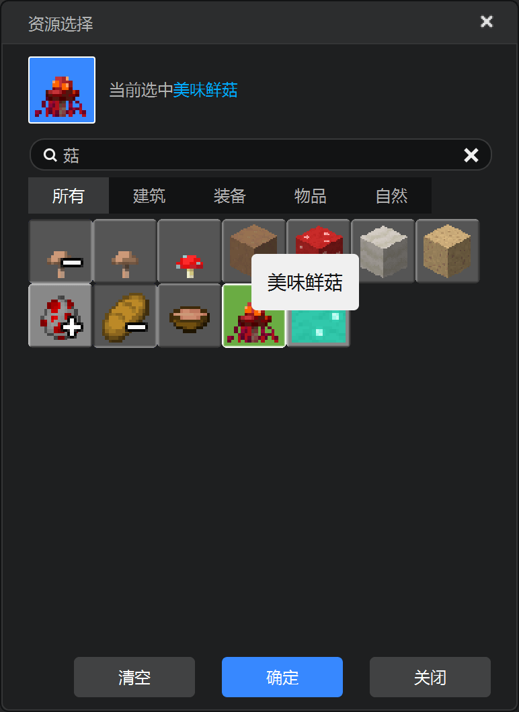

--- 
front: 
hard: Advanced 
time: 30 minutes 
--- 
# Implement the delivery logic 

<iframe src="https://cc.163.com/act/m/daily/iframeplayer/?id=634681ada240f794f8c6eaef" width="800" height="600" allow="fullscreen"/> 

**Demo can be downloaded here: [link](https://g79.gdl.netease.com/in_game_purchases_demo.zip). ** 

## Order polling, delivery parts 

If you want to do your work well, you must first sharpen your tools. In order to help novice developers get started with product production faster, the editor has prepared two tool parts. As long as you use these two parts in the editor, you can easily implement a simple product. 

They have not been tested and verified too much, it is recommended to use them only for learning reference and be used in production environment with caution. 

 

Don't be scared by the complicated pictures, this is just to better illustrate the relationship between the components and how they work. Please download and import these two parts, and let's start with the simplest item. 

 

## Delicious Mushrooms 

First, mount the OrderPoll part to the GM preset. If there is no such part, create one: 

*As mentioned in the previous chapter, the GM preset refers to GameMananger, which is usually an empty preset with the constant loading and preloading checked. 

 

Following the two parts downloaded above, an ItemShip part will also be downloaded, which is an example of using the above two parts. Click the player preset to mount the item shipment part to the player preset. 

 

Expand the properties of the item delivery part, and you can see the following configuration: 

 

Among them, the implementation instruction type, key, and value are all filled in according to the implementation instruction configuration of the goods in Kaiping. For example, the implementation instruction in Kaiping in the above figure is `{"code":2001}`. Of course, writing `{"code": 2001, "text": "Delicious fresh mushrooms", "version": 1}` is also possible. 

Once the item is used in a game, it will disappear, so it is not a persistent product and is not checked; Print event information is recommended to be checked during the development stage for easy debugging. 

The above are all the default configurations provided by the ShipBase part, and the remaining `Give item list` is the configuration provided by the ItemShip part. 

Use the popular UI to configure the list of items to be shipped for this product: 




 

Congratulations! Your first product is ready! 

Package your work and test it yourself, then enter the game to see the effect: 

 

## Healer 

Since the healer part is complex enough to realize the professional function and has been inherited from TriggerPart, we create a new healer ship part (HealerShipPart) to separate the permission determination. 

Create an empty part, inherit ShipBasePart, and name it HealerShipPart: 

 

Since the healer's product implementation instruction is `{"code": 1001}`, we fill in 1001 as the value. Check the persistent product, because the professional product requires the player to remember the player's purchased status after exiting the room. 

Compile a cloud storage table name according to the suggestion. After going online, the player's purchase information will be saved under the container of this name. If you suddenly change it, all the players who have purchased before will lose their purchase records and lose permissions. Of course, as long as it is not overwritten or deleted, everything will return to normal as long as it is changed back. This is to help understand its meaning. 

The healer is a product that takes effect permanently after purchase, so there is no need to check the timed product. 

 

It’s time to write some code, but not much. First edit `HealerPart.py`, and let the healer part ask other parts whether to stop it before turning the player into a healer: 

```python 
def OnTriggerEntityEnter(self, e): 
for entityId in e['EnterEntityIds']: 
if entityId in self.GetLoadedPlayers(): 
self.NotifyOneMessage(entityId, 'You try to choose the healer profession') 
eventData = { 
'playerId': entityId, 
'role': self.classType.replace('Part', ''), 
'cancel': False, 
} 
self.BroadcastPresetSystemEvent('PlayerTryChoiceRoleEvent', eventData) 
if not eventData['cancel']: 
self.TurnHealer(entityId) 
``` 

As you can see, if you listen to the `PlayerTryChoiceRoleEvent` event and cancel it, the player will not be able to choose the healer profession. 

Then edit `HealerShipPart.py`, listen to this event, and call an interface `IsPlayerService` provided by the shipping part, passing in a player id, which will return whether the current player has the right to enjoy the service of this product. If the player does not have the right (that is, he has not purchased it or has purchased it but it has expired), cancel the event and remind the player in a friendly way. At this time, you can show your talent and pop up some floating windows to attract consumption. In short, you know. 

- IsPlayerService server 
- method in ShipBasePart 
- Description 
- Get whether the current player has the right to enjoy the service of this product

- Return value: bool 

| Parameter name | Data type | Description | 
| -------- | -------- | ------ | 
| playerId | str | player id | 

```python 
def InitServer(self): 
""" 
@description Server-side part object initialization entry 
""" 
ShipBasePart.InitServer(self) 
self.ListenPresetSystemEvent('PlayerTryChoiceRoleEvent', self, self.PlayerTryChoiceRoleEvent) 

def PlayerTryChoiceRoleEvent(self, e): 
if e['role'] == self.classType.replace('ShipPart', ''): 
if not self.IsPlayerService(e['playerId']): 
self.NotifyOneMessage(e['playerId'], 'You haven't purchased the healer profession yet') 
e['cancel'] = True 

``` 

Done! Enter the game to view the effect (this gif is a bit long, so the purchase part is accelerated, and the player model is transparent. Don't ask me why. I don't know either): 

 

## Member special effects 

Since the member special effects parts themselves are not complicated, the main thing is to call the preset play method when the client is loaded: 

```python 
def COnUIInitFinished(self, e): 
self.GetParent().ToEffectPreset().Play() 
``` 

So recreate a VipEffectShip part and inherit ShipBase. Modify the original code above to the following: 

```python 
def COnPlayerBrought(self, playerId, expireTime=-1.0, newBuy=False, orderTime=None): 
preset = self.GetParent().ToEffectPreset() 
preset.Play() 

def COnPlayerExpired(self, playerId): 
preset = self.GetParent().ToEffectPreset() 
preset.Stop() 
``` 

`COnPlayerBrought` is an overridable client event provided by ShipBase (declare a function with the same name to listen), which will be triggered when **a player purchases an item** or **a player who has purchased an item enters the room**, so just call the preset playback directly under it. 

| Parameter name | Data type | Description |

| ---------- | -------- | ----------------------------------- | 
| playerId | str | player id | 
| expireTime | flout | product expiration timestamp | 
| newBuy | bool | whether it is a new purchase, False means entering the room after purchase | 
| orderTime | flout | order creation timestamp (purchase time) | 

Similarly, `COnPlayerExpired` is triggered when **player permissions expire**, and the special effects will be stopped. 

Expand the property bar of the member special effects part, and configure the implementation instructions and cloud storage table name as before. 

 

Check the timed product. 

 

Select the second timing type. 

 

For example, if we want this product to increase its validity period by 10 minutes each time it is purchased, and check whether it has expired once a second, we can set it as shown below: 

 

Save the parts, package the work and test it yourself, and enter the game to view the effect: 

 

#### So far, the three products we designed in Chapter 2 have all realized the shipping function. The following are some ShipBase interfaces and events, I hope they will be helpful to you. 

## Events 

- ## SOnPlayerBrought server, COnPlayerBrought client 

- Description 

- **Triggered when a player purchases a product** or a player who has purchased a product enters a room** 

| Parameter name | Data type | Description | 
| ---------- | -------- | ----------------------------------- | 
| playerId | str | player id | 
| expireTime | flout | product expiration timestamp | 
| newBuy | bool | whether it is a new purchase, False means the player has purchased and entered the room | 
| orderTime | flout | order creation timestamp (purchase time) | 

- ## SOnPlayerExpired server, COnPlayerExpired client 

- Description 

- **Triggered when a player's product rights expire**


  | Parameter name | Data type | Description | 
| -------- | -------- | ------ | 
| playerId | str | player id | 

- ## SOnPlayerNeverBought server, COnPlayerNeverBought client 

- Description 

- **When a player who has never purchased the goods responsible for this part enters the game** 

| Parameter name | Data type | Description | 
| -------- | -------- | ------------------------ | 
| playerId | str | player id | 
| regTable | bool | Whether the table has been created, but the data is empty | 


## Interface 

- ## IsMyService server 

- method in ShipBasePart 

- Description 

- Whether this order is responsible for this part 

- Return value: bool 

| Parameter name | Data type | Description | 
| --------- | -------- | ---------------------------------- | 
| orderBody | dict | Order body provided by cb of QueryLobbyUserItem | 

- ## IsPlayerService Server 

- method in ShipBasePart 

- Description 

- Get whether the current player has the right to enjoy the service of this product 

- Return value: bool 

| Parameter name | Data type | Description | 
| -------- | -------- | ------ | 
| playerId | str | Player id | 

- ## GetPlayerLastServiceTime Server 


- method in ShipBasePart 

- Description 

- Get the remaining validity period of the current player's product rights, -1 for permanent or non-timed products 

- Return value: flout/int 

| Parameter name | Data type | Description | 
| -------- | -------- | ------ | 
| playerId | str | player id | 

- ## SetCloudPersistent server 

- method in ShipBasePart 

- Description 

- Record the product purchase order status in the cloud data table of this part 

- Return value: None 

| Parameter name | Data type | Description | 
| ---------- | -------- | ---------------------- | 
| playerId | str | player id | 
| orderId | int | order id | 
| orderTime | flout | order creation timestamp | 
| expireTime | flout | product expiration timestamp, -1 permanent | 

- ## SetOrderShip Server 

- method in ShipBasePart 

- Description 

- Notify the NetEase store system that the order has been shipped 

- Return value: None 

| Parameter name | Data type | Description | 
| -------- | -------- | ------ | 
| playerId | str | player id | 
| orderId | int | order id | 

- ## GetPlayerUid Server 

- method in ShipBasePart / OrderPollPart 

- Description 


- Same as the official httpComp function, get the player uid 

- Return value: str 

| Parameter name | Data type | Description | 
| -------- | -------- | ------ | 
| playerId | str | player id | 

- ## ShipPlayer server 

- method in **OrderPollPart** 

- Description 

- This interface part is called every 4 seconds by default. You can also call it manually to check whether the player has undelivered orders. If so, start the delivery process 

- Return value: None 

| Parameter name | Data type | Description | 
| -------- | -------- | ------ | 
| playerId | str | player id | 

- ## CheckExpire server 

- method in ShipBasePart 

- Description 

- This interface part is automatically called according to the frequency set in the property panel. You can also call it manually to check the validity period of the player's permissions. If it expires, cancel the permissions and trigger OnPlayerExpired 

- Return value: None 

- ## DebugDelTableAllData Server 

- method in ShipBasePart 

- Description 

- **Use with caution**, clear all order data in the cloud storage table, enable the debugging function and enter `claer table name` in the chat box for the same function 

- Return value: None 

| Parameter name | Data type | Description | 
| -------- | -------- | ------ | 
| playerId | str | player id | 

- ## DiffForHumans Server 

- method in ShipBasePart 


- Description 

- Convert timestamp to human-friendly language (supports forward only), such as `just now`, `x minutes ago`. This is a broken version. It is recommended to only describe when the product was purchased. Better ones are on GitHub 

- Return value: None 

| Parameter name | Data type | Description | 
| --------- | --------- | ------ | 
| timestamp | int/flout | timestamp | 

