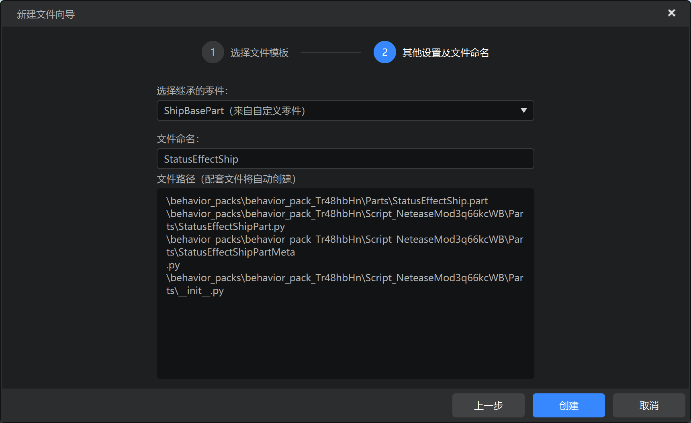
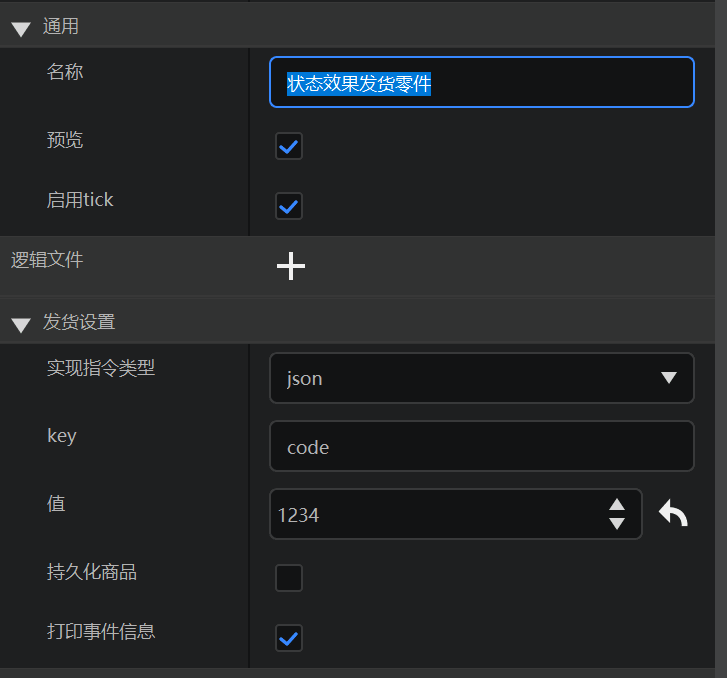
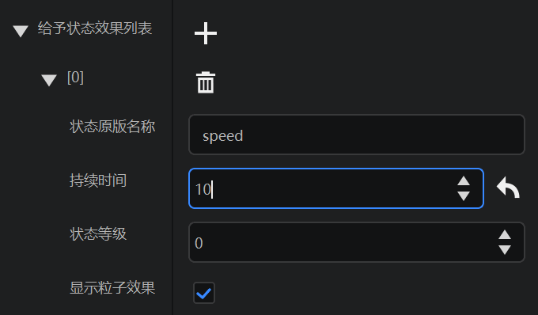
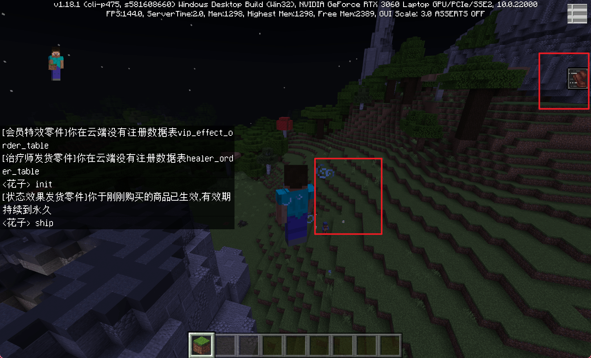

--- 
front: 
hard: Advanced 
time: 20 minutes 
--- 
# Homework on implementing the delivery logic 

After learning how to implement the delivery logic through parts, you can apply what you have learned to complete the following homework. 

## Homework requirements 

- Read the source code of the item delivery part, please download the Demo: [link](https://g79.gdl.netease.com/in_game_purchases_demo.zip). 
- Imitate the item delivery part and make a status effect delivery part. 
- Run the status effect delivery part and test the effect. 

## Operation steps 

1. Read `ItemShipPartMeta.py` 

```python 
@sunshine_class_meta 
class ItemShipPartMeta(ShipBasePartMeta): 
CLASS_NAME = "ItemShipPart" 
PROPERTIES = { 
"itemList": PArray(text="Give item list", group="Shipping settings", sort=30, childAttribute=PDict(children={ 
"itemDict": PCustom( 
sort=0, 
text="Item selection", 
editAttribute="MCItems", 
default=("minecraft:wooden_sword", 0), 
withNamespace=True, 
withAuxValue=True, 
isBlock=None, 
), 
"count": PInt(sort=1, text="Item quantity", default=1) 
})), 
} 
``` 

2. Read `ItemShipPart.py` 

```python 
@registerGenericClass("ItemShipPart") 
class ItemShipPart(ShipBasePart): 
def __init__(self): 
ShipBasePart.__init__(self) 
# Part name 
self.name = "Item Shipping Part" 
self.itemList = [{'itemDict': ('bestmap:testItem1', 0), 'count': 1}] 
self.cmdType = 0

self.cmdValue = 2001 

def CanAdd(self, parent): 
if not isinstance(parent, PlayerPreset): 
return "Item delivery parts can only be hung under player presets" 

def SOnPlayerBrought(self, playerId, expireTime=-1.0, newBuy=False, orderTime=None): 
parent = self.GetParent() 
if not parent or parent.entityId != playerId: 
return 
for item in self.itemList: 
self.SpawnItemToPlayerInv({ 
'newItemName': item['itemDict'][0], 
'newAuxValue': item['itemDict'][1], 
'count': item['count'] 
}, playerId) 

``` 

3. Analysis 

It can be seen that the `ItemShipPartMeta.py` metadata file exposes the item list as a configuration in the editor's property bar, so that the corresponding data member `itemList` can be visually edited, and then the items are distributed to the player's backpack when the `SOnPlayerBrought` player purchases the goods. 

4. Imitation 

Create StatusEffectShip parts, inherited from ShipBase. 

 

Modify the Chinese name of the part and the default attributes. 

 

Edit the metadata file, mainly pay attention to the sort recommendation of 30, and set the group to the same "shipping settings" as the parent part 

```python 
@sunshine_class_meta 
class StatusEffectShipPartMeta(ShipBasePartMeta): 
CLASS_NAME = "StatusEffectShipPart" 
PROPERTIES = { 
"effectList": PArray(sort=30, text="Give status effect list", group="Shipping settings", childAttribute=PDict(children={ 
"effectName": PStr(text="Status original name", sort=1, default="speed"), 
"duration": PInt(text="Duration", sort=2, default=1), 
"amplifier": PInt(text="Status level", sort=3, default=0), 
"showParticles": PBool(text="Show particle effects", sort=4, default=True) 
})), 
} 

``` 


Edit the `__init__` method of the logic file and add a member named effectList. 

```python 
def __init__(self): 
ShipBasePart.__init__(self) 
self.name = "Status Effect Shipment Part" 
self.cmdValue = 1234 
self.effectList = [] # Add this 
``` 

Rewrite `SOnPlayerBrought`, then traverse effectList and add the status to the player to ship. 

```python 
def SOnPlayerBrought(self, playerId, expireTime=-1.0, newBuy=False, orderTime=None): 
parent = self.GetParent() 
if not parent or parent.entityId != playerId: 
return 
for effect in self.effectList: 
self.AddEffectToEntity(playerId, effect['effectName'], effect['duration'], effect['amplifier'], effect['showParticles']) 
``` 

## Test 

1. Mount to the player preset and configure a status effect 

 

2. Modify the test data in `OrderPollPart`->`ShipPlayer`, implement instruction 1234, and fill in the same value as the part setting 

```python 
if self.debugMode: 
testData = { 
'entity': { 
'orders': [ 
{ 
"order_id": 123456789, # Order id 
"timestamp": time.time(), # Purchase time 
"cmd": '{"code":1234}', # Implementation instruction 
"product_count": 1 # Purchase quantity. Currently, multiple purchases are not allowed, so the return is 1 
}, 
] 
} 
} 
callback(testData) 
else: 
httpComp.QueryLobbyUserItem(callback, uid) 
``` 

3. Enter the game, type `init` and `ship` in the chat box, and observe the effect 


