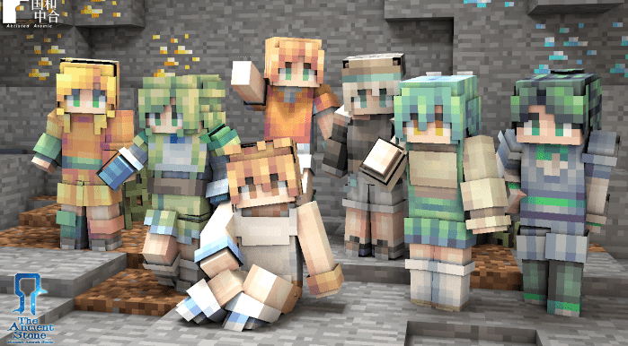
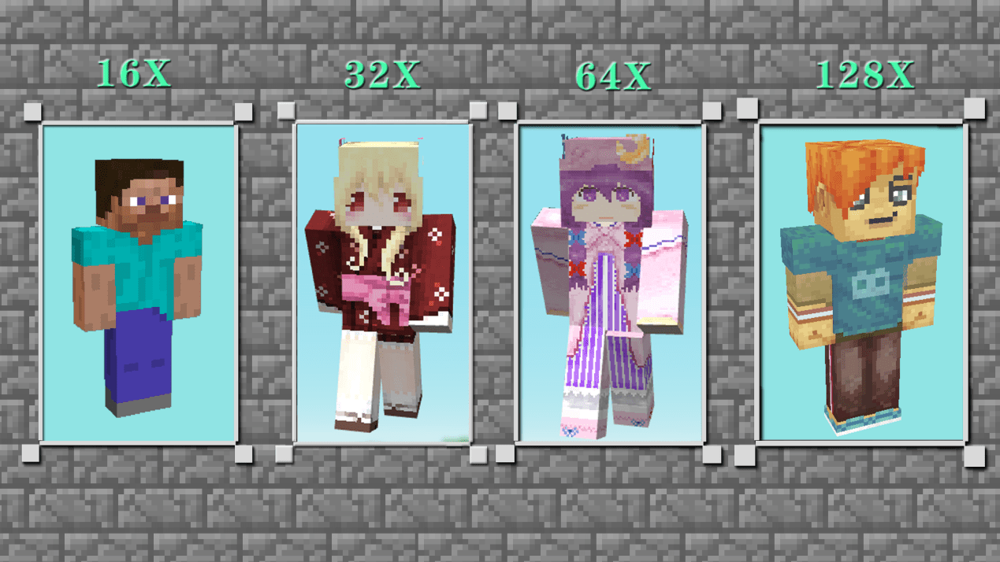
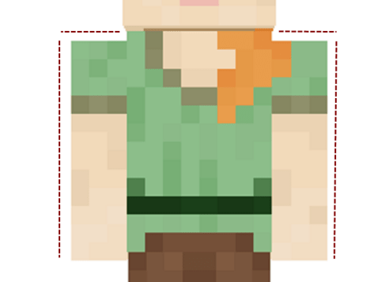
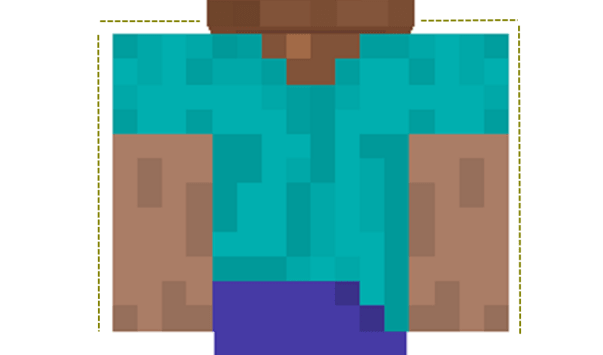
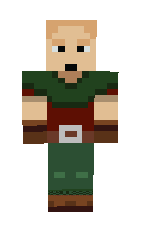
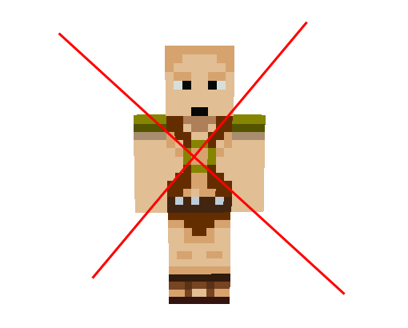

--- 
front: 
hard: Getting Started 
time: 5 minutes 
--- 
# Basic knowledge of skin 

## Understanding what skin is 

Skin is an indispensable element in "Minecraft" and is the existence of adventurers' personality. 

How to create and own a skin that belongs to you? How to make your own personalized skin not ordinary? 

Then follow this skin tutorial to learn how to create your own exclusive skin~ 

 

First, let's understand what the essence of skin is. 

Skin is actually a texture. Textures can be understood as the clothes we usually wear, and we ourselves are the main body of the character. When we wear clothes of different styles, we are also decorated with different styles and appearances. The texture of the skin defines our style and appearance in the game. 

 

## Understand the visual magic of skins - resolution 

If the texture of the skin determines the style, then the key to determining the fineness of the skin lies in "resolution"! 

At present, 16x (X means pixels) is the most basic and commonly used official texture specification, while 32x, 64x, and 128x are high-resolution texture specifications. Different skin resolution sizes will give a "high-definition" precision improvement in visual effects, and resolution is one of the factors that determine whether the texture is high-definition and fine. 

 

Tips: If you like pixel style very much, it is recommended that you do not draw high-definition textures exceeding 64X. Note: At present, the skin software skin3d does not support 32x skin drawing. If you need skins with corresponding pixel sizes, you can choose BlockBench. 

## Understand the different body types of skins 

In my world, adventurers can choose two body types: 1. Standard Steve body type 2. Alex body type 

 

 

The biggest difference between the two body types is the thickness of the arms. You can choose the body type based on the skin style you decide. For example, if you are drawing a girl, then Alex's thin arms will definitely be more suitable for the girl's softness. On the contrary, if you are drawing a boy, then you need Steve with thick arms to show the boy's toughness~ 

 

When drawing skin texture types, we also have two options: 1. Single-layer skin 2. Double-layer skin 

 

1. Single-layer skin: The skin has only one layer, and the arms and legs can only be drawn in one style, and then the software automatically mirrors and copies. It is very suitable for novices who are just starting to draw. 

 

2. Double-layer skin: It means adding another layer of texture on the basis of single-layer skin, which is equivalent to putting another piece of clothing and a hat on the character. Moreover, the hands and feet of double-layer skin can be drawn separately on the left and right, and the software will not mirror and copy. It adds more fun and choices for creation. Generally, it is the skin format often selected by novices after they advance.

 

## Rules for skins that cannot be displayed 

After completing their works, many adventurers have encountered problems such as not being able to upload their beloved skin works, or failing the review. Here, in addition to complying with and paying attention to the review system proposed in the new version of the "Developer Content Review System", we must also pay attention to the following points. 

Screenshots of failed uploads 

First, the skin is missing. 

A common problem caused by incorrect specifications drawn and saved by the software during the drawing process. All you need to do is test and check it in the skin software 3Dskin first. If you find any missing, just fill it in and upload it again. 

 

Second, skin drawing is too exposed 

Sometimes the so-called exposure is not just the skin without clothes, but also includes the skirt that is too short, resulting in too much white space in the lower body, or the upper body clothes that are too low, resulting in too much white space, which may be judged as too exposed. So everyone should pay more attention to the color coverage when drawing~ 

 

Third, directly use the original texture 

Many developers like the original texture series, and then directly paste the original texture on the body after drawing the face and limbs. Then it will cause the review upload to fail. Therefore, it is generally recommended that you make some minor modifications when using the original textures on your body, such as completing the parts and details of the clothes, or drawing your own logo~ 

 

The above are the most common skin review issues that developers have encountered so far. If you want to know more about the upload specifications, you can check out "Component Listing Specifications and Review Guide" for more in-depth learning. 
