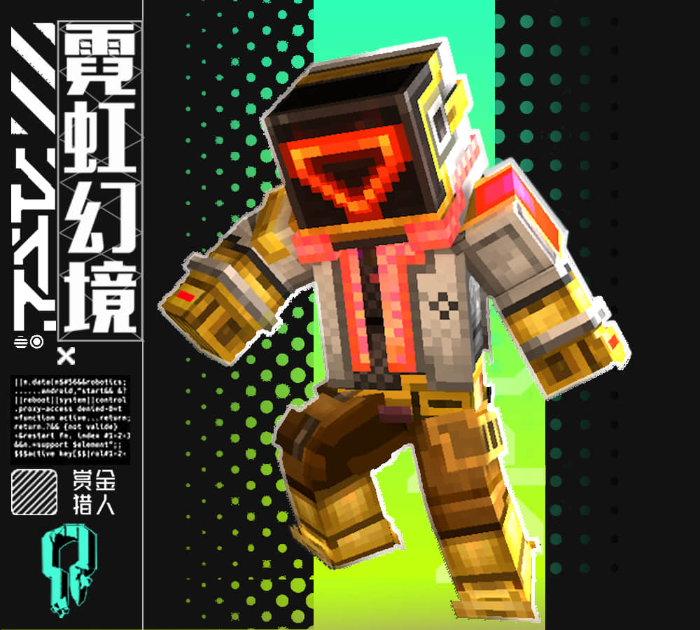

--- 
front: 
hard: Getting Started 
time: 5 minutes 
--- 
# Initial skin operation 

## Choose a skin you like for category structure analysis 

Judge the resolution, structure and model base of the selected skin. 

For example: This skin is a 32-pixel, double-layer skin based on Steve's body model. 

 

## Comment on the pros and cons of this skin and the room for improvement 

Comment on the pros and cons of this skin, and propose room for improvement and ideas for these pros and cons. 
