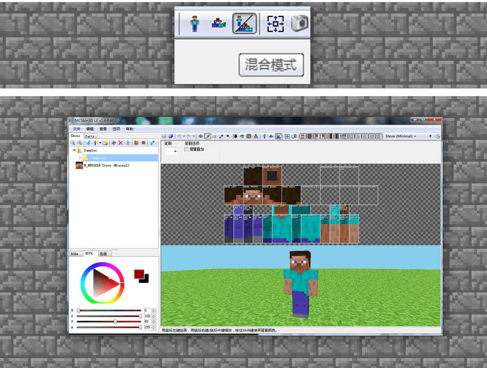
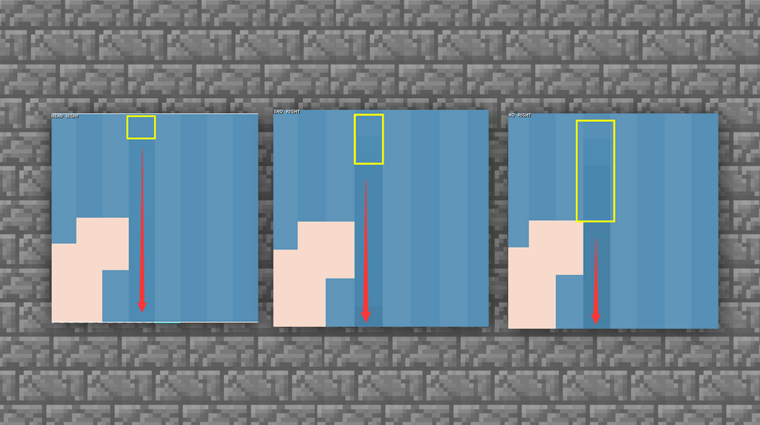
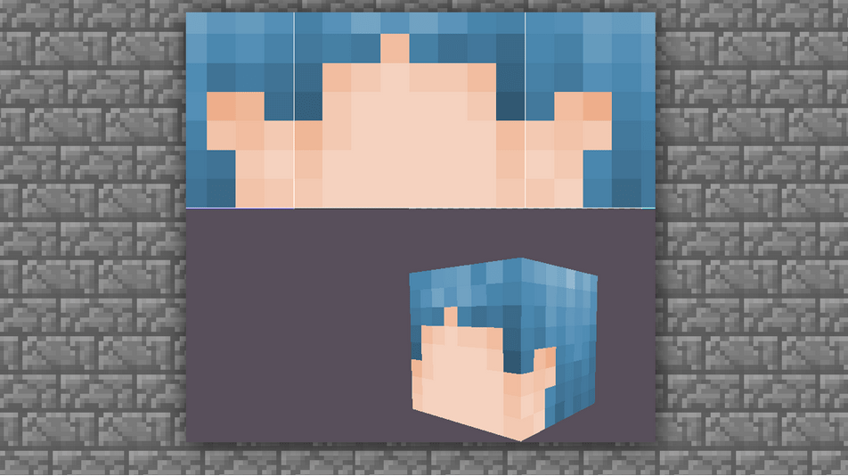
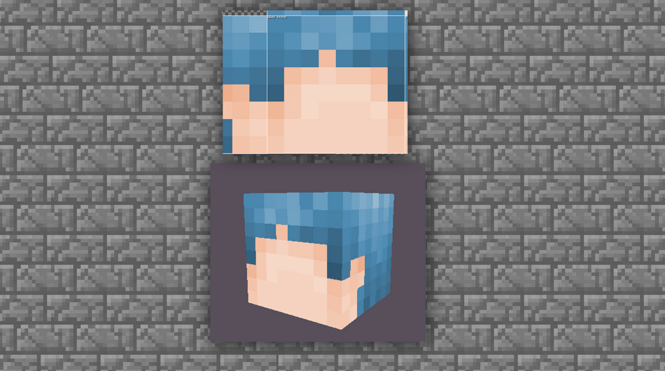
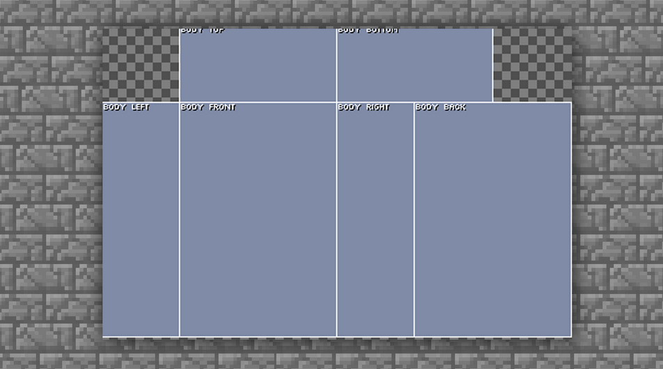
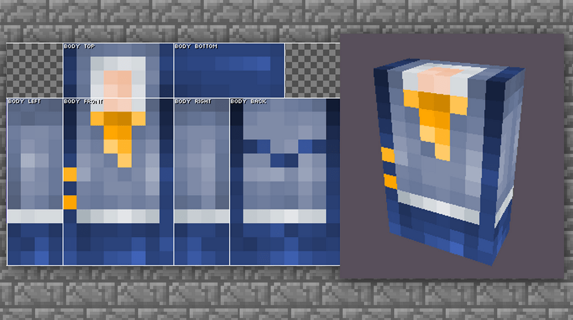
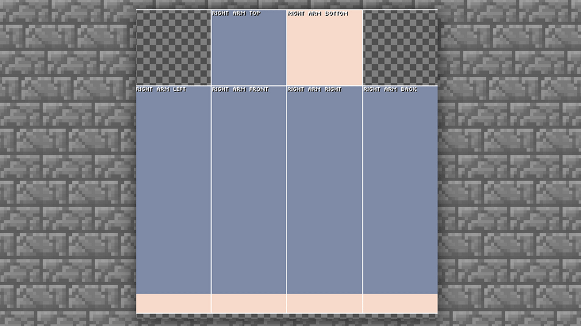

--- 
=front: 
hard: Getting Started 
time: 5 minutes 
--- 
# Steps and specifications for making skins 

## Learn to set a skin 

Before drawing a skin, don't rush to start drawing it directly~ because if it is your first time drawing a skin. It is best to set a skin first! 

First, you need to draw a basic draft or find some references for yourself. 

 

Secondly, set a style for the skin. The style can be determined by your own style. 

If you are doing original drawing, you can find some real style combinations for reference, and you can try some two-dimensional color matching in color matching. Such a mixed style combination often yields considerable creative gains~ 

 

Then, you can find inspiration from real clothing cases and determine the general style type, short sleeves, long skirts or long pants. 

But please note that the 16X texture structure is that each face has a limited number of pixel grids that can be drawn, so if we need to draw all the contents such as eyes, hair, mouth, etc., it is definitely not recommended to learn to make trade-offs. And if you really want to draw more finely, it is recommended that you try to draw a higher level of high-definition textures after you become proficient in drawing in the later stage to realize this idea. 

 

Finally, give the skin a color tone definition. 

For example, the main clothing color, skin color and hair color of our skin should be selected in advance. And it should be noted that when drawing, the general color should not be too bright or too heavy (too high saturation), such as bright red or dark black. 

 

After such a set of processes, we have a definition and direction for the overall skin we want to draw. In this way, the process of completing the skin will be more efficient! 

## Start drawing your own skin 

### Drawing the head 

Since we have learned the skin settings, let's start our introductory learning with single-layer skins. 

First create a single-layer STEVE skin. 

Select [Skins] → [Players] → [Steve (Minimal)] 

Note: The skin with Minimal is a single-layer skin, and the skin without Minimal is a double-layer skin

 

After confirming the new behavior, we can see that an original Steve is generated in the software. 

Turn on the 2D/3D hybrid mode in the toolbar to display the texture and model together. 

Note: Of course, you can also start drawing directly. As long as you are confident enough, you can start in any mode. 

 

In order to facilitate the drawing of the head, we will cancel the display of all areas outside the head. 

Click the option in the box to cancel the display of all parts except the head from the toolbar. 

 

After clicking on the torso, hands and feet, only the head and helmet are left, so you can draw accurately. 

 

(The above cases are not recommended for everyone to use~ because they are not conducive to beautification in the later stage) 

First, we choose the commonly used neutral head skin and hair colors that can add or subtract shadows and highlights as the skin and scalp base colors of our skin map. 

 

If you are not sure whether the color you pick is the color you want, you can refer to the following accurate color picking methods: 

First, you can choose a relatively intermediate color, such as black, gray and white. Gray is between black and white, that is, gray can add shadows and highlights in the later stage, which is very suitable as an intermediate color. 

Second, you can choose the character picture case you like or want to draw and directly pick the color, which is also possible. 

 

After selecting the color, use the pencil mode in the toolbar to draw the head. The two selected colors are left in the blank areas of the texture. 

(Note: All colors can be left outside the texture, which can well ensure that the color will not deviate from the original color after later drawing~ Leaving colors outside the texture display will not affect the character's skin itself, so the blank space can be used at will, and you can also leave your own signature.) 

 

Directly use the pencil large brush to paint the head model block [top] top of the head, [bottom] part of the chin connecting the neck, [front] face, [Right] right side face, [Left] left side face, [Back] back of the head, all with skin base color. 

 

#### How to draw hair 

The hair style in the head area has certain limitations in terms of the degree of drawing. We can use bangs to increase the beauty of the skin.

 

The first part of the base color bangs only needs to have a rough distribution shape, because it will be superimposed through the helmet later, so you don’t need to worry too much about the problem that the bangs seem a bit dull in the initial performance. 

Next, start to superimpose the shadows on the hair, that is, color the hair texture. Make the hair look more natural. 

We select the lighten/darken tool in the toolbar 

 

You can adjust the intensity of the tool here according to the actual situation and find the feel of drawing. Lightening is used to reflect the highlight part, so start with the dark shadow to increase the texture. 

The texture of the hair is normally one by one, so you also need to try to draw it down one by one in the pixels. 

 

First, distinguish the lines one by one. 

 

Although the current lines may be relatively rigid, they have a preliminary expression of the layers of the hair. Then the next important step is: the overlapping of dark shadows. 

 

Leave a grid from the first darkened area and draw a line. Then the number of grids can be adjusted according to personal visual effects. Repeat the deepening of the shadows, and the layers of the hair will be highlighted. 

 

Note: In many cases, you don't need to apply it very regularly. Applying it very regularly will make the performance look very rigid. 

Next, add a highlight part. The highlight does not need to be applied all over, only part of it is enough. For example, just like the highlight in the example picture, the hair can be given a local highlight feeling. 

 

In the tool selection, you need to choose lighten between lighten/darken. 

Then select the area with the brightest highlight, which is usually in the middle of the upper forehead. 

 

 

Use the tool to draw a brightening line directly. 

 

After this increase, do you feel that the hair is a little more prominent?

Then we adjust the surrounding gradient transition to be natural. 

 

Next, we start drawing the top of the head. According to popular understanding, the top of the head generally has a [swirl]. 

That is, the hair is scattered according to one or more center points. 

So in the current case, if you need to draw a middle-parted feeling, you need to continue to use the darkening function. 

 

The hair is divided into half on the left and half on the right, and then start drawing the other hair in the vertical direction. 

 

After completing the current step, you can see that the top of the head has a certain shape. Next, you need to follow the content mentioned above and draw the shadow and highlight parts. 

 

After filling the shadow and highlight, the hair drawing is basically completed. 

You can adjust the details according to your personal preferences. 

#### How to draw the face 

Next, we will continue to refine the face. The face is generally drawn according to the direction of the hair roots, and shadows and highlights need to be added. 

#### Continue to use the [Darkening Tool] 

 

Draw a circle of shadows along the roots of the hair. Using the overlay effect, you can draw the shadow of the face. 

 

The face is relatively flat at present, so we can use highlights to increase the volume. 

 

The part below the neck is a blind spot, so we can use a little shadow technique to roughly apply some shadow effects to create a sense of connection with the neck. 

 

After completing the current step, the performance of the face is roughly the same. Next, we will start with the two most important points of the head: bangs (helmet part) and eyes.

Let's start with the bangs. 

#### How to draw bangs 

The bangs are the helmet part in the texture. 

 

Generally speaking, if the hair part is already completed, you can use the PS tool to copy and modify it directly. Of course, if you are not very familiar with PS, then we can draw the bangs again according to the hair drawing method. 

 

The second layer of bangs looks very dull at present, so we need to adjust it. 

Trim the edges of the bangs, and the trimming shape can be selected according to your own personal style. 

 

Then, based on the shadow performance of the first layer of hair, color the shadow and highlight of the second layer of helmet. 

 

The trimmed hair will become very natural. After some detailed adjustments to the color and shadow, we can draw the facial features and eyes. 

#### Drawing eyes 

There are actually two ways to draw facial features. The first is the conventional two-grid drawing method that everyone often uses, and the second is the Japanese three-eye drawing method. The mouth part is usually chosen by everyone according to their own preferences 

The first method: the conventional two-grid eye drawing method. The height of the eyes is best in the fifth to seventh rows of the face. Different height positions can make the eyes show different states. 

 

The second type: This type is a more Japanese-style drawing method, which makes the distance between the two eyes farther, and adds eyebrows and light blush, which will have a more cute effect. 

 

So you can draw the eyes according to your own preferences and aesthetics, and try to add some light and dark adjustments to the eyes. 

So far, we have completed the steps of drawing the head. With a good start, the next drawing will be smoother. 

### Drawing of the body 

#### Overview of body drawing

As for the drawing of the body, as long as you understand the drawing rules for hair, you can figure out a set of handy drawing methods. The basic operation of the body is actually the same as the head, and the focus is on simplifying the clothes. 

 

#### Body drawing skills 

First, as usual, we set the interface to only display the [Body Part]. Hide all parts other than the body in the middle of the [Toolbar]. And set the mode to mixed mode. If it has always been this mode, you don’t need to set it. 

 

After setting it up, we only need to draw the middle body part, that is, the body map, and the left and right sides are the hands and feet, which do not need to be drawn for the time being. 

 

Use [Toolbar] → [Eraser] to first erase all the original parts of the body. 

 

Then use [Toolbar] → [Pencil] to fill the clothes with the base color. 

**Note: You can also draw the outline first, so that you can better color the blocks. In the demonstration part, we will take the base color first as an example. ** 

 

Then start to roughly draw parts such as collars and buttons to determine the overall shape of the clothes in advance. 

 

After the base color is laid, you can start to process the light and shadow. There is one thing you need to pay attention to: most common clothing belongs to the fabric category, the light and dark relationship is relatively scattered, and there will not be too strong contrast. Therefore, many large areas of clothing should be transitioned through intermediate colors as much as possible. 

We use [Toolbar] → [Luminosity Brush] to color the details of the first layer. 

 

Next, start to refine the light and dark of the clothes to increase the texture of the clothes. 

Continue to use the [Toolbar] → [Luminosity Brush] to darken and overlay 

 

The overall darkness has been almost added, and the side joint connection can be deepened a little bit. Of course, we also need to pay attention to the light feeling when coloring. Do not apply direct highlights. The color should be softened and extended. 

Continue to use the [Toolbar] → [Luminosity Brush] to darken and overlay the contact part of the side joint. 

 

At this point, the drawing of the body is basically completed. Let's display the head we drew before and take a look at the overall effect. If you think the overall effect is not good, you can make some fine adjustments. After the adjustments are completed, you can start the next step. 

 

### Drawing of limbs 

#### Drawing of hands and feet 

Through the drawing of the head and body, we have a basic understanding of the method of drawing the overall structure. 

In the single-layer skin, you only need to draw one hand and foot, and it will automatically become two, just like a mirror image. But in the double-layer skin, it is different, and there is also a little content that needs to be paid attention to. 

First, let's display the arms as usual. 

[Toolbar] → [Blending Mode] Open & Display [Arm Part] Separately. Either left or right. 

 

The color of the clothes for the hands and feet can be selected according to the color of the clothes on the body. If the design is sleeveless, just draw the skin color according to the color of the face. Next, let's start directly. First, paint the base color of the arms according to the base color of the clothes. 

Note: Don't forget to draw the hands. 

 

 

Then, based on the same principle as before, first draw the general shadow. The upper limbs can be roughly divided into three parts: the arm, forearm, and hand. Because the volume of the blocks is the same, we only need to use shadows to divide the arm into two parts. 

Similarly, use [Toolbar] → [Lighten and Darken] to draw the arm in sections. 

 

 

Darken the parts close to the body, such as the armpit and the side and front close to the body. At this time, you can display the body part, and then observe and draw the whole part. 

 

First, darken the part of the arm close to the body. Use [Toolbar] → [Lighten and Darken] to choose darkening. 

 

Then just add a little highlight to the middle part of the arm, don't make it too bright, and refer to the clothing settings of the body part for brightness issues. 

 

Next, we will transition the light and shadow relationship from the front to the side.

 

When drawing the inner part, there is no need to arrange the highlight part. Because this is the backlit side, you can use a dark transition to suppress the light. 

 

For the other back side, you can directly follow the same pattern or copy it directly. 

 

The arm part is basically completed. Next, you can color the hand part again according to the previous arm coloring method. 

Note: The part of the hand close to the body is defined as the palm, and the palm needs to be darkened. 

 

In this way, the structure of the entire arm is completely drawn. Let's display both arms and the body to see the overall effect. 

 

Here we mainly check whether there are any problems with the connection part, and then we can start drawing the legs according to the drawing of the arms. 

#### Drawing of legs 

The drawing method of the legs is roughly the same as that of the arm sleeves, because the lower limbs can also be divided into three parts, and you only need to display each part. 

First, lay the base color as usual. Then here I will show you a little trick. If you want to reasonably connect the upper and lower body, you need to extend the clothes of the body part. 

 

Based on the drawing of the hands, continue to add the distinction between light and dark in the legs. 

Use [Toolbar] → [Lighten and Darken] to select Darken 

 

Similar to the drawing of the upper limbs, the upper limbs are darkened in the armpits, and the legs are darkened between the legs, because this is the least exposed to the light source. Similarly, we also need to pay attention to the superimposed color and number of dark parts, and pay more attention to the seamless connection with the upper body. 

 

Continue to superimpose the dark parts, and then superimpose the highlights like the upper limbs. 

 

For the part where the thigh roots meet, it is recommended that you draw it according to the combination of the upper and lower parts, otherwise the skin will look a bit out of place when walking. 

There are many ways to draw the sole, but because the sole is vague in reality, you can do whatever you like. In the case, choose the round-shaped drawing method. You can also choose the stripe drawing method (see finger drawing for stripes) 

 

Then show all the parts and let's take a look at the overall effect. 

 

According to the overall, you can add some small details to decorate, and our own small skin is completed. 

 

## Correct format for skin export 

After our skin is drawn, we need to export it in the correct format so that it can be uploaded to the web page correctly. 

If you use MCskin3D, just use the menu bar [File] - [Save As] to save the texture. 

 

Enter the name of your skin into the file name, and then save it directly. 

 

 

If you are a developer who uses Photoshop to draw skins, you must choose PNG format when saving. Otherwise, there will be a reading error. 
