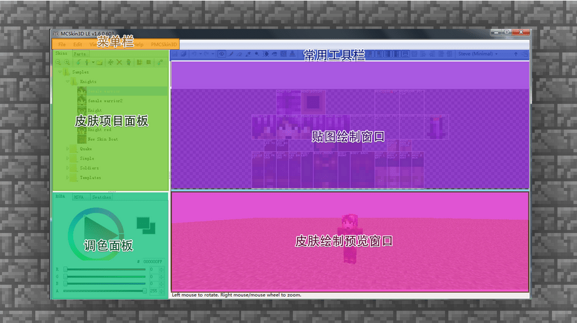
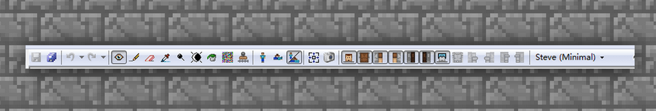
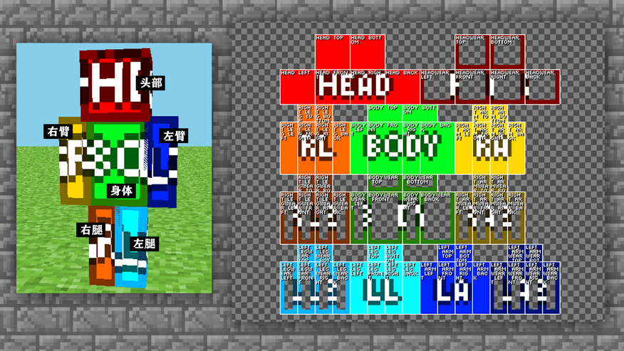
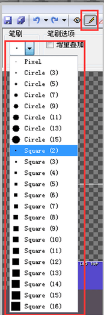
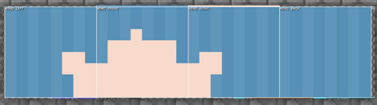
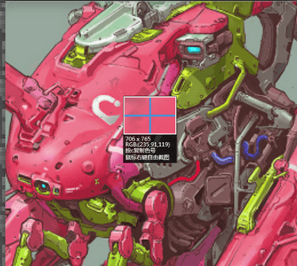

--- 
front: 
hard: Getting Started 
time: 5 minutes 
--- 
# Software Learning: MCskin3D Software Tutorial 

Through the above explanation of the basic concepts, I believe everyone has a general understanding of skin. But if you want to draw skin, it is also very important to choose a good auxiliary skin drawing software. And MCskin3D software is the easiest and most practical skin drawing software for Minecraft. Let's get to know MCskin3D together. 

 

MCskin3d is a free skin maker, through which you can draw the skin used in "Minecraft". In this software, you can experience the most convenient skin drawing method, and you can also browse and load all skins that meet the specifications in the game, as well as batch management. This editor supports editing in 3D view, 2D view editing, and 3D/2D half view drawing, so that skin drawing is no longer a problem. 

## MCskin3d interface introduction 

Next, let's learn how to operate the interface~ 

——First, we download MCSKIN3D and open the software interface. 

As shown in the figure below, the software interface is clearly divided into six major blocks: menu bar, common toolbar, skin project panel, texture drawing window, color palette, skin drawing preview window. 

 

Menu bar: It collects all the functions and operation commands of MCSKIN3D, including 5 major menus. Through the operation of the menu, you can complete the project material management, editing projects, adjusting views and other operations. 

 

Common toolbar: It contains the tools commonly used when drawing and editing skin textures, which are also commonly used when we draw. 

Such as lens adjustment, drawing tools, eraser, color picking, skin display mode selection, etc. 

 

Skin project panel: All newly created skins or drawn skin files will be saved in this panel, which can be intuitively distinguished from the small icons, and you can right-click the skin here to [rename]. And you can also zoom in and out, copy, and increase or decrease the resolution, which is very clear and convenient. 

 

Texture drawing window: This area is used for fine-tuning textures. It is very important. For example, this part is needed when drawing eye color, character bangs, and clothing accessories. When you are proficient in the operation, you can basically draw roughly on the texture directly, and then switch and adjust the model texture back and forth. This part is more advanced, and you can try it when you have a certain level of proficiency.

 

Each piece of the map has the model block name written on it, so you can easily find the part that needs to be drawn. 

 

Color palette: a color blending and selection panel where you can select and blend your favorite colors, and then use drawing tools to color them. Of course, there is also a black technology here, which is the color palette. You can save your favorite colors or used colors in the color palette, so that you can easily retrieve them. 

Skin drawing preview window: The drawn skin will be displayed and read in 3D in this part. You can use the mouse to move the perspective accurately to see the effect and picture feeling of the skin. The model previewed here is the same size as in the game, so you can adjust it with confidence. 

 

## Create a new skin using MCskin3D 

### Create a new skin type 

Now that the modules have been introduced, let's start the actual operation. 

First, find [New Skin] in the menu bar in the skin project panel 

 

Then select the skin type model you want to draw. ALEX and STEVE correspond to the latest double-layer skin texture model, and the one with the minimal label is the old version of the texture model, that is, the single-layer skin version ALEX and STEVE. 

So what is a single-layer skin and what is a double-layer skin? Let's learn through examples. 

—Single-layer skin: The skin has only one layer, and the arms and legs can only be drawn in one style, and then the software automatically mirrors and copies. Generally suitable for beginners to practice. 

 

—Double-layer skin: It means adding another layer of texture on the basis of a single-layer skin, which is equivalent to giving the character another coat and a hat. Moreover, the hands and feet of double-layer skin can be drawn separately on the left and right, and the software will not mirror and copy. It adds more fun and choices for creation. Generally, it is the skin format often selected by beginners after they advance. 

 

## How to use MCskin3D to draw skin 

The most commonly used tools for skin drawing in **MCskin3D** are: 

Pencil, eraser, color picker, brightness brush, paint bucket. 

Next, let's try how to operate each tool. 

 

【Pencil】Use pencil to draw pixel blocks for skin, which is often used to draw the structure and details of the skin. And you can also adjust the brush size according to your needs. 

 

 

 

【Eraser】You can erase and modify everything you drew wrong. Like a pencil, you can adjust the brush size as needed.

 

[Color Picker] can pick up colors from the previous drawing place/case, which is very convenient and quick. 

 

[Brightness Brush] is a tool that can make the base color brighter/darkened. According to different strengths and brush sizes, the intensity of brightening and darkening can be controlled to increase and change the light and shadow contrast of the character. 

 

 

[Paint Bucket] can directly lay down large quantities of colors, which is very useful for laying down the base color. 

 

After getting familiar with the tools, let's start drawing our own skin~ 
