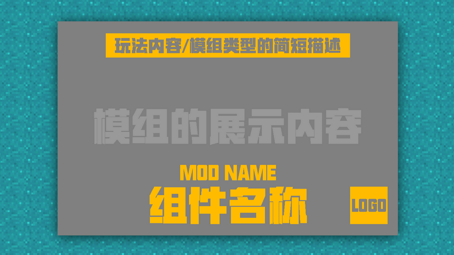

--- 
front: 
hard: Getting Started 
time: 5 minutes 
--- 
# Promotion and Upload: Make a promotional image and put it on the developer platform 

## Understand the importance of promoting your work 

After we have completed the work, if we want more people to understand and appreciate your work, it is important to arrange an impressive promotion for the work. It can make you stand out from many ordinary visual promotions.  

So under what circumstances can we use promotional images? 

1. Work Upload Platform 

There will be a special promotional image upload location on the developer platform, and all the size specifications are clearly written on it. Just make it according to the size and rules. 

 

2. Make a personal video promotion 

Making a good promotional video can also play a good role in promoting your work, and the cover of the promotional video is also a primary promotional image position that attracts attention. 

 

With a clear promotional channel and location, combined with a good promotional picture, everything will be twice the result with half the effort. But of course there is a premise, we must understand what is a good promotional picture. Next, let's take a comparison picture to feel the good and bad. 

This character itself is blue, but the background is real and the same color, which completely blends the character and the background together. This is very undesirable. Because it not only fails to achieve a good promotional effect, but also lowers the texture of our work. 

 

And the overall layout of the picture is clear, with clear priorities. The background color and the front character part are clearly divided. Although there are also cold colors, they do not appear abrupt and are even more coordinated. This is a good promotional picture. 

## How to quickly conceive a promotional image with personal style 

It is not difficult to make a good promotional image, but you must learn to combine the correct composition layout, font type, color, combination shape, position, etc. according to the corresponding size. Only then can you get the basis of the promotional composition you want. 

 

**—Understand the usual listing size and specifications of the developer platform** 

When listing works on the computer version/mobile version of the developer platform, the size is usually mostly horizontal. 

 

 

For example: the carousel images displayed on the homepage and the carousel images on the product details page are mostly horizontal, but the cover image is generally a vertical image, so everyone must pay attention to this point, and the size must be adjusted and drawn according to the size given on the platform.

 

**—Layout of horizontal promotional images** 

**Icon image composition (mobile version)** 

The icon image is the first image displayed to players in the resource center area component in the current version of the mobile launcher. However, due to its small size, its main function is to convey a sense to players, that is, to roughly judge the style and type of module by seeing the icon. 

 

For the icon image, what we need to do is: without stacking too many elements, it can stand out from the icon display images in the resource center and successfully attract players. 

The following is a brief overview of the resource center icon: 

 

### Production suggestions 

First, the icon image can be divided into multiple areas. Here I suggest dividing it into 3 areas: 

 

Area 1 will be blocked by the rating content, so try not to place key elements in the lower right corner, and also pay attention to the component text not being blocked by the rating, which will affect the overall appearance. 

Because of the setting of the rating (area 3), the area 2 part is relatively abrupt, so the recommended way to deal with it is to pull a small horizontal bar at the bottom to perfectly integrate the rating into the entire icon image. 

 

The small horizontal bar can be used to add the team/studio name, or the component name or gameplay type. 

After the color of the small horizontal bar and the text is selected, it is recommended not to modify it at will. Keep it consistent in future icons, and it will exist as a characteristic logo of the studio's works, which is convenient for players to recognize. 

### banner image (computer version & mobile version) 

Banner image, the core display image of the gameplay. The beauty of the banner and the quality of the content it shows will determine the effect of player drainage. A good banner is very important for everyone to publish their own gameplay promotion content in player forums, communities, and news. 

 

General banner design suggestions can refer to the following composition for combination. It is recommended that you make a banner image that highlights the theme of the gameplay, is beautiful, and has a certain visual impact. 

 

### Font/color selection

It is recommended to use bold fonts as much as possible. Generally, we recommend that you choose commercially available open source fonts. 

You can try a font style close to the official logo, which will look comfortable and not inconsistent. 

 

On the premise of not using three-dimensional font design, we generally recommend that you choose gradient colors to make flat fonts, and at the same time, try to choose pure color gradients. If you can master the principle of color matching, of course, we also recommend that you try other gradients with large color spans. 

### POS picture 

**Key points: This is the picture that appears on the purchase page. Generally, players who can see this picture have the possibility of becoming your customers. ** 

 

So the information we need to convey in the POS image is very simple: 

1. Thank the adventurer for his support, and hope that the adventurer can pay attention to the studio's subsequent works or join the studio discussion group 

2. In case the adventurer's balance is insufficient, tell him that he can go to the advertiser to watch the advertisement to get diamonds 

Production suggestions: 

The content of the POS image does not need to be related to the component content, but it needs to have a certain degree of versatility, so follow the above points to complete the production, and then put the studio's logo, and it is almost done. 

### Carousel image 

The carousel image can be called the banner in the component page. It is a place where you try to put the most attractive parts of the component you think. 

But be careful not to enlarge the instructions in the carousel image. Try to put the component effect image in the game as much as possible. Make good use of the valuable places and put the coolest things in the module on it to attract the interest of a specific part of the players. This is the biggest role of the carousel image. 

Note: No matter how brilliant you think a certain highlight in the gameplay is, do not use the same one for all three carousel images... 

 

## Upload the work to the developer platform 

After the promotional images are made and arranged, we can directly upload the work and promotional images through the developer platform's listing process. 

First, we log in to the developer platform with a developer account, select [Work Management] - [Listing and Resource Management] on the page [Publish New Resources] to start listing our works. 

 

Then, we fill in the information about our work based on our own work.

 

The component information here must be selected according to the type of product you make~ Otherwise, the wrong category cannot be put on the shelf. 

 

Then upload the promotional picture we made according to the specifications and location. 

 

 

After uploading, just click Save, and then apply for listing review. If there are any missing parts, the system will prompt you to complete them. 

 

After the review is passed, the Shelf button will appear, and you can directly put your work on the shelf to start showing your talent. 
