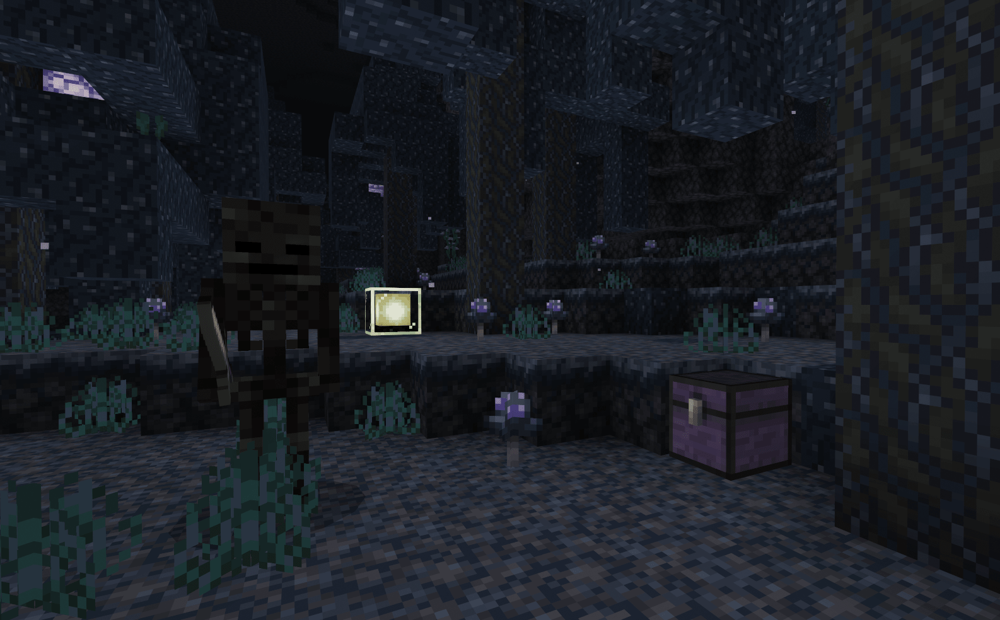

--- 
front: https://mc.163.com/dev/mcmanual/mc-dev/assets/img/1-1.221f1a2b.jpg 
hard: Getting Started 
time: 5 minutes 
--- 
# What is a gameplay map? 

<iframe src="https://cc.163.com/act/m/daily/iframeplayer/?id=62457fab75882ab49558bcc9" width="800" height="600" allow="fullscreen"/> 

Parkour maps, adventure maps, survival maps, mini-game maps, decryption maps and other types of maps can be called gameplay maps; they rely on the original game content and expand it, and innovate more "possibilities" on the basis. At the same time, the gameplay map needs to be different from the original game, which is the importance of **core gameplay** in the gameplay map. 

 

**This series of tutorials will explain how to create and publish a gameplay map from beginning to end, so that novice developers can become qualified gameplay map developers. ** 

## Comparison of the difference between gameplay maps and gameplay components 

First of all, the most obvious and most important difference between gameplay maps and gameplay components is "freedom". Game maps must rely on a map scene. Players will complete all games in this map scene. Even maps with open world gameplay must have "boundaries"; 

But gameplay components do not need to add extended gameplay content to the infinitely generated original world. 

 

Therefore, we can also infer that the game scene is an important element of the gameplay map. So in the following chapters, we will focus on how to use the developer workbench and other software tools to efficiently create game scenes. 

If developers want players to be more immersed in the game, or even put themselves into the role of the game, then they should choose a gameplay map; compared to functional components, maps can make the gameplay more complete and the immersion stronger during the experience. Everything in the map is decided by the developer, and the style of the scene will be better controlled, and the general movement of the player can also be grasped. 

 

Imagine: the player is born in a dark forest, surrounded by dust and glimmers. The player needs to explore the forest and find important treasures to escape; during this period, he may encounter monsters, discover ruins, and obtain loot. 

In such a description, if you want a full sense of immersion and control the player's play direction while ensuring the game experience, a gameplay map is definitely the best choice. 

## Elements required for gameplay maps 

The elements that a gameplay map must have are: 

- Core gameplay: The core gameplay will run through the entire game process, and players will always play around it. 
- Game scene: the area where players are active, which can be as large or small as possible, but cannot be non-existent or infinitely large. 

In addition, additional scoring elements can be expanded: 

- Numerical system: attribute restraint relationship, equipment bonus, level increase growth, etc. 
- Clearance goal: players need to play the game towards the goal and eventually clear the level. 
- Additional gameplay: stack more branch gameplay on the basis of the core gameplay to increase playability. 

Only by fully combining the above elements, using them reasonably and giving full play to creativity can we develop high-quality gameplay maps! 

## Experience high-quality gameplay maps 

There are many works in the resource center of the Chinese version of Minecraft. It is recommended that new developers experience some works before learning development, so as to have some understanding of maps and components. In addition, experiencing high-quality gameplay maps is also a very important lesson, because this can not only learn good game design, but also understand what kind of game content can give players a better gaming experience. 

There are also relevant tutorials and examples on the official website of Minecraft developers: [《My Seaside Farm》](../../20-Gameplay Map Tutorial/Chapter 00: Example Download/Example Download.html) 

 

**Homework:** Try to experience some excellent gameplay maps and analyze the parts you like or dislike. 

