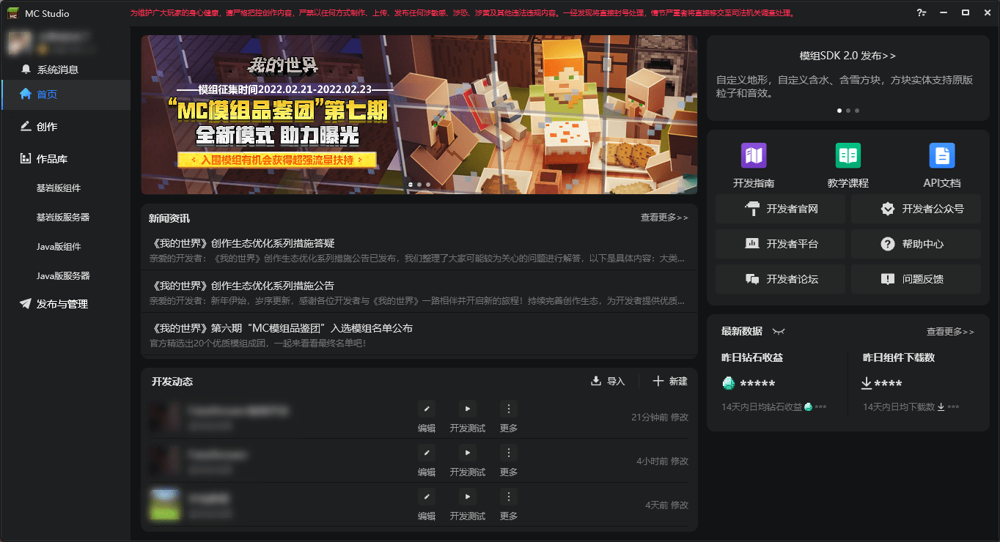
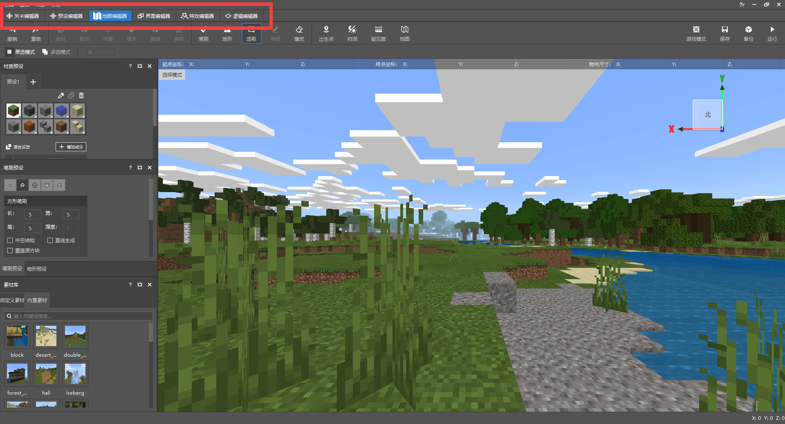
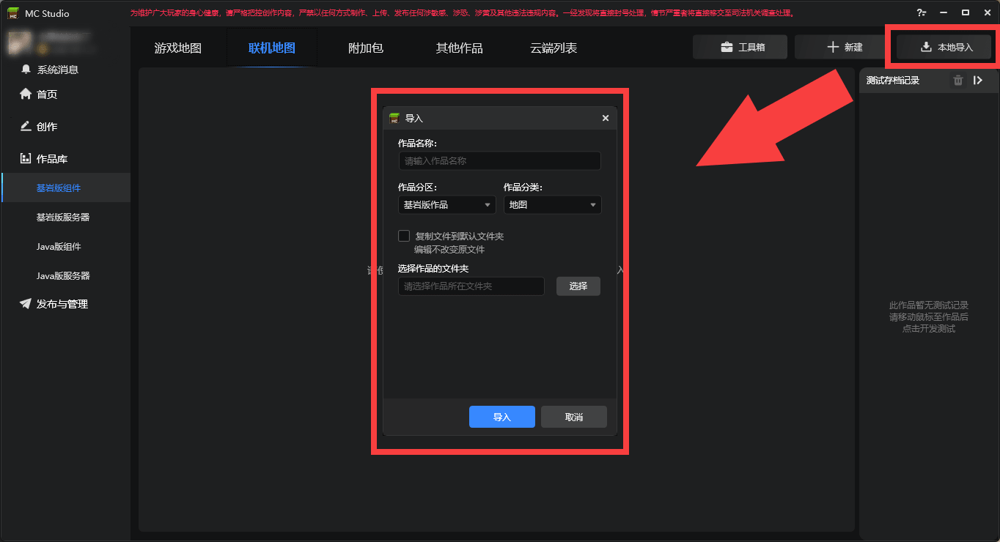
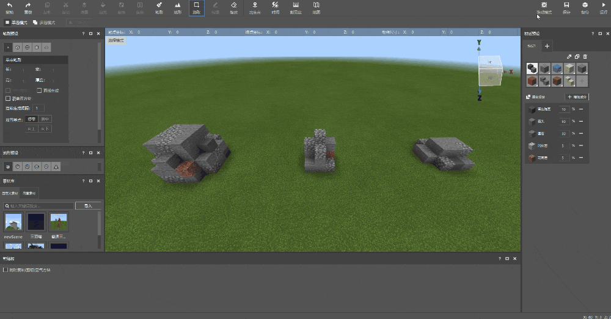

--- 
front: https://mc.163.com/dev/mcmanual/mc-dev/assets/img/2-2.64c9a165.png 
hard: Getting Started 
time: 20 minutes 
--- 
# What is a development workbench? 

<iframe src="https://cc.163.com/act/m/daily/iframeplayer/?id=624583ef75882ab49558bce9" width="800" height="600" allow="fullscreen"/> 

On the homepage of [Minecraft Developer Official Website](https://mc.163.com/dev/index.html), you can download the "weapon" of the Chinese version of Minecraft developers: **Minecraft Development Workbench**. 

 

The development workbench integrates a variety of common functions that developers need: news information, development dynamics, revenue data, etc.; most importantly, it provides convenient development tools that can make component development simpler and more efficient. 

 

## Open and use the editor 

In the creation column, create a new blank map; after creation, find the newly created map in the Bedrock Edition component of the work library, and click Edit to open the editor. 

 

Opening the editor will switch to the map editor by default. There are a total of 6 editors including it: 

- Level Editor: Create custom game content (items, blocks), provide a stage for placing presets, special effects, etc.; 
- Preset Editor: Create parts, presets and edit them; 
- Map Editor: Modify the terrain, buildings, etc. of the map. Save structures and materials for reuse; 
- Interface editor: create UI interface; 
- Special effects editor: create particles and sequence frame special effects; 
- Logic editor: write visual blueprint code. 

The above 6 editors are more or less useful in development. In this chapter, we will introduce the map editor and explain how to use the map editor to create buildings and save them as materials for subsequent use. 

 

## Map Editor 

After clicking Edit, the map editor will be opened by default; 

 

As shown in the figure, the red box is the toolbar, and we will use the tools here to create; the orange box contains brush materials, brush presets and material libraries. The created buildings can be saved as materials and can be called up in the material library at any time; the blue box is the game screen, and operations such as moving and flying are consistent with the game; the green box has some additional functions. 

### Brush Tool 

 

Select the brush tool, adjust the material and size of the brush in the **Material Preset Window** and **Brush Preset Window**, then click anywhere on the map to place blocks. It also supports dragging the mouse to place multiple blocks with one click. 

 

In the material preset window, you can also use the eyedropper to absorb the clicked material; you can also mix and match materials, and brush out multiple block materials at the same time to make the terrain more natural. 

 

The brush can also select the shape and adjust the length, width and height. Select in the brush preset window, which is divided into: single point brush, square brush, spherical brush, cylindrical brush, hemisphere brush. Other functions also have their uses. Reasonable use will get twice the result with half the effort: 

- Hollow structure: The shape generated by the brush is air inside. 
- Straight line generation: Select two points and form a line between the two points to generate a shape. 
- Overwrite the original block: The brush will replace the original block being operated. 
- Continuous generation spacing: When dragging and placing, the distance from the last generated shape. 
- Placement base point: Based on the brush click position, select which side the shape will be generated on. 
- Placement direction: Rotate the brush shape. 

### Terrain tools 

Terrain tools can adjust the terrain, such as smoothing, erosion, etc.; the next chapter will focus on terrain tools, so I won't go into details here. 

### Selection tools 

After selecting the selection tool, drag the mouse to draw a range. After selecting, you can press a certain edge of the selection to zoom in or out or drag the corresponding XYZ axis arrow to move. 

 

Multi-select mode can also adjust multiple selections at once, which is more convenient. 

 

After selecting a selection, you can save the blocks in the selection as structures or materials. Structures can be randomly generated in the world through features. The materials will be saved in the editor, and they can still be used even if the map is switched. In addition to the materials saved by the developer, there are some built-in materials in the editor, all of which are from the original structure: village houses, woodland mansions, shipwrecks, etc. 

 

After the selection is made, we can edit the selection with the next tool. 

### Editing tools 

In edit mode, the six tools that have been in a gray and unclickable state in the toolbar are lit up. These tools are based on the editing tools. We select this tree frame, and then we can perform the following operations on the tree in this selection: 

- Copy: Keep the blocks in the selection and copy a material that can be placed arbitrarily. 
- Cut: Clear the blocks in the selection and copy a material that can be placed arbitrarily. 
- Stack: Copy the blocks in the selection continuously in a certain direction and place them directly. 
- Fill: Fill the selection with a certain block. 
- Replace: Replace a block in the selection with another block, such as: grass block -> dirt 
- Offset: Move the selection to any XYZ direction without affecting the blocks in the selection. 

Copy and cut operations will also be recorded in the clipboard on the right side of the editor. If you accidentally make a mistake, you can select it back through the clipboard. 

### Eraser tool 

Click or drag to clear the blocks in the map: 

 

## Make buildings and save as materials 

Next, we use the map editor to make some building decorations, and use the selection tool to select them and save them in the material library. 

 

If you have made buildings in advance, you can import the archive into the editor and save them; click **Local Import-Select Archive-Import**. Next, find the imported map and click Edit, and you can see the buildings made in advance. 

 

Of course, you can also use the map editor to start making directly. Use the hemispherical brush to add a variety of blocks to the material presets: stone, raw stone, cyan terracotta, etc. and adjust the mixing ratio. Simply modify the size, placement base point and placement direction, and click twice; stones of different sizes, materials and shapes will appear. 

*The editor window can be dragged and placed at will. In order to see it more intuitively, the material preset window is placed on the right side of the picture* 

 

You can also use the single-point brush or eraser tool to fine-tune, or click the game mode in the upper right corner to enter the map and modify it yourself. 

 

Using the selection tool to quickly place blocks can save a lot of time when making buildings; however, it is generally suitable for some repetitive and large-scale filling work. It is not recommended for some small buildings, which will be counterproductive. 

 

In the next chapter, we will learn how to use the terrain tool. At that time, we will also need to use the selection and editing tools together, so the various tools of the map editor complement each other. 

 

After making a building, use the selection tool to circle the building, click Save as material above and modify the name, and then you can see it in the custom material library; Remove air and remove fluids, as the literal meaning, is whether to save air and fluids (water, magma) when saving the material, which will be decided by the developer according to the situation. 

 

**Homework:** Try to use the map editor to make buildings and decorations, or import external archives and save the made buildings as materials. 
