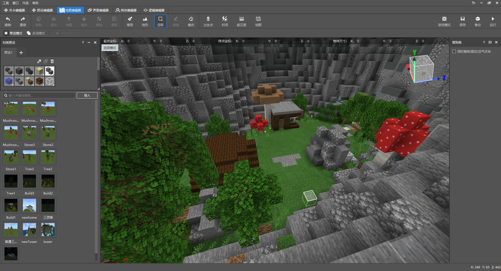

--- 
front: https://mc.163.com/dev/mcmanual/mc-dev/assets/img/3-1.9e1364d9.png 
hard: Advanced 
time: 20 minutes 
--- 
# The role of game scenes in gameplay maps 

<iframe src="https://cc.163.com/act/m/daily/iframeplayer/?id=6245844875882ab49558bcef" width="800" height="600" allow="fullscreen"/> 

In the first chapter, we introduced the essential elements of a gameplay map, including: game scenes. In short, it can be divided into terrain + buildings. After creating a good terrain and "pasting" buildings on the terrain, the game scene has been formed. 

Scenes are very important in game maps. The first step after players enter the game is to appreciate the game scenes. They also deal with scenes all the time during the game. In the architectural map type, there are only scene buildings and no gameplay. Even so, many players are willing to spend time appreciating and experiencing them, so this is why gameplay maps need to polish the scenes. 

 

* Taking "My Seaside Farm" as an example, the map scene is composed of island terrain (gray part) and buildings (color part); and the ocean acts as a boundary. * 

In terms of architecture, whether it is made using tools in the map editor or manually made in the archive, it is composed of blocks set by the developer himself, and spliced together step by step. The terrain is different. Using the terrain tool, a large number of blocks can be quickly generated and debugged by the developer; this chapter will teach you how to use the editor's terrain tool to make terrain and briefly introduce the terrain software WorldPainter. 

## Terrain Tool 

Open the map editor, we can find the terrain tool in the toolbar, and there will also be a "Terrain Preset" window. We can use these presets to create terrain: 

- Bump: Slowly bulge the terrain, stacking it higher and higher. 
- Erosion: Gradually cut the terrain blocks until it is flat. 
- Smooth: Make the terrain friction smoother and the slope more natural. 
- Fill: You can fill the potholes until it is flat, similar to bumps. 
- Top Cover: Select blocks through material presets and paint them on top of the terrain. 
- Plants: Click to generate the original plants. 

Except for plants, these presets can adjust the operation area to circle or square, adjust the area size, and whether to affect fluid blocks in the preset window (if checked, the terrain tool will avoid fluid); 

### Bump 

Click the ground to make the terrain slowly bulge, and click the blocks within the range to determine the material of the bulge; 

 

### Erosion 

Almost the opposite of bulge, each time you click or hold, the terrain will be continuously reduced until it becomes a plane. 

 

### Smooth 

Make the uneven terrain gradually smooth, and the smoothing standard is similar to the terrain generated by the original version. 

### Fill 

Use it on holes to quickly fill them up. If you keep clicking on the same position, it will not continue to stack upwards after filling the plane, which is different from the bulge. 

 

### Top Cover 

Top Cover allows you to select a block in the material preset window and paint a layer of blocks where you click. Unlike other presets, Top Cover also allows you to select the number of layers and effects to be painted: Top Cover, Top Replacement, Surface Replacement; these three effects are slightly different. 

 

### Plants 

Select the plant type and click to generate (need to be on the block of the environment, such as trees need to be on the dirt or grass block) 

 

## Fabricating terrain 

Next, we use this terrain preset and other tools to fabricate a simple terrain. First, use the selection tool to clear a range from the forest: Select Range -> Replace -> Replace leaves and wood with air. 

 

### Mountain 

Use the brush tool or the ridge of the terrain tool to circle an area; be casual and create it according to your own ideas. The stones in the circled area will be molded into a mountain. Of course, it is completely unusable at present. It is very unnatural and does not look like a mountain at all. 

 

Then use erosion to reduce some slopes and try to make these regular spheres look less "regular" and more natural. 

 

It is necessary to remind you that the method and style of terrain creation do not need to be unified. Every developer has his own ideas, and the finished products developed are also varied; divergent creativity is also a key step in development! For example, the terrain can be completely non-natural and non-realistic. Square is also a good choice: 

 

*The lobby of the "Jungle Rush" Demo map was created using the brush function of the map editor, and the overall look is natural and harmonious. * 

Go back to the tutorial content and continue to brush higher mountains on the outer circle of the stone mountain to reflect the layered feeling of the mountains. And make it more natural through erosion and smoothing. 

 

If there is only one kind of block, the mountain will be very monotonous and unnatural; so we need to select it and randomly replace some block materials with similar colors or that can make the mountain more natural: stone -> stone 60%, cobblestone 20%, andesite/polished andesite 20%. After the overall replacement, use the top layer to cover and brush blocks of other materials according to the slope or number of layers of the mountain. 

 

For this mountain, I mainly painted the slope and the top of the mountain with cyan terracotta tiles, gray concrete, and concrete powder blocks. The overall tone is gray and black, without too much modification. It looks bare at first glance. After learning the method, developers will definitely be able to make better use of tools to create good-looking terrain. 

### Lake 

Because the space reserved in the mountain is small, if a lake is created within this range, there may be no other space for activities, so I plan to dig a lake from a certain position of the mountain, similar to the effect of a cave; 

 

You can use the brush tool, change the material preset to air, check the cover original block and adjust the placement base point to the center, so that we can DIY a large eraser. 

 

After digging out a new area, we continue to paint it to make it more natural and integrated into the terrain. 

 

In addition, I also dug a small pool on the mountain above the cave, and connected the bottom of the pool to the cave, so that the water will flow to the pool in the cave, forming a connection. 

 

At this point, our terrain is almost done. Overall, it is still very desolate. There is nothing else on the mountain, in the basin, or in the pool of the cave. Therefore, we need to add vegetation and natural landscape. Use the flowers, plants, stone cones, etc. in the original version to continue to improve the terrain. 

 

The original version has a large number of blocks and vegetation for modifying caves and karst caves, so we can use these to decorate a beautiful scene. 

In the area surrounded by the mountain, remember the trees, stones and other materials saved in the previous chapter? Now they can come in handy. 

 

Click on the material you want to place directly in the material library, and then place it in the editor; click on a certain location in the map, and the material will not be generated directly, but displayed in the form of a selection. The developer can also drag the XYZ axis to fine-tune the position, and then click OK to generate it. If you accidentally place it in the wrong position, you can click the Undo button to rewind this step, or you can use the selection tool again to select the placed building and perform other editing operations. 

 

Place all the materials according to your own ideas. At present, our scene has a very good effect; what is more interesting is that we have almost no reliance on content outside the editor, and the buildings and other decorations we have made can be reused, that is, the materials can be reused. 

 

If you are still not satisfied with the current effect, you can continue to adjust it. Click the game mode in the upper right corner of the editor and make it manually. 

## WorldPainter (terrain tool) 

WorldPainter is a software tool dedicated to Minecraft terrain production. This software is very powerful. If you are proficient in the software, you will have no problem with all kinds of large-scale natural terrain landscapes. 

WorldPainter official website address: https://www.worldpainter.net/ 

 

After downloading and installing from the official website, open the WorldPainter homepage, you can see that there are many tools similar to the editor in the software. In addition, there are many powerful functions that the editor does not have; so if you want to make more professional and larger terrain, it is highly recommended to learn and use WorldPainter. 

However, WorldPainter only supports the export of JAVA version game maps. After export, it can only run on the JAVA version of the game. You need to use other tools to convert the archive to the Bedrock version. It is recommended to use: [Chunker](https://chunker.app/), which supports the archive formats of the Bedrock version and the JAVA version. Upload the map file to convert to each other, and you can also change the world settings with one click. 

 

**Homework:** Use the Minecraft Workbench map editor to create simple terrain: lakes and mountains. 
