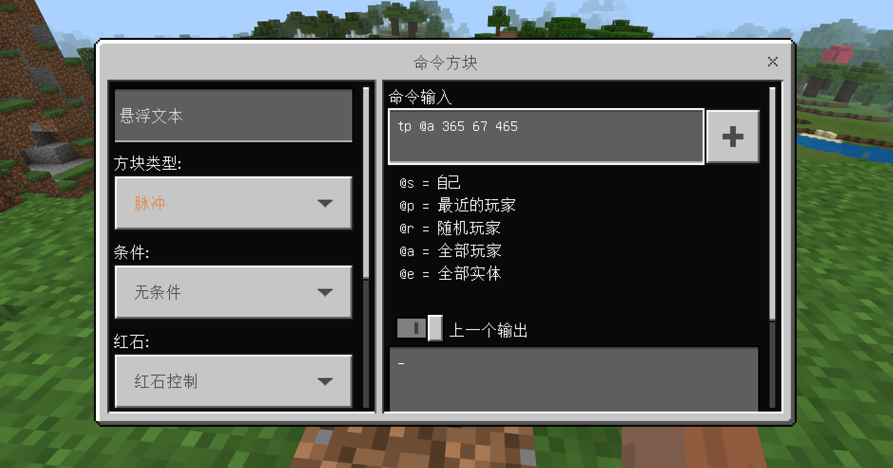

--- 
front: https://mc.163.com/dev/mcmanual/mc-dev/assets/img/4-2.4ec735bf.png 
hard: Getting Started 
time: 15 minutes 
--- 
# Commands that can change the world 

<iframe src="https://cc.163.com/act/m/daily/iframeplayer/?id=624584b2b8a81f8fa083c0c5" width="800" height="600" allow="fullscreen"/> 

If you have played the original survival version of Minecraft, we all know that all materials need to be collected and obtained by yourself, and destroyed before creation; but if you want to break this rule, we can enter a mysterious letter in the game (/gamemode creative or /gamemode 1) to switch from survival mode to creative mode. 

 

## What is a command? 

Simply put, a command is something that players can enter to activate a function. 

In the game, commands can be entered through the chat window, and the general format is: / + command body; **The initial slash (/) is required. ** Some commonly used commands include: 

- gamemode: Switch the player's game mode 
- gamerule: Set the game world rules 
- setblock: Generate blocks in the world 
- give: Give items 

In addition, there are many more commands. By fully utilizing their functions and combining them, you can create a unique way of playing. 

[Command Block Table (Wikipedia)](https://minecraft.fandom.com/zh/wiki/%E5%91%BD%E4%BB%A4#.E5.91.BD.E4.BB.A4.E5.88.97.E8.A1.A8.E5.8F.8A.E5.85.B6.E6.A6.82.E8.BF.B0) 

## Command's good friend: Command Block 

In addition to players inputting in the chat bar, using the command /give @s command_block, you can get a command block. Under normal circumstances, this block can **use redstone signals to activate commands**, no matter where the player is. 

 

Right-click to open the command block menu. Next, the functions of the command block will be introduced one by one (Bedrock Edition) 

 

There are three types of command blocks: pulse, chain, and loop. The execution process of these three command blocks is slightly different. 

- Pulse: The appearance is orange. The command block executes a command each time it is activated. 
- Chain: The appearance is green. This command block will only be executed when the command block pointing to it is activated. 
- Loop: The appearance is purple. Each time it is activated, the command will be executed several times in a loop (1 game tick). 

Switching the command block and saving it will change its appearance: 

 

*From left to right, they are pulse, chain, and loop; the scissor head on the top of the command block is pointing, which will affect the triggered chain block* 


The command input box on the right is where you enter commands. You don't need to add a slash (/) before the command in the command block, but adding it won't have any effect. When using commands in the command block, you need to pay attention to distinguishing the **target selector**. Take the /gamemode 1 (switch to creative mode) command as an example. It is meaningless when executed in the command block because the command block doesn't know whose game mode to modify (it's not the command block itself anyway, because it's just a block...), so at the specific position of the command, we need to add a target selector to let the command block find the execution object. 

 

Add a **@a** after the switch game mode command, and the command block will switch all players in the game to creative mode. 

After the command block is triggered, the output window below will provide some prompts: 

 

*The target selector of the command in the picture is incomplete, and the error is fed back in the output window and the specific location is pointed out* 

### Conditions 

There are two types of conditions: **unconditional** and **conditional** . This option is mainly for chained command blocks. 

The default state is unconditional, which means that the chain block itself must be executed regardless of whether the command block pointing to it is successfully executed. The conditional one requires the command block pointing to it to be successfully executed before the chain block itself will be executed. 

Conditional constraints actually have a great effect. For example, we need to implement a function: clear the player's gold ingots to give him diamonds (barter). If unconditional is selected, the player will be given diamonds directly regardless of whether the player's gold ingots are successfully cleared. Here, conditional conditions must be used to ensure that the player has gold ingots and clears them. 

You can tell by **appearance** whether a command block is conditional or unconditional: 

 

*Unconditional (left) Conditional (right)* 

### Conditions 

Under normal conditions, a command block needs a **redstone signal** to trigger execution; if its trigger condition is switched to **stay on**, the three different types of command blocks will have different effects. 

A normal command block will only execute once, a chain command block will still wait for the command block pointing to it to execute, and a looping command block will execute infinitely at a frequency of once every 1 game tick **(1 second = 20 game ticks)**. 

A large number of looping command blocks will cause obvious lag when they are kept on, so try to avoid using them in large quantities. 

### Delay in selected options 

It is mainly reflected in the looping command block. If you set it to 20, the looping command block will execute once every 20 game ticks (1 second). 

If used on a pulse command block or a chain command block, after the command block is activated, it will delay the set time before executing the command. 

 

*Loop command block with no delay set and remains enabled* 

### **Execute the first selected option** 

This option only takes effect on loop command blocks. If enabled, the command block will **wait for the delay before executing the command** before executing the command; otherwise, it will **execute the command first and then delay** . 

## Make a simple small function 


There are many types of commands, and each command has a different way of using them, so it is impossible to cover them all in the tutorial; next, we will use several commonly used commands as examples to create some small functions. 

### Player Teleport Point 

First, turn on the coordinate display in the settings. The player's current coordinates will be displayed in the upper left corner. Record the coordinates at the location you want to teleport to, and you will need them later. 

 

Then find an area (such as the game lobby) to place a command block so that the player can teleport when clicking a button or stepping on a pressure plate (which can activate a redstone signal). 

 

Enter the command /tp <target selector> <coordinates xyz> in the command block, and place a button for the player to use. 

 

Put a command block and a button on the ground. It looks ugly. You can build a simple building to surround the command block and make it more like a teleportation site: 

 

The teleportation function alone is very abrupt. Other details and effects should be added to make the teleportation more "attractive". Use the /particle command to generate particle effects at the teleportation location; place a conditional chain block after the teleportation command block, and particles will be generated if the player successfully teleports. 

```Command 
/particle minecraft:totem_particle <coordinates xyz> 
``` 

Note that in the picture, the chain command block is used to ensure that the previous command block points to the chain command block. 

 

 

Therefore, command blocks are very flexible to use. Simple teleportation functions can also be combined to produce very different effects, such as adding a delay to the teleportation, or allowing the player to be teleported without any operation when entering the range. (All commands and usage methods can be found in the command table URL at the beginning of this chapter) 

### Give items to players 

Many gameplays require players to obtain props, equipment and other items, so the function of giving players equipment is very important. We need to allow players to continue to obtain gold ingots when they are close to the gold mine, and this can be done with one give command. 

Place a looping command block that remains open in the center of the gold mine, set a delay of 20 game ticks (1 second), and the command is as follows: 

```Command 
/give @a[r=5,m=0] gold_ingot 0 1 
``` 

 

The command body is give + target selector @a (all players), and the content in brackets after the target selector is to filter the target selector or add conditions: r=5 represents a 5-square range centered on the command block; m=0 is a player in survival mode. Therefore, by adding conditions to the **target selector**, the function of detecting players is realized. So when there is no player within the five-square range centered on the command block, nothing will happen to the command block. 

 


Let's continue to add functions to it and implement the **"barter"** function; if the player has experience, he can get gold ingots near the gold mine, but the experience will be -1 level. 

Similarly, place a 20-tick delay loop command block that is kept open in the middle of the gold mine, and point it to a chain command block that is kept open and has conditions, and set the following commands respectively: 

```Command 
Loop command block: /xp -1l @a[r=5,m=0,lm=1] 
Chain command block: /give @a[r=7,m=0,lm=1] gold_ingot 1 
``` 

 

The function implemented by the loop command block is to subtract the experience of players with a level greater than 1 in the range every 1 second. When the command block is executed successfully, the chain block will give a gold ingot to the player who meets the conditions. **lm=N** is used to determine whether the player level is greater than N. 

 

Commands are not only numerous, but also have a variety of uses and variations. It takes a long time to understand all the functions of commands, so it is impossible to introduce them in detail in this chapter. If you want to learn more, you can go to [WIKI Encyclopedia](https://minecraft.fandom.com/zh/wiki/%E5%91%BD%E4%BB%A4#.E7.9B.AE.E6.A0.87.E9.80.89.E6.8B.A9.E5.99.A8.E5.8F.98.E9.87.8F) for detailed learning. 

## Further Change the World 

Are you "bored" with the original grass blocks? Or do you want to make your cats and dogs look like what you like, or turn emeralds into rubies. By modifying the material, the above "fantasies" can all be realized! 

 

Right-click the work in the editor, open the work's directory, and you can see **resource_packs (resource pack)** in the map file. Modifying the files inside can achieve the effect of **changing the world**! However, after you open it, you will find that there is nothing inside except some folders. 

So we need to find an **original resource pack**, modify it, and then put it in the map's resource_packs. Find the location of the editor on disk and then find the original resource pack according to the example path: 

D:\MCStudioDownload\game\MinecraftPE_Netease\PCLauncher\data\resource_packs\vanilla 

There are many files in the original resource pack, which contain different types of image files, such as: **textures** is the folder for storing textures, and textures such as blocks and items can be found here; 

 

Open the textures in the original resource pack, the blocks are in the Blocks folder, and you can roughly understand the types of textures stored by translating the folder names into Chinese. Here are some examples of commonly used folder names: 

- textures -> items: item textures 
- textures -> blocks: block textures 
- textures -> models: entity model textures 
- textures -> particle: particle effect textures 
- textures -> ui: UI interface textures 

We change the file name of cyan terracotta to green terracotta, and when we enter the game, we can see that the color of the mountain we made in the previous chapter has changed, and the overall effect of the terrain has also changed: 

 

So the texture package is very important for the gameplay map, and it is not impossible to make Minecraft more like an independent game. 

**Homework: ** Modify the texture package at will to achieve different effects; use instructions and command blocks to create more functions or improve on the basis of the tutorial. 

