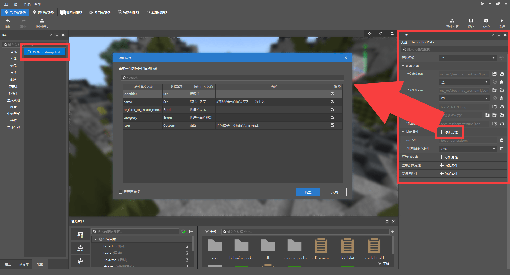
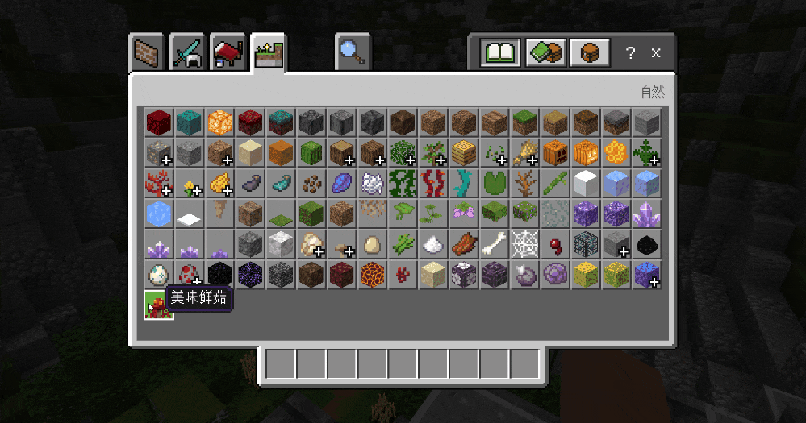
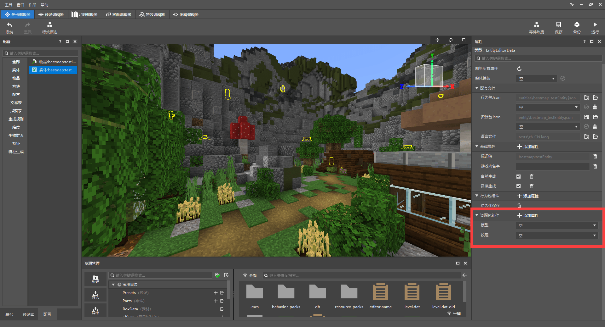
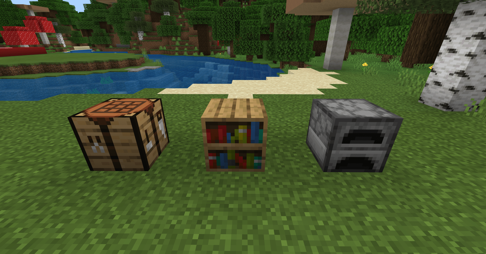

--- 
front: https://mc.163.com/dev/mcmanual/mc-dev/assets/img/5-4.1090e32f.png 
hard: Advanced 
time: 20 minutes 
--- 
# Breaking the constraints of the original version 

<iframe src="https://cc.163.com/act/m/daily/iframeplayer/?id=6245852c48e274908924ef22" width="800" height="600" allow="fullscreen"/> 

When we make a gameplay map, we may use a large number of blocks and items, and even creatures. But the content of the original version is limited. When we are no longer satisfied with the content of the original version, we need to add more. So this chapter introduces how to use the level editor to quickly create custom content. 

## Getting familiar with the level editor 

The level editor has three main windows: **Configuration, Properties, and Resource Management windows**; equally important are the Preset Library (displays the created presets) and the Stage (presets appear here after being placed on the map). 

All custom content created in the level editor will be found in the configuration. Click on one to see its properties; and the Resource Management window is where you can quickly find the map file (the resource pack in the previous chapter can also be found here) 

 

*Entities are not displayed in the map editor, but are displayed in the level editor and will be selected by a yellow box* 

## Create new custom content 

Click New on the left side of the Resource Management window, select Configuration, create a new empty template item and name its file. Click Create and you can see it in the Configuration window. Custom content consists of a namespace and a name (not in Chinese), for example: bestmap:Item1. 

 

After creation, select it in the configuration window on the left to modify its properties; **Take items as an example**, divided into: 

- Supporting files: can quickly open the file and folder of the item. 
- Basic properties: modify the item name, texture file, etc. 
- Behavior package component: add behavioral characteristics and functions to the item. 
- Armor wearing properties: set the characteristics of the item when it is worn. 
- Resource package component: add resource effect characteristics and functions to the item. 

 

We add some basic properties to this item, click the **Add properties** button, add all the selectable basic properties, and modify it to a food called Delicious Mushroom and make it appear in the creation bar. The item texture is simply modified with the original mushroom. 

Add food properties, stacking quantity and usage time in the behavior package component; add usage animation in the resource package component. The final property window and effect are as follows: 

 

 

According to this method, it is also very simple to add custom items and custom blocks with other functions. The editor has built-in a large number of features and properties for developers to freely match, and can always create different effects! 

### Custom Entity 

To create new items or blocks, you only need to draw their textures, which are generally 16x16 pixel images. However, entities in the game (also called creatures) are different from items. They need models to be displayed in the world. Click New-Configuration-Entity Configuration to create a custom entity with an empty template;

 

In addition to the empty template, you can also select the "data template". The data template is the entity configuration preset by the editor. If you select the data template, the attributes of the template will be set by default after creation. 

 

In the resource package component, you can see **model** and texture, which are required settings for entities; making models and drawing textures need to be made using other software, and then imported into the editor after completion. Here we recommend **BlockBench**, which is a simple and easy-to-use model design software, which is very suitable for novice developers to quickly get started with model making. 

BlockBench official website: https://www.blockbench.net/ 

Install and open BlockBench, create a new Bedrock Edition model 

 

Next, you can start creating new blocks and making models; you can also find the original creature model in the original resource package (creature model path: ···\models\entity), open it in blockbench to see in detail how the original creature model is composed, which is very helpful for novice developers to learn! 

After the model is made, export it together with the texture. The model is a json file and the texture is a png format image. 

 

*Export model* file to local 

 

*Export texture image file to local* 

In the resource management window of the editor, click Import **BlockBench-json model (organism)**, modify the model ID and select the corresponding texture. 

 

After importing the model, apply the model and texture to the custom entity; if you encounter difficulties when editing the components of the custom entity, you can also use the template to replace the properties of the original entity with one click, and then just need to modify it. When creating a new entity, you can select the data template, and the properties of the template will be created by default; or select the overall template in the entity's property window and click the "check mark" button to refresh. 

 

Choose the zombie template, delete its attack-related attributes and modify it to the model and texture just imported. That's it. Click Run to enter the game and test it: 

 

### Custom Blocks 

Same as the method for items and entities, click New-Configure-Block Configuration; in the level editor, most of the original custom content creation methods are similar, so you only need to learn them briefly to master these methods and develop them. 

 

Create a custom block, draw and select a texture, add brightness and collision box in the behavior pack component, and you can make a glowing block. 

It is worth noting that there are two ways to map blocks: **Six-sided consistent mapping** and six-sided optional mapping, and their functions are the same as the name. The former only needs to draw one map, and the **six sides (top, bottom, east, south, west, north)** of the block are all this map; if it is the latter, you can draw up to 6 maps and set them separately. If you want to achieve the effects of some blocks, you need to pay attention to changing the mapping method, such as the original workbench, bookshelf and furnace. 

**Homework:** Draw textures of blocks and items and add them to the game using the level editor; make models and try to create new custom entities or overwrite the original entity models or textures. 

