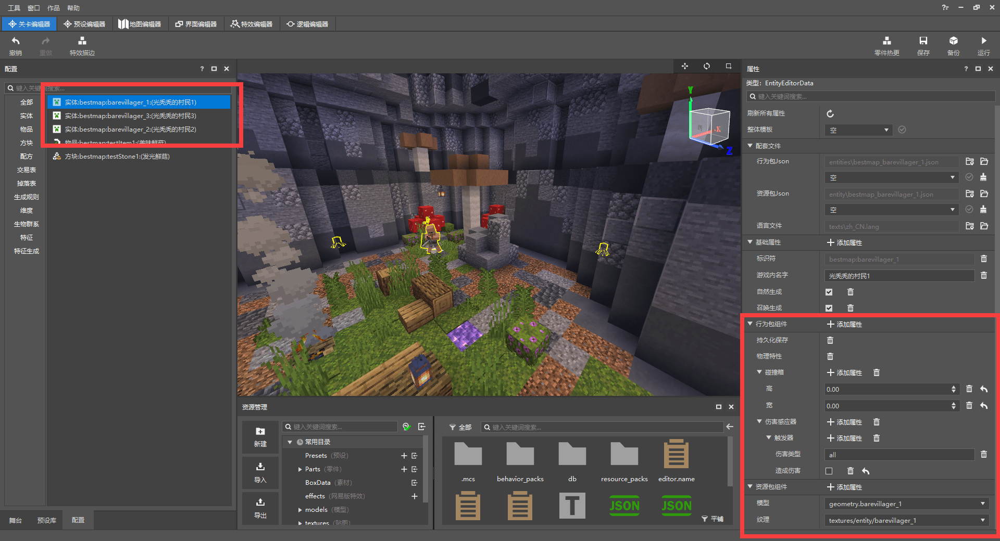
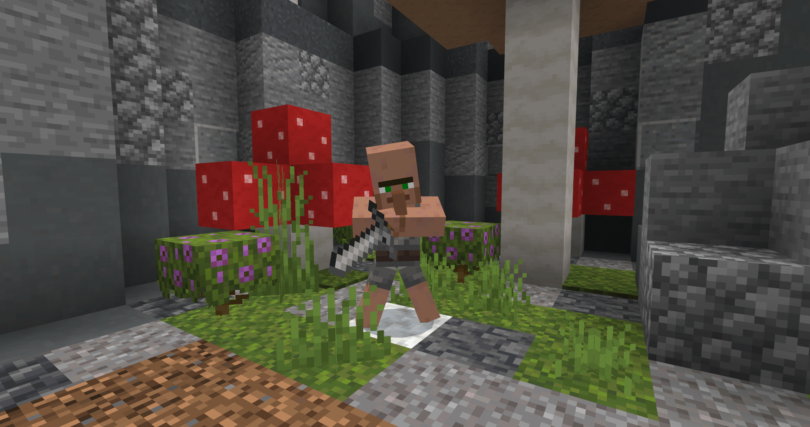
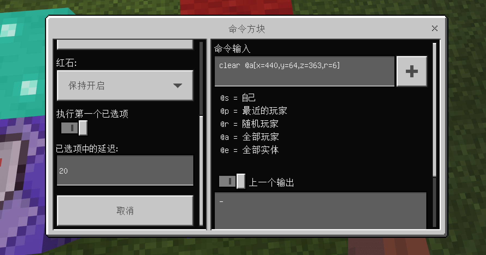

--- 
front: https://mc.163.com/dev/mcmanual/mc-dev/assets/img/6-1.49605400.png 
hard: Advanced 
time: 30 minutes 
--- 
# Officially start making a gameplay map 

<iframe src="https://cc.163.com/act/m/daily/iframeplayer/?id=624585cdb647e504b5299d90" width="800" height="600" allow="fullscreen"/> 

In the previous chapters, we have learned what a gameplay map is, how to make a map scene, how to use commands and command blocks to make simple gameplay functions, how to change the visual effects of the scene by modifying resource packs, and how to add custom content. 

With these skills, we can prepare for actual combat and make a gameplay map from scratch. 

## Map Concept 

Looking at the various classic gameplays of Minecraft, the gameplay that can last for a long time and is always loved by players is the minigame. Even some survival servers have some minigame activities. Among the minigame categories, KitPVP (professional war) is an outstanding gameplay. So in this chapter, we will use the gameplay map to make a professional war minigame. 

The game scene uses the map that has been made in the previous chapter: 

 

In terms of gameplay, players can choose a profession in the lobby and obtain professional equipment when entering the battlefield (game scene). Players need to use equipment to fight other players. There are two branches in this gameplay: 

- The game is played in a single round, and players join at the same time: When all players are ready and have chosen their professions, the game starts. There is only one life, and the player who survives to the end wins. 
- The game continues, and players join at will: After players choose their professions, they can enter the game scene by themselves. There is no resurrection limit and no winning condition. 

The former can make the gameplay more specific and competitive; while the latter is more inclined to the refreshing experience of PVP battles. Players can return to the game scene and join the battle as soon as they are resurrected. This time we chose the latter, but the idea of the former will also be explained during the production process. 

## Make a lobby 

Because it is a small game map, we need to build a lobby first. Players will come here to choose their profession and enter the game scene after joining the game or resurrecting after defeat. 

 

Use the brush tool of the map editor to select the cylindrical brush, enclose an area, and the block material is similar to the terrain style of the game scene. Place some reused materials (mushrooms, stone piles) in the area, and build a campfire camp at the player's birth point (the amethyst block is used to mark the player's birth position). 

Make 3 NPC models in BlockBench respectively. Here, the model actions of the original villagers are modified, and items are added to distinguish the corresponding professions of the NPC. Use custom entities to display profession information in the lobby. And using entities will be more attractive and vivid than signs or other text guides. 

 

After exporting the model and texture separately, switch to the level editor and import them one by one; custom entities do not need too many properties, just place them in the lobby, so these three entities only have: persistent storage (entity will not disappear), physical properties (entity will be affected by gravity), collision box (entity width and height), damage sensor (set the entity not to be attacked). 

 

The properties of the three entities are similar, only the models and textures are different. After adding them to the game, place them in the lobby respectively: 

 

 


## Add gameplay functions 

The three NPCs placed in the lobby correspond to the three professions in the map. When the player approaches the NPC, the profession will be selected and teleported to the game scene. 

Choose an area to store the command block for the production function. Generally, an area that players will not see or discover will be selected, so it is not recommended to place it near the game scene. 

 

The scenes are all closed, so I directly choose to place the command block near the lobby, and developers can quickly find it when they refer to it. 

There is a key point to note about the area of the command block. When there is no player near a block, the system will automatically unload the block. If the area of the command block is unloaded, the command block will no longer take effect, so we need to use a command to set the area to a constant loading state so that the block will not be unloaded. 

```Command 
Player manual input: 
/tickingarea add <xyz> <xyz> 
Tip: <xyz> is the coordinate of the constant loading area, usually the lower left corner and upper right corner of the cube area, and the cube area is formed by two coordinates 
The coordinates can be turned on in the game or select a block to see the coordinates of the block in the lower right corner of the map editor 
``` 

### Use command block production function 

First enter a command **Add a new professional scoreboard** to label the player; by modifying the value of the player scoreboard to label the player with a **professional label**, for example: 1 - Heavy armor profession 2 - Arrow profession 3 - Breakthrough profession 0 - No profession selected 

```Command 
Player manual input: 
/scoreboard objectives add role dummy profession 
``` 

Then record the coordinates of the NPC, use the **loop command block** to detect when the player is close to the NPC position to label the player with a profession.

```Commands 
Loop command block: 
/execute @a[x=?,y=?,z=?,r=1] ~ ~ ~ /scoreboard players set @s role 1 
``` 

The execute command can change the command executor and execution location. The target selector selects a player within a certain xyz coordinate range and executes the command with the player. After selecting the player through execute, the target selector can be set to @s to point to yourself. 

Place 3 sequential chain command blocks in a row after the loop command block to give players equipment, teleport to the game scene, and place professional tags. 

 

The command block windows 1234 are marked in the order of pointing in the figure. Please note that you must ensure the **pointing of the command block**, otherwise the chain command block will not be executed. 

The target selector parameter **[score]** represents the score of a certain label on the scoreboard used to judge the target. It is an important parameter for judging the profession. The four command blocks in the picture are the most basic conditions for realizing this function. If you want to adjust the equipment of the profession, you can also **continue to add chain command blocks** in the middle to give items. 

 

Each command block chain can complete the function of one profession. We will continue to add 2 more to complete the function of selecting a profession and transmitting. The complete command chain of a profession is as follows: 

```Command

Loop command block: execute @a[x=443,y=64,z=355,r=1] ~ ~ ~ /scoreboard players set @s role 1 
Chain command block: give @a[scores={role=1}] iron_leggings 1 
Chain command block: give @a[scores={role=1}] iron_boots 1 
Chain command block: give @a[scores={role=1}] leather_chestplate 1 
Chain command block: give @a[scores={role=1}] stone_sword 1 
Chain command block: give @a[scores={role=1}] bestmap:testItem1 3 
Chain command block: tp @a[scores={role=1}] 352 83 442 
Chain command block: effect @a[scores={role=1}] slow_falling 5 1 
Chain command blocks: scoreboard players set @a[scores={role=1}] role 0 
All the above command blocks point to the next command block 
It should be noted that in the give command, if you give a custom item, you need to write out the namespace and name of the custom item, while the namespace "minecraft" can be omitted for the original item. 

``` 

The coordinate point of the teleported player is set above the game scene, and the slow falling effect is set for the teleported player. 

 

### Add recovery items 

Different professions need different equipment and effects. If the original content cannot meet your ideas, you need to add custom content to expand it. For example, if I want to add a prop to restore health to all professions or a certain profession, then I need to add custom items.

Open the level editor, create a custom item, set basic properties, and add food properties to it (do not replenish satiety, only add healing potion effects). Lower the use time and change the animation to eat. 

 

Of course, if you do not add new custom content, you can also change the original potion to something else by modifying the texture pack. 

### Scene interaction function 

Create a custom block and draw a texture, add it to the game, and place several such blocks in the game scene; when the player steps on it, he will get the status effect. 

Use the command block to detect the block under the player's feet, and give the player the potion effect when the block is the set block. This function only requires one command. 

```Command 
execute @a ~ ~ ~ detect ~ ~-1 ~ <namespace:block identifier> 0 /effect @s jump_boost 1 3 
``` 

Add this command to the loop command block that remains open, the effect is as follows: 

 

When the command block is executed, a prompt will appear in the upper left corner. If it is executed in a loop, a large number of prompts will appear instantly. We can also modify the game rules through commands to turn it off: 

```Command 
Turn off the prompt of the command block (change false to true to turn it on): 
/gamerule commandblockoutput false 
/gamerule sendcommandfeedback false 
``` 


> Extensive use of looping command blocks without delay will cause the game to lag. You can adjust the delay of some looping command blocks appropriately without affecting the game, or use redstone signals to change the looping command blocks to redstone control. 

## Continue to improve the map 

So far, our map is **ready to start the game**. In addition to continuing to add new content or gameplay, there are still some **details that need to be polished**. 

### Backpack items 

For example: when a player is defeated, the backpack items will fall in the scene, and other players can still use them after picking them up; or in the case of death without dropping, the player will still keep these items when he returns to the lobby after being defeated. 

**Solutions** There are actually many, just choose any appropriate one, for example: 

- Turn on death without dropping, clear the player's backpack before giving new equipment when choosing a profession. 

- Turn on death without dropping, use command blocks to continuously clear the backpack items of players in the lobby. 

- Turn off death without dropping, use command blocks to continuously clear item drops. 

All three of the above examples have their advantages and disadvantages. This map uses the second one. However, we only need to continuously **clear a few squares of the area around the birth point**, because the player will definitely be resurrected at the rebirth point in the lobby after being defeated, so we only need to clear a small area. If the entire lobby is cleared, it may affect the distribution of equipment when choosing a profession. 

 

Record the coordinates (XYZ) of the player's rebirth point, use the clear (clear player backpack items) command, and use the target selector (@a=all players) to clear the player's backpack items within a 6-square range (r=6). You can add a delay to the loop command block appropriately. 

### Game Mode and Difficulty 

The default game mode of the map is survival. At this time, players can arbitrarily **destroy blocks**. Obviously, this is contrary to the gameplay of the map. You can directly change the default game mode of the world to adventure in the menu, so that players cannot destroy it. 

 

If you want to make the rules of the map more fixed, you can also use command blocks to continuously modify the game mode of all players. 

And the **game difficulty** also needs to be set specifically. In the simple-hard mode, the player's health recovery speed is normal, but monsters will spawn in the game scene (unless there is sufficient light); if the player's health recovery speed is too fast in the peaceful mode, it is difficult for players to fight against each other, and the game balance between different professions is also different. In fact, you only need to use commands to simply modify the game rules: 

```Command 
Modify the game rule domobspawning to turn off the generation of monsters 
/gamerule domobspawning false 
``` 

### Scene boundary 

In order to prevent players from accidentally leaving the lobby and the game range, add air walls to the lobby and game scene, that is, place barriers or other obstacles at the boundary so that players cannot cross. 

 

## Another idea 

If the map is changed to a unified start, and players need to be fully prepared in the lobby before starting, then at least the following changes should be made: 

- Players will not immediately receive equipment and teleport after choosing a profession, but will only be labeled with a profession, and equipment will be distributed uniformly when the game starts 

- Set up victory conditions, detect the surviving players in the game scene after the game starts, and the game ends when only one person is left 


This chapter does not provide methods for this kind of thinking, but leaves it to novice developers to try on their own! 

**Homework: ** Create a complete map from scratch: It requires basic gameplay and functional logic, can be played normally, and all game scenes in the map are in line with the theme. You can create it freely or follow the tutorial! 

