--- 
front: https://mc.163.com/dev/mcmanual/mc-dev/assets/img/7-25.gif.d998b7c3.png 
hard: Advanced 
time: 20 minutes 
--- 
# It is actually very simple to implement the function 

<iframe src="https://cc.163.com/act/m/daily/iframeplayer/?id=62458611b8a81f8fa083c0d3" width="800" height="600" allow="fullscreen"/> 

Most of the current gameplay is made by command blocks. If there is another very efficient and simple method to collaborate and complement each other, then the development of gameplay maps will be easier. The preset editor and logic editor of the Minecraft development workbench are just like this. 

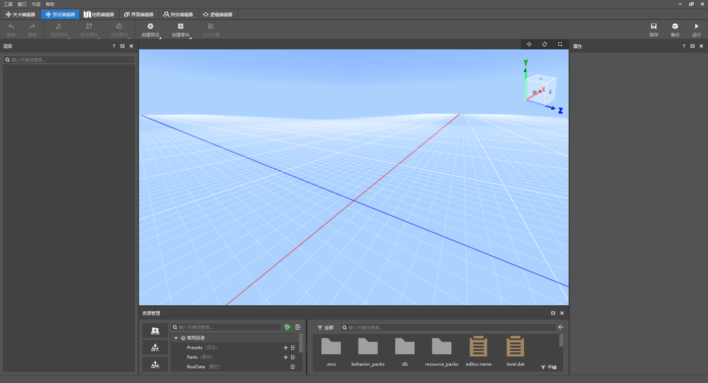 

*Preset Editor Page* 

In the level editor, in addition to the configuration, there are two other windows: the preset library and the stage. The preset library, as the name implies, is a warehouse for storing presets. All created presets will be seen here. If you apply a preset to a map, you can see it in the stage window. The stage is a window that displays all presets in the map scene. 

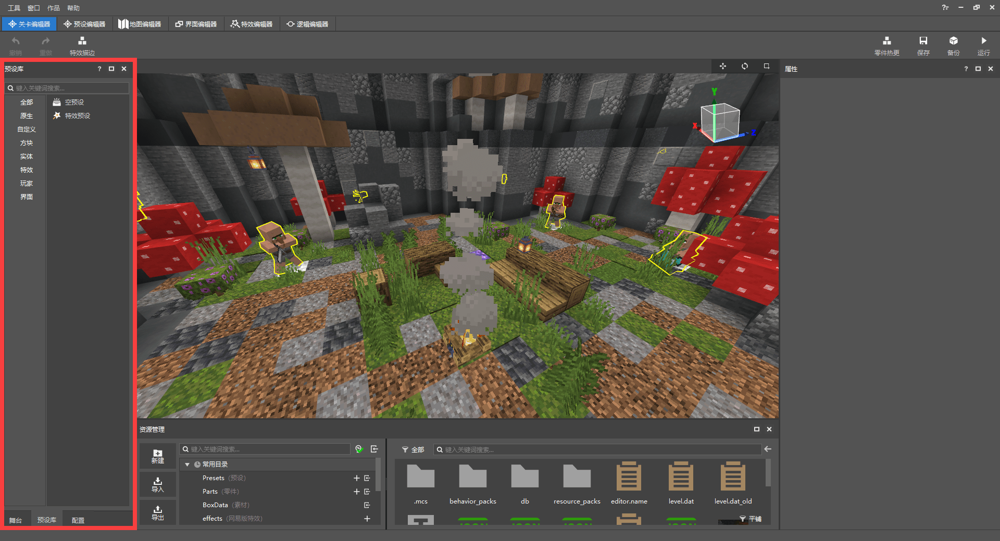 

## Create a preset 

Click Create Preset above, and you can see that there are 6 types: Empty Preset, Entity Preset, Special Effect Preset, Player Preset, Block Preset, and Interface Preset. These six types correspond to different functions, and their usage and uses are also different. 

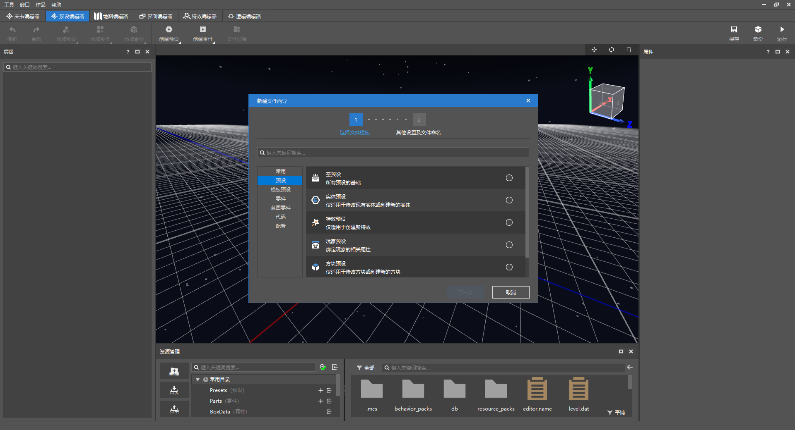 

### Empty Preset 

There is nothing in the empty preset, so we need to add content to it ourselves; **First open the map editor, right-click the material and select Import as Preset Material**, so that you can see the material in the preset editor.

 

Create a new empty preset, click the "Add Material" button above the preset editor to add the imported material to this preset, and you can see it. 

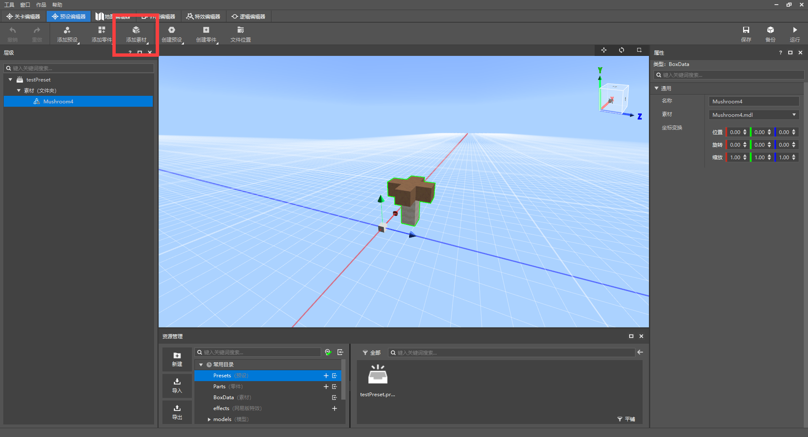 

The properties of the empty preset are only name, preview, preload and constant load (mouse over the options to see detailed explanations). 

### Entity preset 

The entity preset has many properties, because this preset represents an entity. In the property window, you can choose to associate with a certain entity, and then set the relevant properties for the entity of this preset. 

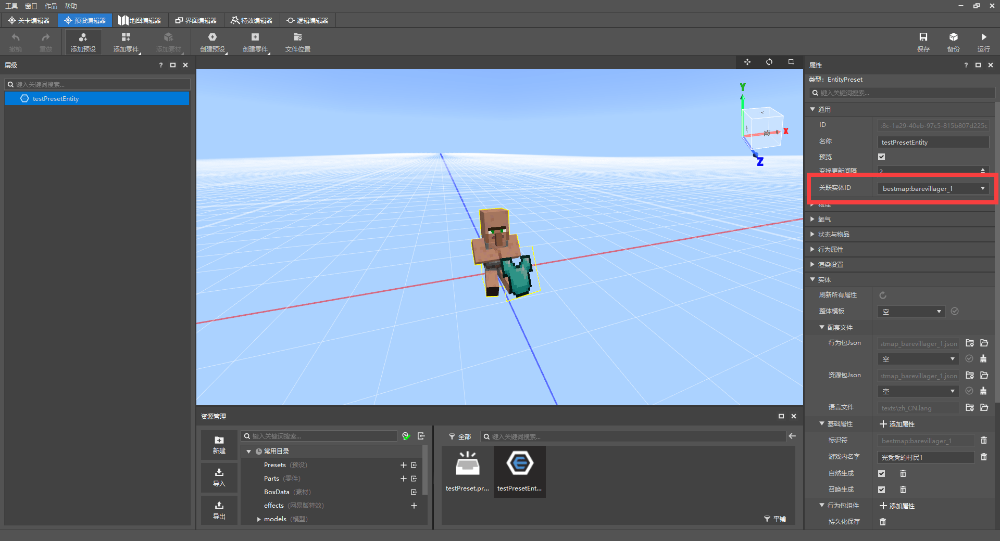 

### Special Effect Preset 

This preset needs to be used with particle effects or sequence frame effects. Use the special effect editor to create it and then associate it with the preset. 

### Player presets 

Player presets can adjust game players, such as hunger value, no dropping upon death, whether jumping is possible, and other attributes; **Only one player preset can be created.**

### Block presets 

Similar to special effects and creature presets, but associated with blocks, you can choose original or customized blocks. 

### Interface presets 

Need to be used with the interface editor to display the UI interface on the player's client, such as buttons, progress bars, etc. 

## Add parts and sub-presets 

You can add another preset to a preset, that is, nesting. For example, what will happen if we add a building material to the empty preset we created, and then add a block preset to this preset? 

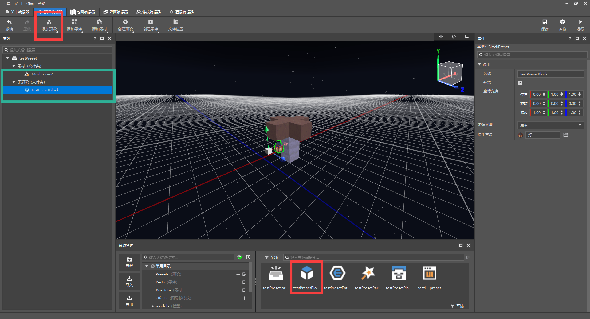 

Click Add Preset or directly drag it into the hierarchy window in the resource management, and the block preset will be added to the sub-preset folder of the empty preset. 

In addition to nesting between presets, we can also add a very important thing: parts. 

Parts can realize all kinds of wild ideas, but the functions of parts need to be filled by writing code. Ordinary parts are not suitable for novice developers who don't know how to program; they need a visual programming tool: the logic editor to match the parts. 

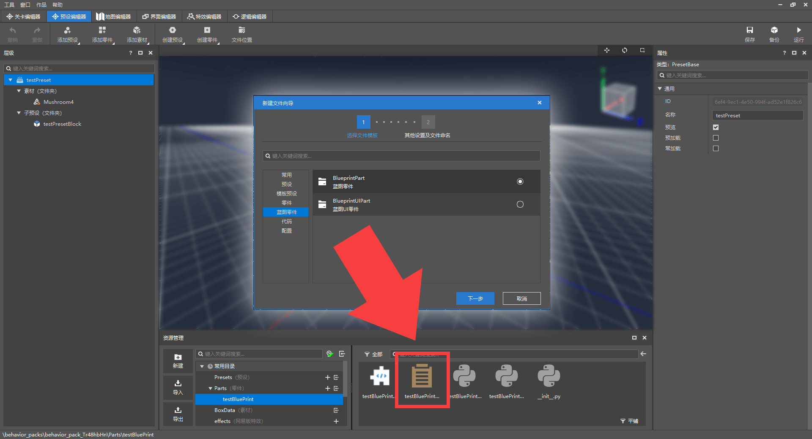 

Create a blueprint part and double-click the .bp file in the resource management window to jump to the logic editor. 

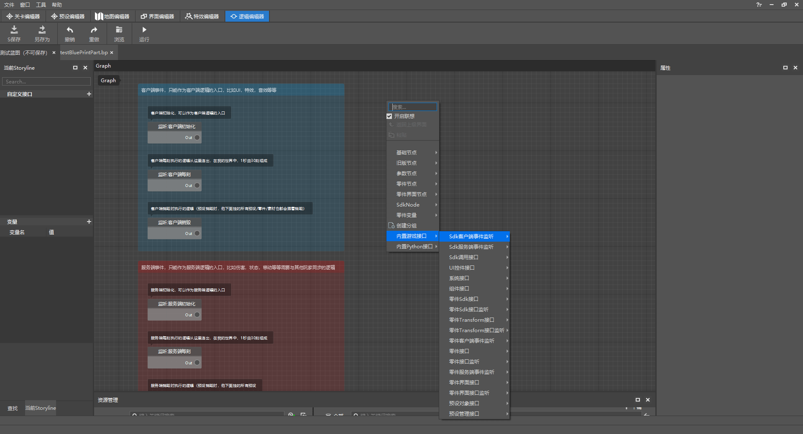 

Next, the functions we wrote in the logic editor will be assigned to the parts, and the presets loaded with the parts will also have these functions. One ring after another, constantly piling up parts and presets, thus forming a huge development resource! Are you more interested in the development of gameplay maps? 

Back to the logic editor, some events that may be used have been placed here in advance: client time and server event. Different functions need to act on these two, so they need to be distinguished. 

Right-click the grid interface to create a blueprint node, and then connect the blueprint nodes with lines to realize logical functions, such as: 

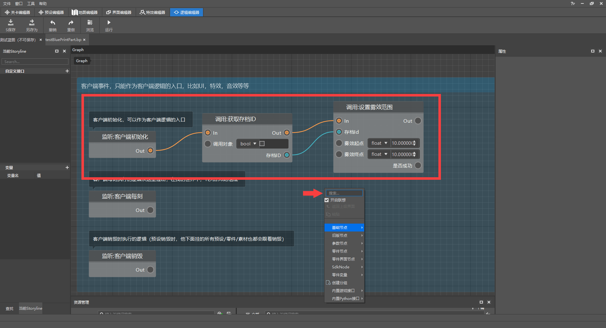 

Create an interface node to set the world fog effect range. You can see that this node requires 3 parameters (save ID, fog effect start point and fog effect range). The save ID is obtained by another node. The fog effect start point and fog effect end point are entered by ourselves. Then, start from the client initialization time node and connect them one by one. It's done. 

**When the player enters the world, the client will initialize. At this time, the parts detect the event and obtain the save ID and then set the fog effect. ** 

There are many available interfaces in the logic editor. If you are dazzled and can't read it all, you can query the interface document and then use the search function to find and add it. 

MODAPI interface document URL: <a href="../../../mcdocs/1-ModAPI/接口/通用/指数.html" rel="noopenner">Click the link to open the webpage</a>. 

After completion, we save the logic, return to the preset editor, and add the blueprint parts to the preset: 

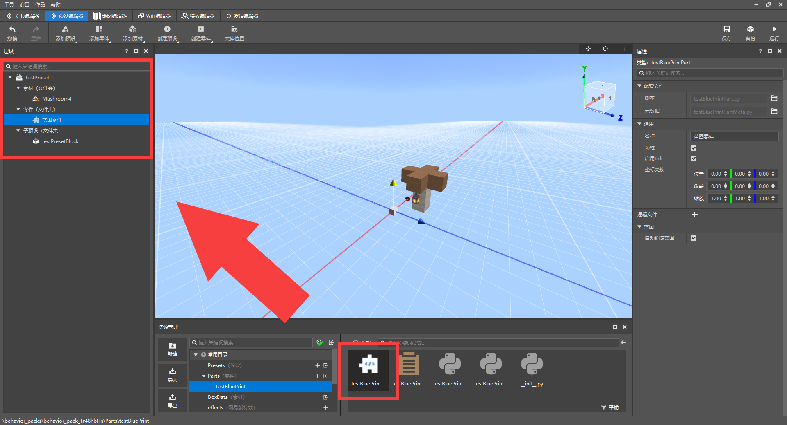 

Then switch to the level editor, add the preset to the stage (map), click Development Test, and enter the game to test the effect. 

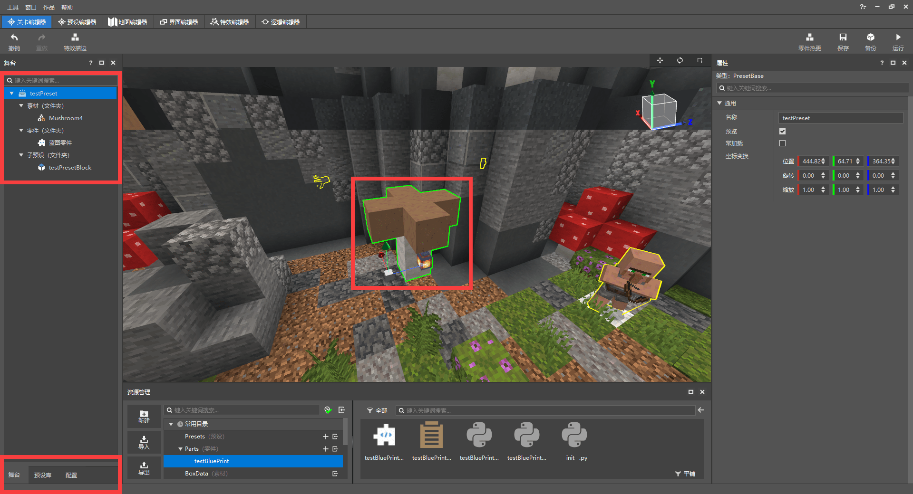

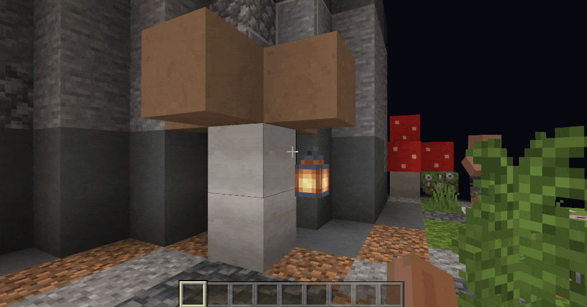 

If you want to learn and understand the preset editor and logic editor in more depth, you can find many related tutorials in the development guide on the developer's official website: <a href="../../../mcguide/20-Gameplay Development/12-Visual Programming/00-First Blueprint Mod/00-Tutorial Video.html" rel="noopenner">First Blueprint Mod Tutorial</a>. 

## Add functions using presets and blueprints 

After understanding the preset editor and logic editor, we continue to add more functions to the map. 

Create a new player preset, cancel the player's automatic health recovery and enable the player to not drop when dying, which can solve the problem of inconsistent health recovery speed caused by different game difficulties; 

The newly created player preset will be automatically added to the stage of the level editor. There is only one player preset. 

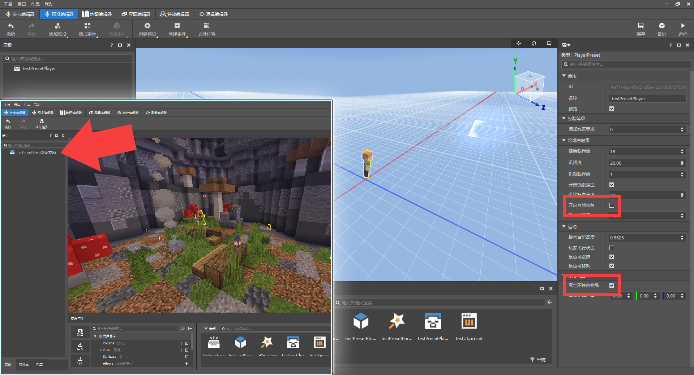 

Create 3 entity presets and associate them with the three NPCs in the lobby. Add a special effect preset to each entity preset and place it on the NPC's head as a guide mark. 

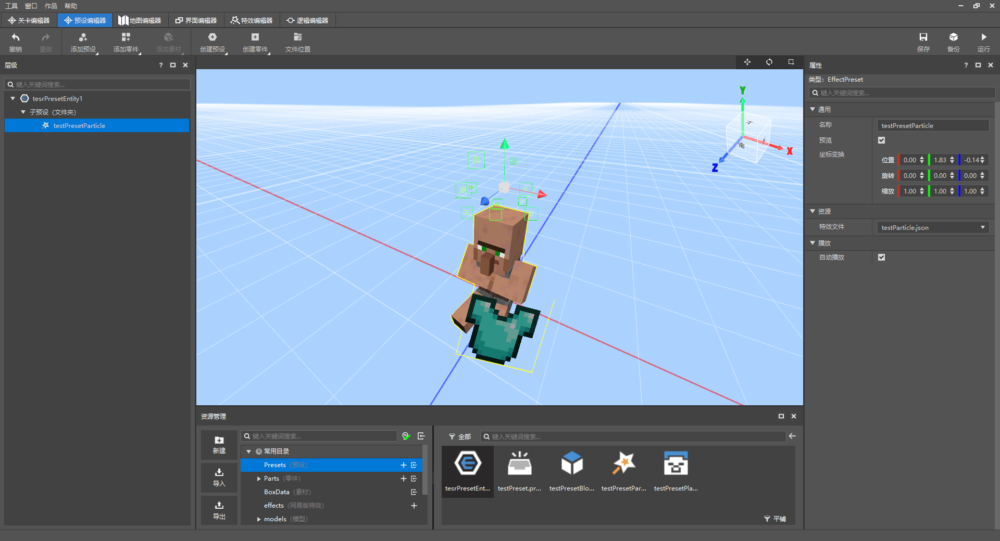 

Drag the entity preset to the level editor, and the particles and entities will appear together in the map, and the entity will always be retained according to the appearance in the preset (the particles are on top of the entity's head). 

**It should be noted that: if you modify the properties of a preset in the preset editor, the preset will also be updated synchronously in the level editor; however, if you modify a preset individually in the stage of the level editor, the preset will no longer be modified uniformly. ** 

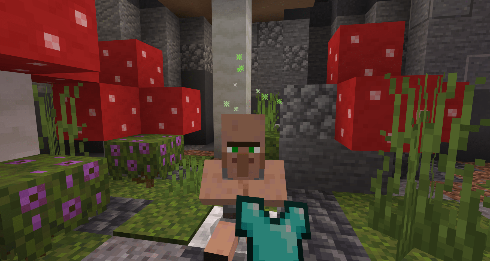 

Switch the operation mode in the upper right corner to drag, rotate and scale the preset; if you want to make detailed adjustments, you can fine-tune the value in the property window. 

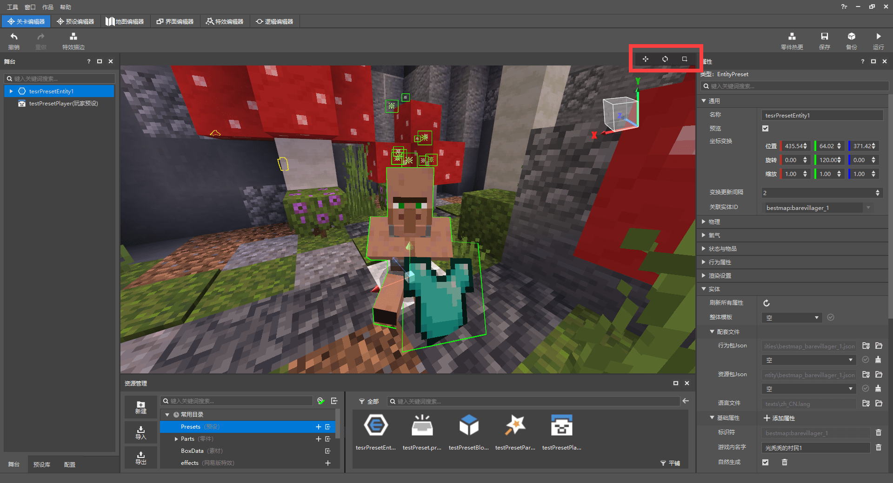 

Next, create an empty preset to load some basic functions: clear the player's backpack items when the player dies. 

We use command blocks to implement this function, but it is cleared when the player returns to the lobby; we can use the logic editor to replace it with a better way. 

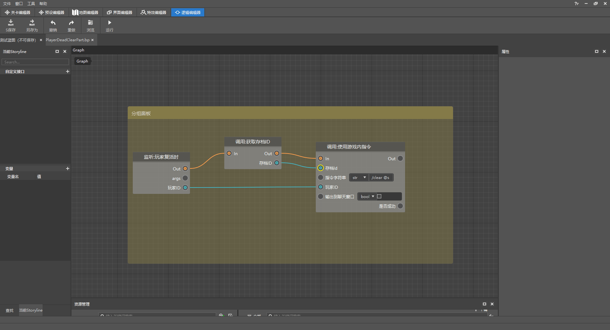 

Right-click to create an event that listens to the event triggered when the player is resurrected, and then call the "Use In-Game Command" interface. 

- Event: Listen for an event. When the event occurs, the script will respond and bring back some parameters, such as the player ID that triggered the event. 
- Interface: Execute a function. Most interfaces require parameters to execute, such as player ID or archive ID. 

Listening to the player's resurrection event can bring back the player's ID. Call the interface and execute it on this ID. 

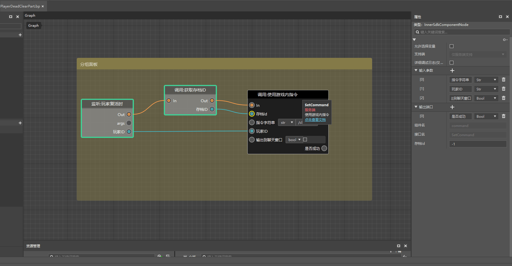 

The required parameters and output parameters of the interface will be displayed in the property window after selecting a node; if you don’t know how to use the interface, put the mouse on the node to display the specific information and link of the interface. 

Simply create 3 nodes and connect them to achieve this function. Enter the game to test it: 

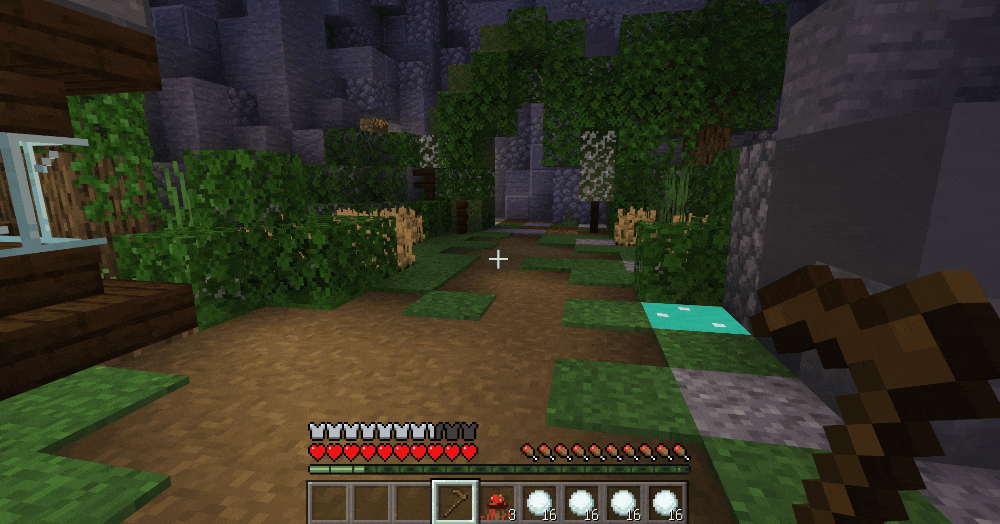

## Generate props 

Randomly generate some props in the game scene, and players will have different effects when they pick them up. It is not difficult to implement this function using presets and blueprint parts, and there are many controllable conditions. 

Create empty presets and blueprint parts, enter the logic editor to write the functional logic of the parts. First, create a custom interface and write the logic for generating item entities (generating items in the map). 

 

**Custom interface:** Writing a custom interface will write logic in a new window. There will be 1 input and output. The logic will start running after the input and end at the output. After writing the custom interface, you can call it repeatedly in the logic function of the main window. *The custom interface is like a factory. You can adjust the working method of the factory at will (write logic), or you can start the factory at any time (call the custom interface)* 

Then create a timer in the main logic that can repeatedly trigger the custom interface, and execute it once every period of time, that is, generate an item once. 

 

Simply create a few nodes and connect them to complete a simple function. Switch to the level editor and click Run to test it. 

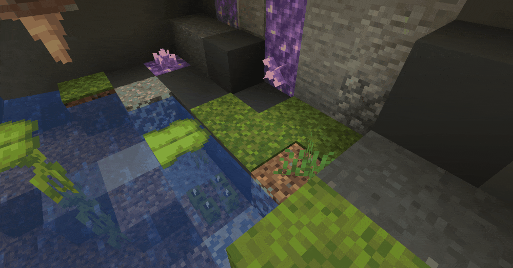 

Items can be successfully generated. Continue to add nodes to write the logic for players to pick up and give potion effects. 

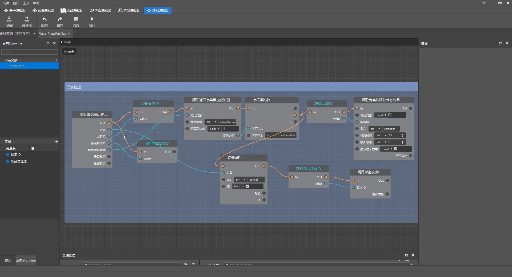 

When there are many nodes, the various lines may be messy and difficult to understand; the method of implementing logic in the figure is only one of them, and there may be better methods waiting to be implemented. 

The general process is as follows: listen to the player picking up items -> use variables to save the parameters brought back by the event (player ID, item entity ID) -> compare the name of the item picked up by the player, if it is a cookie, cancel the player's pick-up action and destroy the item -> give the player a potion effect 

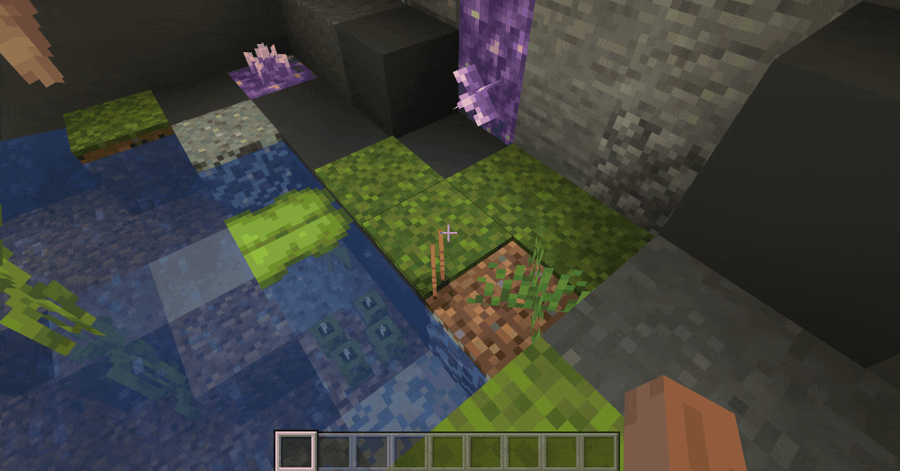 

For example, the coordinates of the generated items, the generated items, the judgment of the items picked up by the player, and the potion effect given to the player, these functions can continue to add logic to make them richer, such as setting the generated items to multiple or randomly distributing the generated coordinates; the logic editor can do this, but this requires developers to practice makes perfect and make good use of it. 

**Homework:** Use the preset editor and logic editor to implement any of the following functions: 

- Generate random items at fixed or random coordinates in the map (using the built-in Python interface - random node) 
- When the player dies, give the killer an item or add a status effect (using the node that monitors the player's death event) 
- Change the way the player chooses a profession from walking near the NPC to clicking on the NPC (using the node that monitors the player's attack on the entity event) 
- Play as you like to implement the gameplay function logic 

