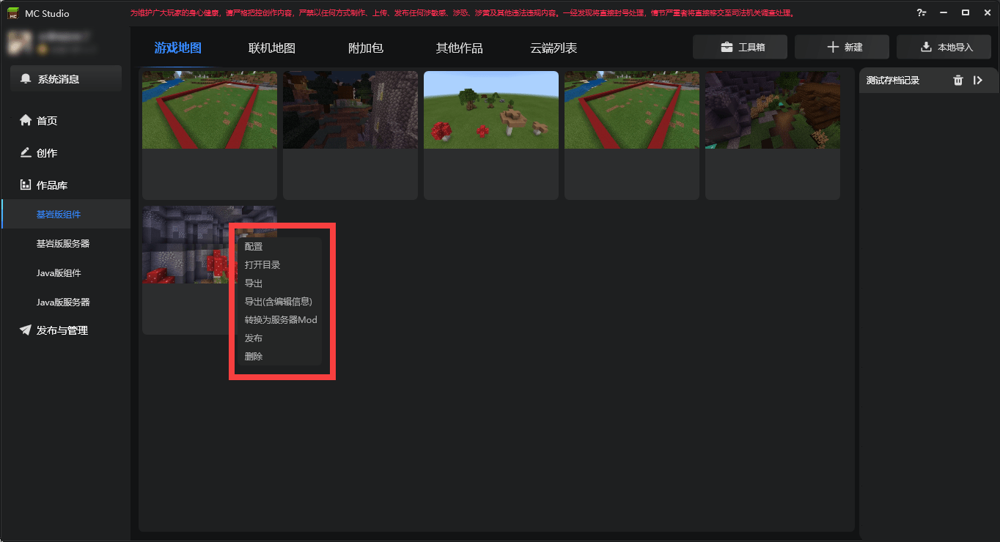
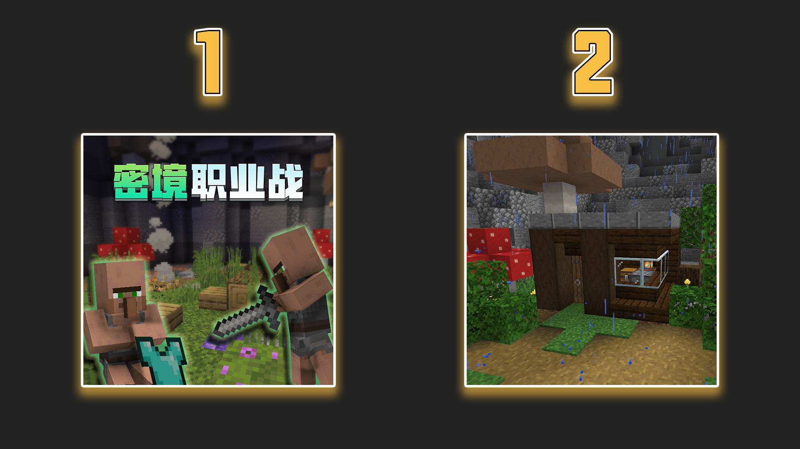
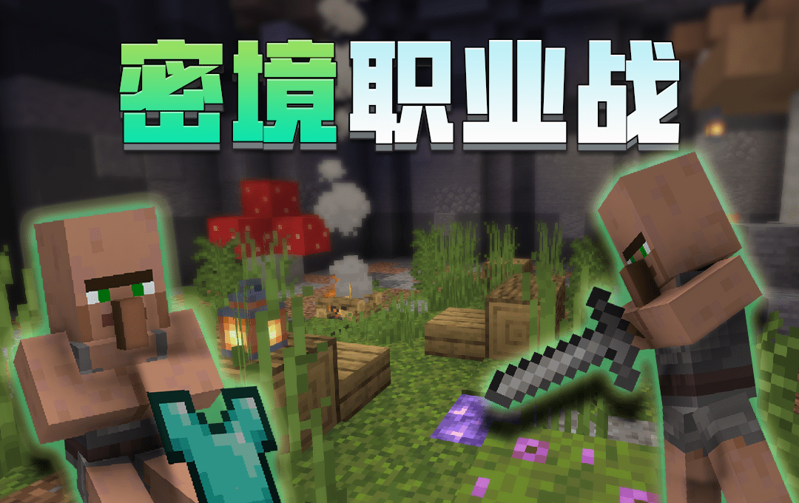
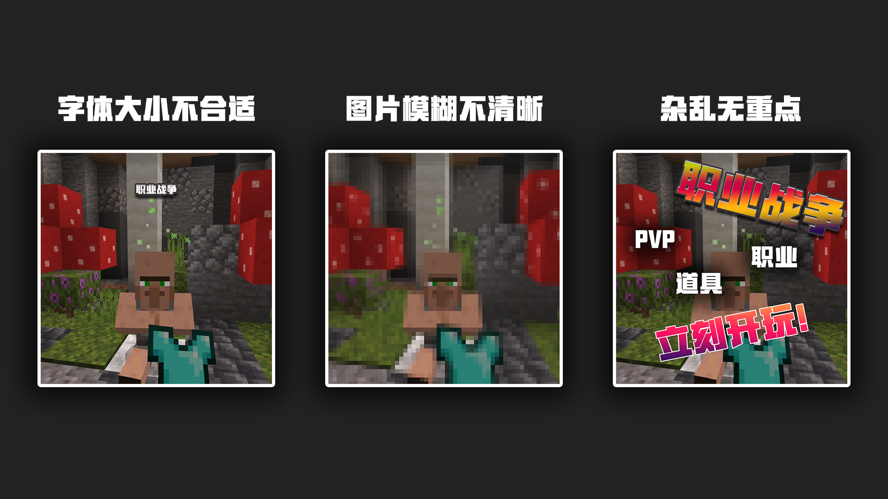

--- 
front: https://mc.163.com/dev/mcmanual/mc-dev/assets/img/8-2.5f06072a.png 
hard: Getting Started 
time: 10 minutes 
--- 
# Package and publish 

<iframe src="https://cc.163.com/act/m/daily/iframeplayer/?id=62458672b8a81f8fa083c0d9" width="800" height="600" allow="fullscreen"/> 

When the gameplay map is completed, we can package it and upload it to the developer platform for release; however, before release, we also need to make corresponding promotional pictures, videos, etc., so this chapter will introduce how to export and make qualified promotional pictures and upload them to the developer platform. 

## Work Packaging 

Right-click in the Minecraft Developer Workbench to package and export the work; you can also publish directly, and the Minecraft Development Workbench will directly package the work and jump to the developer platform publishing page. **It is recommended to export the work yourself and back it up before publishing it on the developer platform. ** 

 

## Promotional pictures 

When publishing a work, in addition to filling in some basic information, the required banner pictures, icon pictures, POS machine and other picture files are very important, because these are directly related to the exposure of the work. "Clothes make the man, and the saddle makes the horse", although it is not very suitable for description, the literal meaning still makes sense. **Reasonable packaging of works is what a qualified developer must do. ** 

### Icon picture 

Comparing the following two pictures, which one would you be interested in and want to experience? 

 

I believe most people will be interested in the first picture, because in the first picture we can see a lot of information at a glance: villagers picking up equipment, obvious map name; while in the second picture, there is no information, only some simple buildings, and it is not even clear that this is a gameplay map. 

In the first impression, reasonable packaging reflects its importance. Therefore, try to work harder on the promotional pictures. The most important goal is to attract the player's attention and arouse interest. 

### Banner picture 

Banner picture is a large horizontal picture. Although it is not needed under normal circumstances, if the work is relatively good or participates in some exposure activities, a banner picture is needed for display. 

 

### POS machine 

POS machine picture refers to the picture that pops up when the player purchases a component. When the player sees this picture, it means that the player wants to obtain the component. At this time, it is OK to continue to display the work or thank the support. 

 

### Carousel 

You can select 3 pictures to display in the carousel. This is one of the best ways to let players understand the work. Whether it is directly showing the actual game screen, or adding text or rendering effects, the purpose is to attract players' attention. 

Since the carousel can display three pictures, please choose carefully. **Don't upload the same picture three times**. It is strongly not recommended to do so. 

### Video

When the work is paid for download, you must upload a video, and the content of the video is related to the work. For specific specifications, please refer to this: <a href="../../../mcguide/35-上舍与入入/课程06-作品视频格式输出与规格.html" rel="noopenner">作品视频格式输出与规格</a>. 

Videos can be in a variety of forms, such as creative short videos, text introductions to the work, voice explanations to introduce the work, or live presentations of the work; 

## Packaging suggestions 

- All required image formats are detailed on the release page. It is recommended to strictly follow the format requirements to produce images and videos 

- Ensure that the clarity of the image and the recognition of the image content are high, so that players can see the key points at first glance and attract attention 

- The style of the image and video should be as close to the original or close to the style of the work as possible to reduce the sense of disobedience. 

 

For more detailed specifications and suggestions for making promotional images for works, please refer to another tutorial: [Promotional Art Tutorial](../../40-Art Tutorial/7.Promotion Tutorial/01.Suggestions for making component listing images.html) 

**Homework:** Make a qualified promotional image and publish a complete gameplay map 

