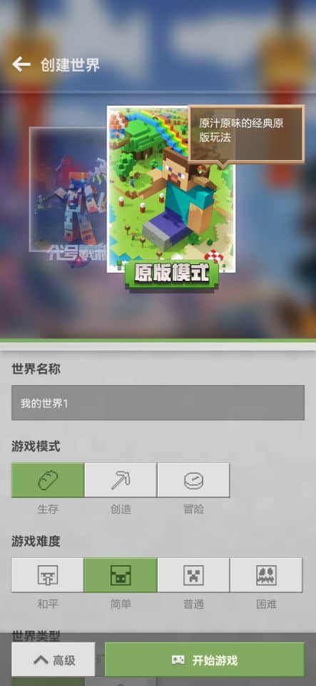

--- 
front: 
hard: Getting Started 
time: 15 minutes 
--- 
# Basic Concepts of My World 

In this chapter, we will start to understand the various contents in My World from macro to micro. 

<iframe src="https://cc.163.com/act/m/daily/iframeplayer/?id=62ce4236a240f794f8c2c745" width="800" height="600" allow="fullscreen"/> 

## Archive, World, Block 

In My World, players need to create a world before they can start the game. The following figure shows the Chinese version of the world creation interface. 

 

But for us developers, its more accurate name should be "archive". 

The different dimensions we see after entering the game, such as the main world, the next world, and the end of the world, are called a "world". 

That is, archive, which is the general term for all worlds and all data information in the world. 

Each world is composed of blocks. A block is a part of the world with a size of 16x256x16 blocks, which is the basic unit for loading and unloading the game map. 

The game generally only loads blocks near the player and the birth point block. With the in-depth exploration of the player, the blocks will be dynamically loaded and unloaded to ensure the efficiency of the game. 

The X coordinate of the block: Floor (X coordinate / 16), the Z coordinate of the block: Floor (Z coordinate / 16), Floor means rounding down. 

The coordinates of the minimum coordinate point in a block (X, Z) are (X * 16, 0, Z * 16), and the coordinates of the maximum coordinate point are (X * 16 + 15, 255, Z * 16 + 15).

## Entity 

Entity refers to every dynamic object that appears in the game. 

There are many types of entities. The following lists several entity types and some corresponding items for readers to understand. 

### Biological Entity 

- Sheep 
- Cow 
- Bee 

### Item Entity 

- Items in the form of dropped objects 

### Projectile Entity

- Arrow 
- Snowball 

### Block Entity 

- Box 
- Record Player 

> Boxes and record players in block entities are obviously blocks, so why are they called block entities? What is the difference between them and ordinary blocks? 

Block entities refer to blocks that can store data. For example, boxes can store information about items stored in boxes by players, while ordinary blocks do not have this property. For a detailed description of this part, you can also refer to the introduction of [Blocks](#Blocks) below. 

At the same time, players are also a kind of biological entity, including local players and other players. In the game, players who are controlled by themselves are called local players, otherwise they are other players. 

## Items 

Items with usage attributes in the inventory and dropped items on the ground are all called items. Drops are also a kind of entity, which is an item entity. 

Drops are actually an entity with the identification name Item. When the player walks near the entity, the item data corresponding to the entity will be obtained, and it will be added to the inventory, and the drop entity will be deleted.

## Blocks 

Blocks are the smallest unit that makes up the world. And the gameplay of Minecraft is to dig and place blocks. 

The length, width and height of a block are all 1, and different blocks have different materials. 

Some blocks have block entities, which can be used to store the internal information of the block. 

For example, a box is a block used to store player items. Players can open the box to store items that cannot be placed in the inventory. After the player stores the items, the program will store the item information in the box to the block entity corresponding to the box. And when the box is placed/destroyed, the program will automatically create/delete its corresponding block entity. 

## Models and textures 

The model is the appearance shape of the blocks and entities in the game. In the development of the Chinese version of Minecraft, two types of models can be used. 

One is the model used in the original version, which is based on multiple cubes and composed by stretching, combining and rotating. 

The other is a skeletal model, that is, a model built using modeling software such as 3dmax. Most creatures in the game can be replaced with skeletal models to achieve different performance effects. 

The model does not have any material textures, and needs to be drawn separately to combine with it. The following is an original zombie model and its texture. 

 

 

After combination, it becomes the appearance of the zombies in our game. 

At the same time, we can dynamically switch the textures of entities in the game. For example, in the game, horses have different colors and different breeds, but they share the same model. We can use the same model and switch the textures it needs to use according to its internal data. 

The figure below is the texture of the horse in the game resource file. You can see that the skeleton horse, zombie horse, mule, and horses of different colors are just different textures. Proper use can greatly reduce duplication of work. 

 

At the same time, models are generally accompanied by animations, such as the animation of dolphins swimming, to achieve better visual effects and bring a better gaming experience. 

The animation can be controlled by code to control the properties of playback timing, playback speed, etc. 

 

## Game interface 

The interface is all the user interaction areas we see in the game. 

For example, the sintering interface after clicking the furnace. 

 

The interface is composed of small controls, such as pictures, progress bars, buttons, and text. 

These individual controls are combined together, and combined with the logic of operation, to form the interface in the game. 

In the Chinese version, the interface we make is generally a mobile interface, so we need to consider how to make it more convenient for mobile touch operations. 

If you need to adapt to computer operations, you need to make dual-end interfaces separately, and determine the user's operating platform before deciding which interface to render. 

## Particles and special effects 

In the game, we often need to use particle special effects to enhance the visual expression effect. 

For example, the smoke particles of a campfire. 

 

In the production of modules, we generally use particles and sequence frames to achieve such effects. 

### Sequence frame 

The animation effect formed by continuously switching frames of pictures is a flat surface in the game. 

### Particles 

Special effects are created by continuously emitting multiple plane patches of different sizes. Rich performances can be simulated by replacing texture materials, etc.