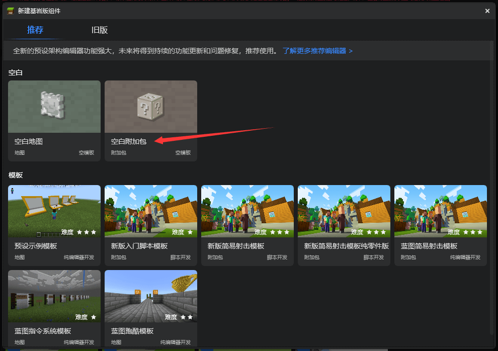
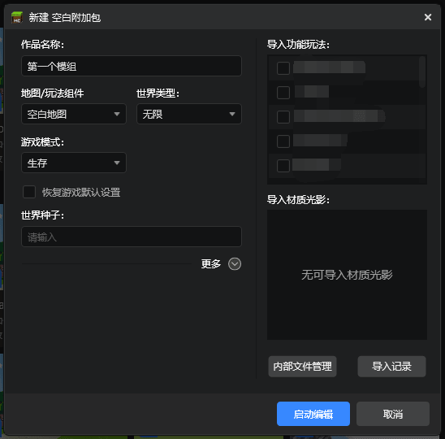
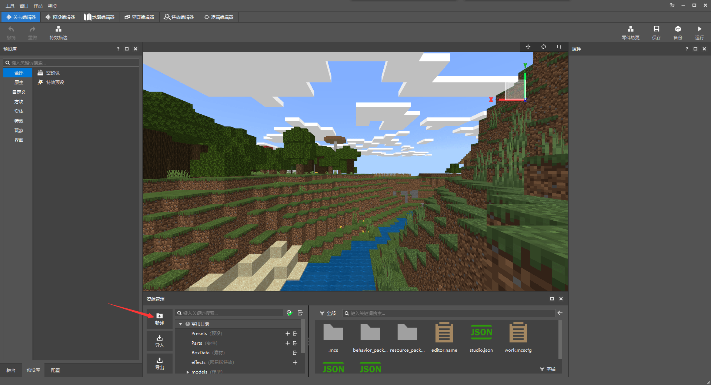
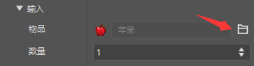
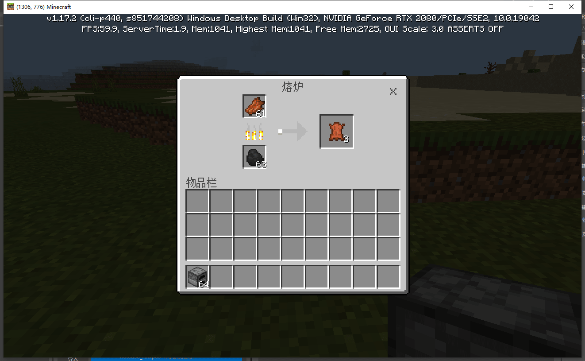

--- 
front: https://mc.163.com/dev/mcmanual/mc-dev/assets/img/02.a85e952d.png 
hard: Getting Started 
time: 10 minutes 
selection: true 
--- 
# The first gameplay made with the developer workbench 

In this chapter, we will use the Minecraft developer workbench to make a simple component. 

<iframe src="https://cc.163.com/act/m/daily/iframeplayer/?id=62ce4273c6dfd1bb76ee9650" width="800" height="600" allow="fullscreen"/> 

## Installation 

The developer workbench is a tool for making modules made by the Chinese version of Minecraft. It integrates a large number of functions for developers to make various modules more conveniently. 

Download address: [https://mc.163.com/dev/](https://mc.163.com/dev/) 

 

After downloading, install it, register a developer account and log in. 

## Create a new project 

After installation, click the "Create" button on the left and click Create a new Bedrock Edition component. 

 

In the pop-up window, select Blank Add-on Pack and Create a New 

 

In the pop-up window, we only need to fill in the name of the work to distinguish different projects, and then click "Start Editing". 

 

After loading, we can see that the developer workbench has 6 built-in editors: 

- Level Editor 
- Preset Editor 
- Map Editor 
- Interface Editor 
- Special Effects Editor 
- Logic Editor 

They play different roles in the production of modules. In this chapter, we will introduce how to use the level editor to configure some simple custom game content. 

## Make a recipe


Next, we use the developer workbench to create a new recipe. 

Here we make a furnace recipe for burning rotten flesh into leather. 

> In the gameplay development of my world, the recipe is a json file. For novices, handwriting json files is a very tedious task, so the existence of the editor makes it very easy to create a new recipe. We only need to follow the editor's file creation wizard and configure step by step to create the corresponding json file. 

First find the "Resource Management" window and click the "New Button" in it, as shown in the figure below. 

 

Next, select "Configuration", then select "Recipe", and click "Next". 

 

Then modify the file name, and the name of each recipe cannot be repeated. Here we name it ```rotten_flesh_to_leather```, so that when there are many recipes in the future, we can quickly find the recipe we want. 

 

Careful students may have noticed that there is a data template above the file name. Here we choose Empty, that is, no template recipe is used. Students can explore the purpose of each recipe template by themselves. 

And it should be noted that the recipe path we created is in the netease_recipes folder of behavior_pack. This path must be found when you need to modify the recipe file in the future. 

After the creation is completed, you can see the recipe we just created in the "Properties" window on the right. 

Now we will modify it to the recipe for burning rotten meat into leather in the furnace. 

The places that need to be modified are: 

- Recipe type 
- Applicable blocks 
- Input 
- Output 

Next, you can follow the picture to operate. 

First, because it is a furnace-fired recipe, not a workbench synthesis recipe, we need to change the recipe type to "furnace recipe" 

 

After the modification, you can see that the original "recipe structure" has become "input" and "output". Just like the furnace in the game, you need to provide an item before firing and an item after firing. 

Next, we change "empty" to furnace at [0] of the applicable block. As the name implies, the applicable block is the blocks in which the recipe can be used. 

 

Then we modify the input and output, changing the input to rotten meat and the output to leather, both with a quantity of 1. 

 


Click the selection button on the right side of the item, search for rotten meat in the "Resource Selection" window that appears, and select it. 

 

The same applies to the output leather selection. 

The modified recipe properties are as shown in the figure: 

 

Click Save in the upper right corner of the window to complete the configuration. 

Next, we can click the "Run" button to enter the game and verify whether the recipe is effective. 

You can see that the rotten meat is successfully burned into leather, and the recipe configuration is successful! 

