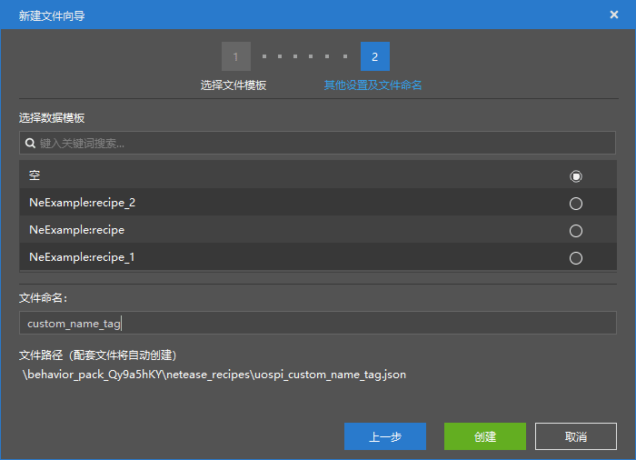
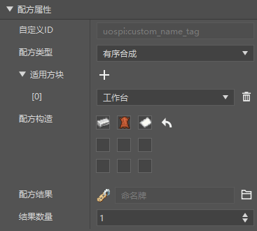
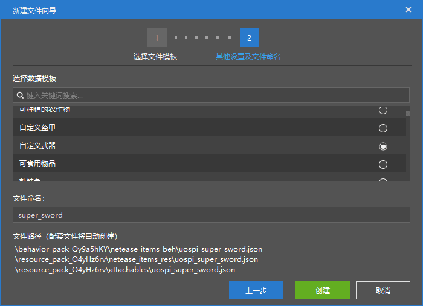
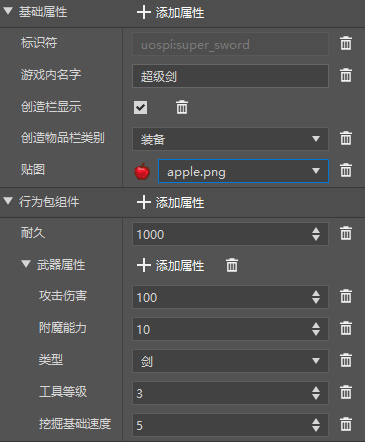
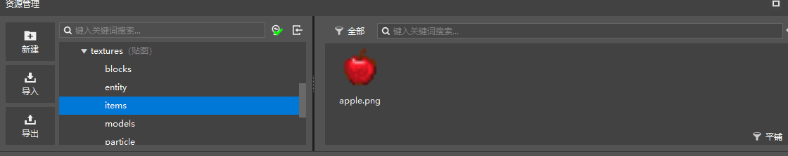
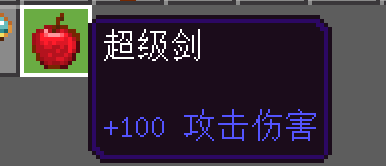
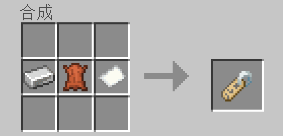

--- 
front: 
hard: Getting Started 
time: 10 minutes 
--- 
# Homework 

After learning how to use the editor to make a simple recipe, you can apply what you have learned to complete the following homework. 

## Homework requirements 

- Configure a recipe for synthesizing a name tag through the recipe configuration function 
- Make a new sword with the attack power set to 100 
- Run the game to try making the recipe and the attack effect 

## Operation steps 

### Make a name tag recipe 

Click the New button in the "Resource Management" window and create a new recipe as before. The file name can be different. 

 

Then write the recipe structure according to your own ideas in the recipe property window and set the recipe result as the name tag. 

The recipe structure can be different from the picture and can be designed as you like. 

 

### Make a sword with 100 attack 

Click the New button in the "Resource Management" window and select "Item" in the configuration. 

Select Custom Weapon as the data template, and the file name can be different from the image. 

 

Then we set in the right window: 

- In-game name 
- Texture 
- Durability 
- Attack damage 

 

For the texture here, temporarily select the built-in Apple material, or you can draw a picture yourself and put it in the ```Resource Pack/textures/items``` directory, and select your own picture. 

 


Then we can enter the game to test. 

### Test 

Enter the game, find our super sword in the creation inventory, and you can see that the attack power has been modified successfully. 

 

Test the recipe and it can be synthesized normally. 

