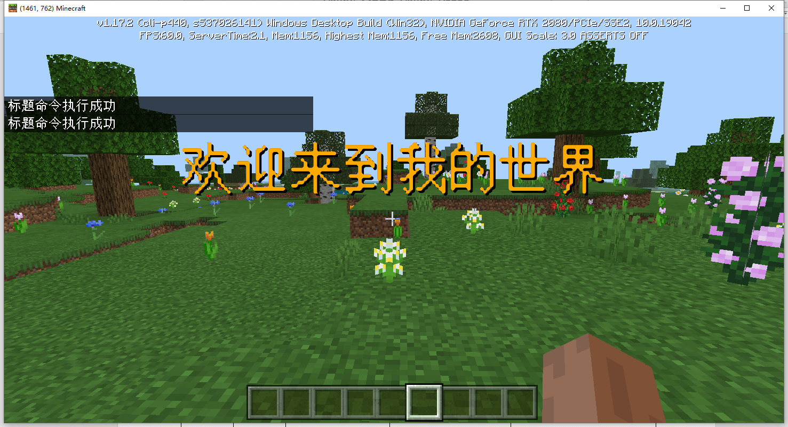
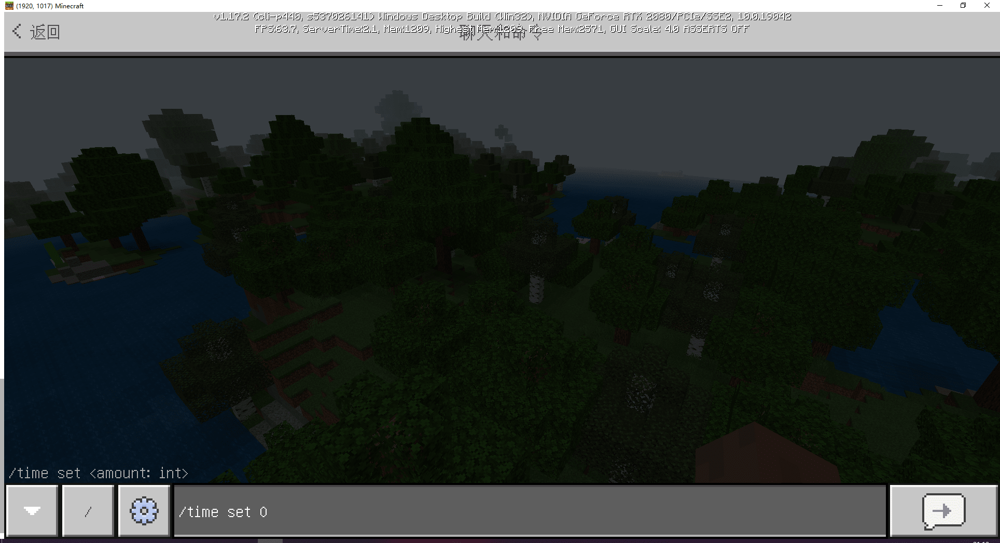
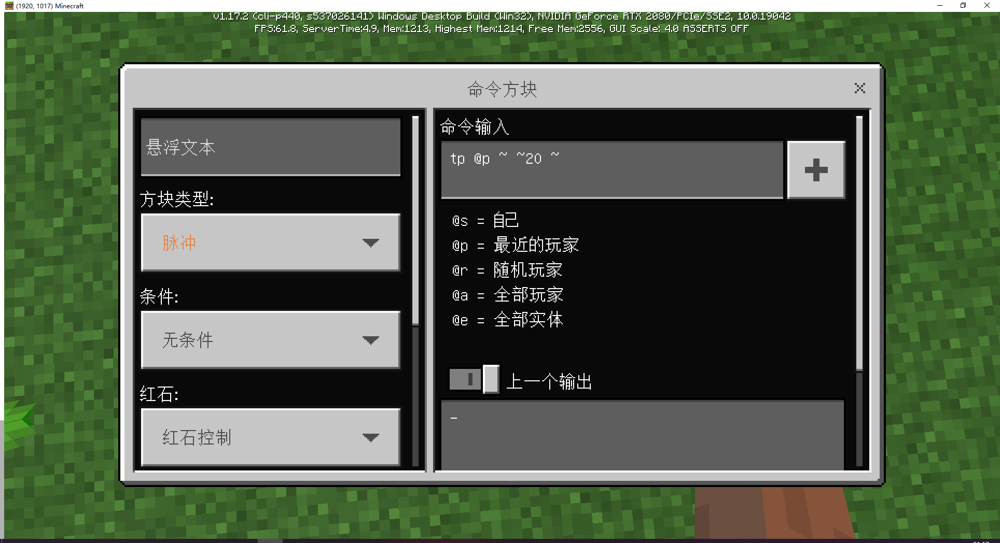
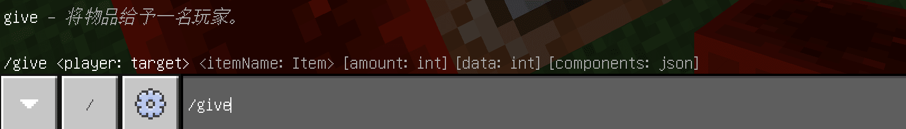

--- 
front: https://mc.163.com/dev/mcmanual/mc-dev/assets/img/01.0461bbf4.png 
hard: Getting Started 
time: 15 minutes 
selection: true 
--- 
# Minecraft original commands 

## Understanding commands 

<iframe src="https://cc.163.com/act/m/daily/iframeplayer/?id=62ce430de6c041f257897fc2" width="800" height="600" allow="fullscreen"/> 

Commands refer to the console commands that come with the original version of Minecraft. These commands can be executed in the chat window and command block of the game. 

Various commands can be used together to achieve some mod-like gameplay. 

### Command function display 

Send an in-game title 

 

Modify the game time 

 

Kill all zombies 

 

Summon a lightning bolt 

 

Such a command with many functions can complement the module SDK. It is also possible to complete many game play methods without the help of the module SDK. 

Therefore, learning the original commands of Minecraft is also a very important part of gameplay development. 

## Command execution method 

### Chat box 

After we enter a game save at random, we can press Enter to enter the chat box. 

Then enter any character starting with / in the chat box to use the console command. 

For example, if we need to set the game time to daytime, we can enter ```/time set 0``` and press Enter to modify the game time.

 

At the same time, you can see the parameter prompt of the command, requiring the last number of /time set to be the quantity, and the type is int. 

### Command Block 

Commands can also be executed in the command block. The command block does not appear in the creative inventory by default, and you need to use commands to obtain it. 

Use the same method to open the chat box, and enter ```/give @s command_block``` in the chat box to get the command block. 

Then put it on the ground and set it. 

Without changing the default settings on the left, we enter the command ```tp @p ~ ~20 ~```, and then use the redstone signal to activate this command block. 

 

The command block will execute this command and increase our y height by 20 grids. 

 

## Command parameters 

Commands will modify the results of execution based on command parameters. 

For example, in the command ```/give @s command_block```, @s and command_block are both parameters of this command. 

Parameters are usually separated by spaces. 

Type /give in the chat box to view the help of the command 

 

Here, the content represented by the <> brackets is a required parameter, and the content represented by the [] brackets is an optional parameter. 

The brackets contain the meaning and type of the parameters. 

For example, ```player: target``` is a player parameter, and the parameter type is a target, that is, a target selector. 

So our command ```/give @s command_block``` means giving a command_block to the target @s. 

@s is the command executor of the target selector, and the selector will be introduced below.

## Target Selector 

In many commands, there is a parameter of type target. For example, the /give command just now. 

Most commands that take entities or players as parameters can select one or more entities or players by certain limiting conditions without specifying entity names, player names or UUIDs. To select entities or players using conditions, you should first enter a **target selector variable**, and if necessary, you can use one or more **target selector parameters** to specify specific conditions (optional). 

### Target Selector Summary Table 


| Variables | Functions | 
| ---- | -------------- | 
| `@p` | Nearest player | 
| `@r` | Random player | 
| `@a` | All players | 
| `@e` | All entities | 
| `@s` | Command executor | 

Using these selectors, you can limit who the command will be executed on. 

You can also use target selectors with target selector parameters to filter entities. 

For example, if you need to filter out all zombies, the target selector is `@e[type=zombie]`, and if you need to filter out 2 zombies, it is `@e[type=zombie,c=2]` 

Here `type=` filters the entity type, and `c=` limits the number of choices. 

## Coordinates 

Coordinates numerically reflect the location of an entity in the world. 

Coordinates are based on a grid formed by three coordinate axes that are perpendicular to each other and intersect at a point (the origin), that is, a spatial rectangular coordinate system.

- The positive direction of the X axis is east, and its coordinates reflect the distance of the player from the origin in the east (+) and west (-) directions. 
- The positive direction of the Z axis is south, and its coordinates reflect the distance of the player from the origin in the south (+) and north (-) directions. 
- The positive direction of the Y axis is up, and its coordinates reflect the height of the player's position. 
- The unit length of the coordinate system is one block long, and each block is 1 cubic meter. 

Therefore, the three coordinate axes form a right-handed coordinate system (the thumb is the X axis, the index finger is the Y axis, and the middle finger is the Z axis), which makes it easier to remember each coordinate axis. 

 

### Absolute coordinates 

In the game, you can turn on the display coordinates through the game settings to check your position. The coordinates displayed here are absolute coordinates. 

 

### Relative coordinates and local coordinates 

In commands, you can not only use absolute coordinates (i.e. specific coordinate values), but also relative coordinates and local coordinates to indicate positions. 

#### Relative coordinates 

Relative coordinates are indicated by `~`. For example, the `/tp @p ~ ~10 ~` just entered into the command block is a position indicated by relative coordinates. 

First, let's take a look at the command parameter definition of tp. 

 

Here our command corresponds to the parameters outlined in the red box.


The tilde of the relative coordinate can be followed by a number, which represents the offset of the coordinate. For example, `~ ~10 ~` represents the y coordinate of the current position of the target + 10. Similarly, `~` is the abbreviation of `~0`. 

#### Local coordinates 

Local coordinates are represented by `^`. If you enter the command `/tp @p ^ ^ ^3`, the player will move forward 3 squares. 

The local coordinate representation here is similar to the relative coordinate. Unlike the relative coordinate, the coordinate origin of the local coordinate is centered on the player's coordinates, and the direction the player is facing is the positive direction of the z axis. 

That is, no matter what direction the player's perspective is facing, using `/tp @p ^ ^ ^3` will move the player in the direction he is facing. 

> **Absolute coordinates** can be mixed with **relative coordinates** or **local coordinates**, but **relative coordinates** and **local coordinates** cannot be mixed. 

## Raw text 

Raw text is a string of text composed of Json. 

Can be used in `/tellraw`, `/titleraw` commands. 

The basic structure of the raw text Json is as follows: 

```json 
{ 
"rawtext": [ # List containing all text objects 
{ 
"text": "", # Original text content, cannot coexist with translate 
"translate": "", # Translation identifier displayed in the language selected by the player, that is, the key in the zh_CN.lang language file 
"selector": "", # Selectors such as "@a", "@s" will be converted directly in the text 
"with": [] # List containing chat string parameters in translate 
} 
] 
} 
``` 

We execute the following commands respectively 

``` 
/tellraw @a { "rawtext": [ { "translate" : "commands.op.success", "with": [ "Developer" ] } ] } 
/tellraw @a { "rawtext": [ { "translate" : "commands.op.success", "with": { "rawtext": [ { "translate" : "item.apple.name" } ] } } ] } 
``` 

You can view the effect of the command. 

 

Here is the "%%s has been set as administrator" language text setting corresponding to `command.op.success`, replaced with the parameter in with. 

Similarly, we can write a message ourselves, for example 

```

/tellraw @a { "rawtext": [ { "translate" : "Hello %%s , %%s", "with": { "rawtext" : [ { "translate" : "%%s", "with" : { "rawtext" : [ { "selector" : "@s" } ] } }, { "translate" : "item.apple.name" } ] } } ] } 
``` 

You can see the execution effect. 

 

However, the color of such prompt text is very single. We can use formatting codes to add color and formatting to it. 

The formatting code consists of a section number (§) and a number. 

For example, §a means that all text starting from here will turn green. Let's add the formatting code and try the command again 

``` 
/tellraw @a { "rawtext": [ { "translate" : "§aHello %%s ， %%s", "with": { "rawtext" : [ { "translate" : "%%s", "with" : { "rawtext" : [ { "selector" : "@s" } ] } }, { "translate" : "item.apple.name" } ] } } ] } 
``` 

 

You can see that the text has turned green. 

The corresponding images of all available colors and formats are as follows. 

 

> **How to quickly type a bar mark using the keyboard** 
> 
> Press and hold the `Alt` key on the keyboard, and press `1`, `6`, and `7` on the numeric keypad in sequence. After pressing, release `Alt` to type the bar mark 

