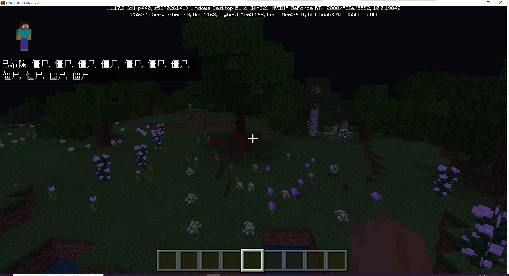

--- 
front: 
hard: Getting Started 
time: 10 minutes 
--- 
# Common commands 

After learning the basic usage of commands in the previous section, we can start learning some common commands! 

## /title 

Send an in-game title 

 

The above effect is achieved using the command `/title @s title §6Welcome to my world`. 

Usage help 

`title <*player:target*> clear` (remove screen title) 

`title <*player:target*> reset` (reset options to default) 

`title <*player:target*> title <*title text: string*>` (display text as main title) 

`title <*player:target*> subtitle <*title text: string*>` (display text as subtitle) 

`title <*player:target*> actionbar <*title text: string*>` (title displayed above the actionbar) 

`title <*player:target*> times <*fade in: integer*> <*hold: integer*> <*fade out: integer*>` (set duration of fade in, hold and fade out) 

## /kill 

Kill/clear entity 

 

The above effect is achieved using the command `/kill @e[type=zombie]`. 

Usage help 

`kill [target: target]` 

## /ride 

Used to make an entity ride on another entity, stop an entity from riding/make a mount eject its rider, and summon a mount/rider. 

Usage instructions 

```

ride <rider: target> start_riding <mount(single): target> [teleport rule: teleport rule] [riding mode: riding mode] 
``` 

Makes the specified rider ride the specified mount. 

``` 
ride <rider: target> stop_riding 
``` 

Makes the specified rider stop riding. 

``` 
ride <mount: target> evict_riders 
``` 

Makes the specified mount evict its rider. 

``` 
ride <mount: target> summon_rider <entity type: entity type> [spawn event: string] [name tag: string] 
``` 

Summons an entity at the location of each mount that is not ridden and not ridden by another entity, and then makes them ride the mount. 

``` 
ride <rider: target> summon_ride <entity type: entity type> [ride rule: ride rule] [spawn event: string] [name tag: string] 
``` 

Summon an entity at each rider's position, and then let the rider ride them. 

## /tp 

Teleport the entity to the specified location 

The specific usage method has been introduced in the [previous section](./1-My World Original Command.html#Relative Coordinates) 

## /summon 

Summon an entity 

 

The effect in the above picture is achieved using the command `/summon lightning_bolt ~ ~ ~`. 

Usage 

``` 
summon <entityType: EntityType> [spawnPos: x y z] [spawnEvent: string] [nameTag: string] 
``` 

```

summon <entityType: EntityType> <nameTag: string> [spawnPos: x y z] 
``` 

## /execute 

`/execute` can execute another command while changing the executor, execution position and angle, adding restrictions, and storing its output value. 

Usage 

``` 
execute <origin: target> <position: x y z> <command: command> 
``` 

You can limit the execution of a command only when the specified block is detected: 

``` 
execute <origin: target> <position: x y z> detect <detectPos: x y z> <block: Block> <data: int> <command: command> 
``` 

For example, if we need to detect a creeper and generate lightning at its location, we can use the following command. 

`/execute @e[type=creeper,c=1] ~ ~ ~ summon lightning_bolt ~ ~ ~` 

 

You can see that a lightning bolt is summoned at the location of the creeper, turning it into a lightning creeper. 

## More commands 

If you want to know more commands, you can visit [Wikipedia](https://minecraft.fandom.com/zh/wiki/Category:%E5%91%BD%E4%BB%A4). 

