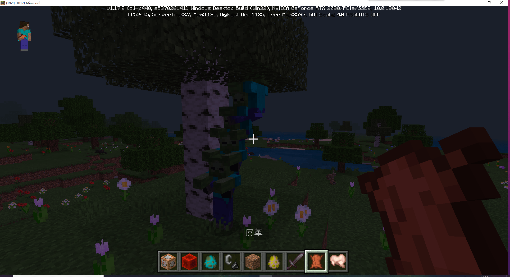

--- 
front: 
hard: Getting Started 
time: 5 minutes 
--- 
# Homework 

## Requirements 

- Use the /ride command to create a physical stacking game. 

- Use the /execute command to summon a creeper at all player positions 

## Steps 

### /ride 

Summon a zombie, enter the command multiple times 

``` 
/ride @e[type=zombie,c=1] summon_ride zombie 
``` 

The more you enter, the higher the stacking game will be. 

 

### /execute 

Execute command 

``` 
/execute @a ~ ~ ~ summon creeper ~ ~ ~ 
``` 

Command explanation: 

@a represents all players 

~ ~ ~ represents the current position of the player 

summon creeper ~ ~ ~ represents the selected players to execute this command 

