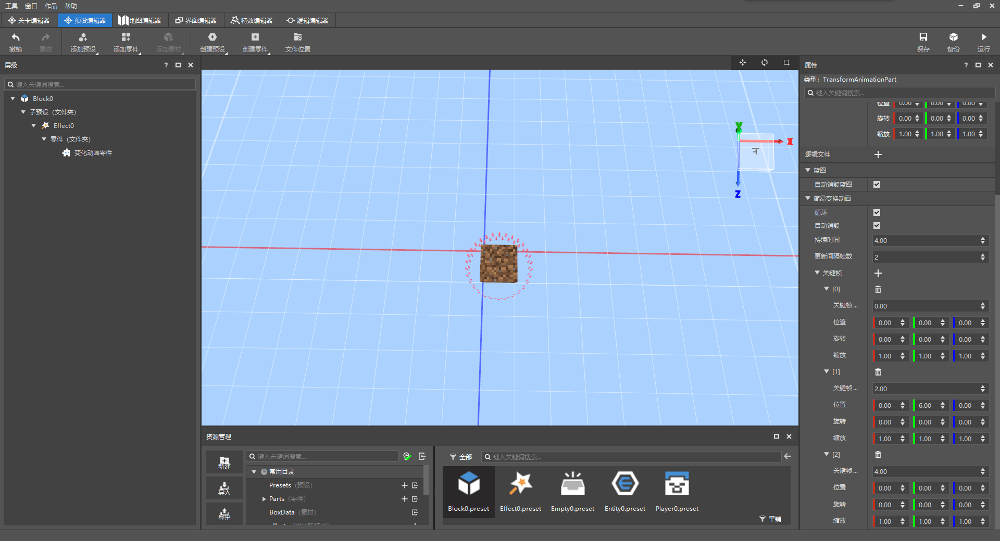
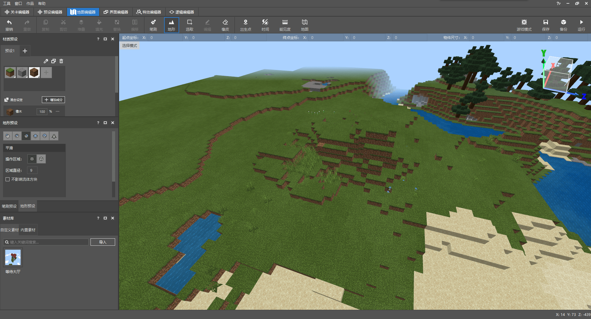
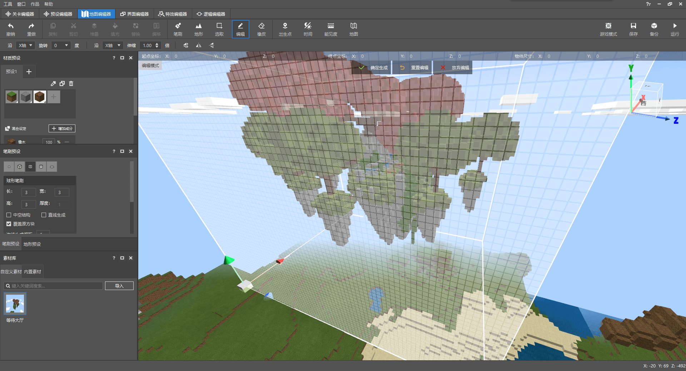
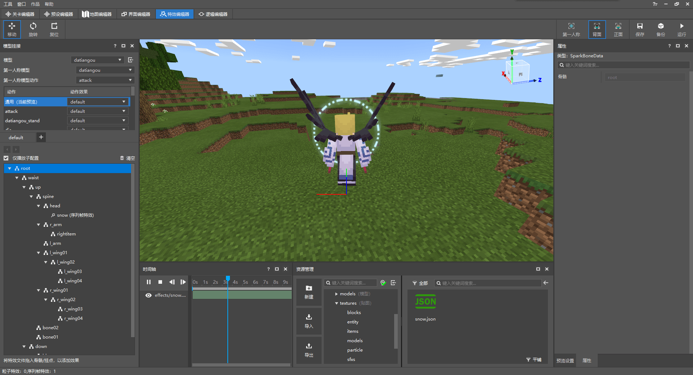

--- 
front: https://mc.163.com/dev/mcmanual/mc-dev/assets/img/01.9c30ad9c.png 
hard: Getting Started 
time: 15 minutes 
--- 
# Minecraft Development Workbench 

Minecraft Development Workbench (MC Studio) is a development tool officially produced by the Chinese version of Minecraft. 

In the previous chapters, we have used the development workbench to create new items and synthesis recipes. 

In this section, we will continue to introduce some of its other editing functions. 

<iframe src="https://cc.163.com/act/m/daily/iframeplayer/?id=62ce5180a240f794f8c2c801" width="800" height="600" allow="fullscreen"/> 

## Level Editor 

The main functions of the level editor are 

- Display of the map (scene) 
- Place instances in the scene, that is, instantiate the preset 
- Display of instances and adjustment of coordinate transformation 
- Editing the properties of instances 

### Stage 

The stage lists all instances existing in the scene. 

After selecting an instance in the stage, the game window in the middle will highlight the game element represented by the instance you selected, and display the specific properties in the property window on the right. 

For example, the mud in the picture is a block preset. 

 

### Preset Library 

The preset library shows all presets that can be used in the level editor. After the preset is dragged into the game window, it will be instantiated. 

For example, after dragging a special effect preset (Effect0 in the screenshot) into the game, you can see it being played in the game. 

 

Drag another special effect into the game, and switch back to the stage panel, you can see that there are two Effect0s on the stage. 

 

## Preset Editor 

As mentioned in the level editor just now, the level editor is mainly an editor that combines presets into the game. 

And our preset editor, as the name implies, is an editor used to edit presets. 

For example, we combine two presets in the preset editor, and combine the special effects and mud presets together. 

 

Switching back to the level editor, you can see that all mud blocks have become mud with special effects edited in the preset. 

 

## Map Editor 

The map editor can edit the map in the game. 

 

The map editor is mainly composed of a game window, menu bar, and toolbar. 

We can use WASD and mouse to move the perspective and position in the game window. 

And use tools to edit the game map. 

### Brush Tool 

For example, when using the brush tool, we can choose the block and brush type we need, and then make buildings directly in the game like painting. 

 

### Terrain Tool 

You can also use the terrain tool to modify the terrain. 

| Before modification | After modification | 
| -------------------- | -------------------- | 
|  |  | 

### Material 

We can also save part of the building in a certain archive as material and export it to other archives for use. 

 

## Interface Editor 

The interface editor can be used to create interfaces. 

The interfaces in my world are all composed of json files, and the syntax of directly editing json files is relatively complicated, and the editing effect cannot be seen in real time. 

Therefore, using the interface editor can greatly reduce the workload of writing interfaces. 

 

In the interface editor, it is mainly composed of component bar, space structure, interface file list, properties, resource management, and preview interface. 

We can select the interface components we need at the top and drag them to the position we need, and then the various components form the window in the game. 

## Special Effects Editor 

The special effects editor can edit the NetEase version special effects and attach them to the skeleton model. 

> Little knowledge: 
> 
> Skeleton model refers to the fbx model made by 3d software such as Blender 
> 
> The model made by BlockBench is called the Bedrock Edition model 

 

## Logic Editor 

The logic editor can use graphical programming to write the logic code of the module. 

 

